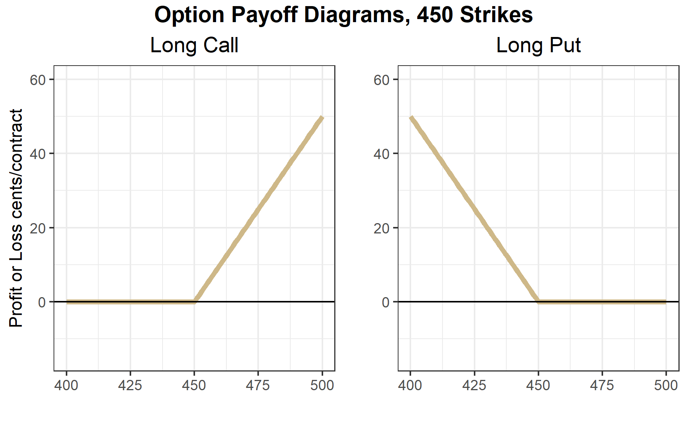

# Introduction to Option Contracts

Interested in more? Please let me know by [taking the survey](https://forms.gle/Q3VByCQZHjfQSy9D7)! 

**Highlights**

-   Learn the basics of call and put options

-   Learn what is moneyness and how it affects option prices

-   Learn about intrinsic value of options

**Check your Understanding**

-   Which option has a 'high' premium, an in-the-money or an out-of-the-money option?

-   Does a long put position have unlimited upside potential? What about a long call position?

-   Suppose you are a farmer with unpriced grain that you will harvest in October. Why would why would a long put option be a hedge?

## What is an Option Contract?

The previous chapter provided an introduction to futures markets and how they can be used to hedge a position in the cash market, or to speculate if you have conviction about the direction of price movement in the future. In this chapter, we introduce options contracts. An option contract gives the holder the right, but not the obligation to a position in the underlying contract by a certain date [@hull2017]. That means that every option contract is tied to another asset or financial instrument. The purchaser of an option contract will accept the position in the underlying only if it is advantageous to do so.

### Call Options Vs Put Options

There are two basic types of options: call options and put options. Call options give the holder the *right to buy* the underlying at a specified price (known as the strike price) by the expiration date of the option contract. Put options give the holder the *right to sell* the underlying at the strike price by the expiration date. Standard call and put options are most commonly one of two types, either American or European. American options can be exercised at any time (meaning the holder of the option contract may take the long position in the underlying asset at any time prior to or at expiration). Whereas, a European contract can only be exercised at the option contract's expiration.

### Option Contract Components

All option contracts must specify the following details.

-   **Expiration Date**: The date at which the option contract either must be exercised or left to expire worthless. Sometimes call maturity.

-   **Strike Price**: The strike price defines the price at which the holder may buy the underlying (in the case of a call option) or the price at which the holder may sell the underlying (in the case of a put option). Sometimes call exercise price.

-   **Exercise**: To exercise the option is to elect to take the position in the underlying (buy at the strike for a call option or sell at the strike for a put option).

-   **Underlying**: The asset or financial instrument on which the option is based. In the case of our class we will be talking about options on futures contracts.

-   **Premium**: Purchasers of an option must pay a price upfront to the seller, called the option premium. This is because the inherent right, but not obligation of an option contract means that they hold a position with no downside risk. An upfront payment, the price or premium of the option is required to entice sellers to trade these contracts.

## What are the Obligations of Option Sellers?

Every option contract has a buyer and a seller. We discussed how the buyer of the option has the right, but not the obligation to buy (for a call option) or sell (for a put option). Once an option seller has taken the position, they have certain obligations, namely to deliver a long position to the call buyer or deliver a short position to the put buyer.

**Call Option Seller:** The call option seller must be ready to deliver a long position in the underlying to a call option buyer. That means that they must be ready to sell the underlying at the strike price. Notice, that the rational call buyer will only exercise if the price of the underlying is above the strike price of the option contract. The call option seller hopes that the price of the underlying stays below the strike price and they get to keep the premium without having to be assigned a losing position in the underling.

**Put Option Seller:** The put option seller is in a similar situation as the call option seller. The put option seller must be ready to buy the underlying at the strike price. The rational put option buyer will only exercise their option if the price of the underlying is below the strike price. Therefore, the put option seller hopes that the price of the underlying stays above the strike price so they are paid the option premium without getting assigned to a losing position in the underlying.

## **Profit and Loss Diagrams for Option Positions**

The preceding discussion containing a lot of descriptions can be quite wordy. In this case, a picture really is worth a thousand words. In the figure below we plot the profit diagram for long and short positions of both a call and put option. For simplicity, we plot both the call and put options with an equal premium. In the next chapter we will learn that call and put options with the same strike have a very specific relationship (and it is not that the prices are equal), but for now it helps create a simple example.

The specifics:

-   Strike = 450.00 cents

-   Premium = 10 cents

Option profit diagrams are often referred to as hockey stick diagrams for obvious reasons. Take a look at the long call figure. A long call position's downside risk is limited to the price paid for the option. If the price of the underlying contract falls below 450 and stays there until expiration, then the option expires worthless and the long call holder's profit is -10 cents \* size of the contract. For example, if this were a call option on a corn futures contract whose size is 5,000 bushels then Profit = -10\*5000 = 50,000 cents or \$500. If the price of the underlying rises higher than 460, the position is in positive profit territory.

Similarly for the long put position. A put with strike price = 450 gives the holder the right to sell for 450. So if the price of the underlying expires above 450, the holder of the long put option position will have profit of -10\*size of the contract. The long put option position has a breakeven point at 440 cents, and has positive profit if the price of the underlying falls below 440 cents at expiration.

The short call position is a mirror image of the long call position along the x axis. This position provides the holder with 10 cent profit at expiration if the price of the underlying is below 450 cents. The profit is declining from 450 to 460 cents, and begins losing money when the price of the underlying is above 460 cents at expiration.

Similarly for the short put position, with the short put position having 10 cents profit when the price is above 450 cents at expiration, and losing money when the price is below 440 cents at expiration.

The key observation being that long option positions have nearly unlimited upside potential, but require an upfront cost, while short option positions receive payment upfront in the form of the option premium in exchange for taking the downside risk.

## Moneyness of an Option

Option contracts are often characterized by their ***moneyness**.* Moneyness simply refers to how near the price of the underlying is to the strike price. We say an option is deep **out-of-the money** if the price of the underlying is far below the strike of a call option and far above the strike of a put option (basically when the price of the underlying is in the flat part of the option profit diagrams). We say an option is deep **in-the-money** when the price of the underlying is far above the strike of the call option and far below the strike of the put option (when the price of the underlying falls in the sloped part of the option profit diagram). Finally, we say an option is **at-the-money** or **near-the-money** when the price of the underlying is near the kink of the option profit diagram.

Getting a feel for these definitions will help you develop intuition for options prices in the next chapter. In-the-money options should be expensive and out-of-the-money options should be cheap.

## Option Prices (Premium)

Option prices (also called option premium) are determined by buyers and sellers in options markets, usually in electronic limit order books similar to other assets available to trade like stocks or futures contracts. It helps to think about option contracts like insurance policies. When you buy insurance for your car you pay a small amount at the beginning of the policy period in exchange for an agreement from your insurance company that they will pay damages in the (hopefully unlikely) event that you crash your car. You buy the insurance to protect yourself financially in the event you need to unexpectedly replace your car. Over your lifetime of car ownership you will probably pay more in car insurance than you collect in insurance claims. But for most of us, the comfort of not having to worry about a surprise \$20K expenditure is worth it. The insurance company makes money year over year because they set premiums in such a way that they take in more premium than they pay out in claims. Insurance companies employ armies of actuaries and statisticians to calculate the probability you will crash our car and the actuarily fair rate (which is probability of a crash time what they have to pay you if you crash). Then the insurance company adds enough to cover business overhead and a profit margin, and that is how your car insurance rate is determined.

Option buyers are like you and options sellers are like the insurance company in the car insurance example. Except in the case of options premiums, market participants are continually assessing what each option contract's premium should be. Given the current price of the underling asset, volatility levels in the market, time to expiration of the contract, and some other things, what is the probability the contract will expire in the money? What is a fair price for a position in the market with limited downside risk and unlimited upside potential? In the next chapter we will learn the basics of option pricing and the most famous (though imperfect) option pricing model, but we can use a concept called intrinsic value to get a sense of some properties option prices should have.

### Intrinsic Value

If we take the profit diagrams for the long call and put positions above and just plot what the gain or loss in the underlying market would be if we exercised right now, they would look similar to the plots above, except not shifted down by the amount of the option premium. This plots the intrinsic value of the options, or how much the position would be in profit if it were exercised immediately.

The options should be worth at least as much as its intrinsic value. Otherwise and arbitrage opportunity would exist. You could buy the option, exercise immediately, and immediately offset your position in the underlying for a riskless profit. For this reason, option prices usually fall somewhat above the intrinsic value diagram, as a function of the price of the underlying along the x-axis. How far above is determined by several factors that we will learn about in the next chapter.

## Margin Requirements

Since long option positions require premium to be paid upfront, the option buyer literally prepays the entire risk of the position. Therefore, no additional margin is required. Option sellers on the other hand, have large downside exposure so those positions require margin to be posted. The amount is determined by the exchange that offers the option contract for trading (with some brokers requiring even more than set by the exchange). The amount of margin required is set at the discretion of the exchange, but is greatly influenced by both recent and historical volatility of that particular market.

## Size of the Underlying

Every option contract will specify how much of the underlying the contract is associated with. In the case of stock options, options most frequently are for 100 shares of the underlying. So if you buy 1 call option with a premium of \$1.00 and a strike of \$120 on company XYZ \$2.00, for example, you have purchased the right to buy 100 shares of XYZ at a price of \$120. Making the actual cost to buy the option $100*1.00 = \$100$.

The size units for options on futures contracts are typically just for one futures contract, though. So if you buy a call option on soybean futures at the [cmegroup.com](cmegroup.com) it is the right to buy just one futures contract.

## Reading Option Quotes

The figure below shows quotes for several options on the January 2021 soybeans futures contract that trades on the [cmegroup.com](cmegroup.com) exchange. The underlying contract information is in the top table. In the LAST column we see that last price the contract had traded for at the time I took a snapshot of these quotes. CHANGE shows the price change since the PRIOR SETTLE price, which is the settlement price from the previous day. HIGH price, LOW price, and VOLUME on the trading session are also provided.

Recall that soybeans are quoted to the eight of a cent, so the 1249'0 means $1249 + \frac{0}{8} = 1249.00$ cents. While the PRIOR SETTLE price of 1243'6 means $1243 + \frac{6}{8} = 1243.75$ cents.

Most providers of option contract quotes will organize the information in a similar way as shown below. Calls and Puts are shown in major columns, organized by ascending strike prices, which are usually displayed in the middle of the table for easy reference whether you are focused on Call or Put options.

Focus on the 1250 strike options that are highlighted in yellow. These options contracts are also quoted in eight of a cent increments, so the LAST price on the call option is 7'5, which means $7 + \frac{5}{8} = 7.625$ cents. Therefore, the cost of the 1250 call option that expires in January is $7.625*5000 = \$31.32$ since one soybean contract is for 5000 bushels. That seems pretty cheap, right. One thing to note is that the monthly options on soybean futures expire on the last Friday at least two business days before the last business day of the month prior to the contract month. If the Friday expiration would land on an exchange holiday the expiration will be the business day prior. All that means in the case of this option, it will expire on December 24th, 2020, just two days later than the day this table was created (notice the date updated column is for December 22, 2020). So, while it is right at the money, there is only two trading days left in the life of the option. What do you think happens the the value of any given option as it gets close to expiration? We will explore in detail in the next chapter.

Next, take a look at the LAST prices for the calls compared to the puts as you move down the table from 1200 strikes to the 1290 strike. In the case of the call options, the prices are increasing as you move down the table with the largest price option being the 1200 strike. Compare that to the put prices. The put prices are increasing as you look down the table from the 1200 strike to the 1290 strike. Take a second and think about why the 1200 call option is worth nearly 48 cents while the 1200 put option is worth less than half a cent.

The figure below show why: moneyness. The figure shows the call and put with 1200 cent strike and the option premium shown in the table above. That means that the flat part of the 'hockey stick' diagram is at -47.875 cents in the long call option figure and at -0.375 cents in the put option figure. The 1200 strike long call is deep in the money and has 49 cents worth of intrinsic value. The 1200 call option should be worth a bit more than 49 cents. But sometimes the last price is a stale price, or reflects a wide bid-ask spread in markets with inadequate liquidity. This is often the case for deep in-the-money and deep out-of-the-money options markets.

Notice the volume columns for both the calls and puts compared to the volume on the underlying. Some contracts that are near-the-money, which means the price of the underlying is pretty close to their strike price, have quite low volume traded. This is an example of an issue trading option markets. Since there are so many option contracts created by offering different strikes, liquidity gets spread thin. So if you are trading option contracts you have to make sure the contract will be liquid enough to get out of the position if you want to.

## Closing an Option Position

There are two ways to close or 'get out of' an option position: take the opposite position or exercise (in the case of option longs) or get exercised upon (in the case of option shorts). Taking the opposite position is the same as exiting a position in any other familiar instrument like a stock or futures contract. If you are long, you simply sell the same option contract then you become 'flat' or have no position anymore. If you are short or have sold the option, you can simply buy the same contract and become flat.

### Exercise and Assignment

The second way to exit the option position is to exercise (if you are long the option) or be exercised upon (if you are short the option). Note that you only have control over this case when you are long the option. If you are long the option and it is in-the-money you have the option to exercise at any time (in the case of American options which most options trading in the United States are American). Though you would only want to if the option is in the money. When you exercise, you receive the corresponding position in the underlying. For example, if you are long one call option on CME March corn futures that is in-the-money and you exercise it, you receive a long position of one contract in the March corn futures with your purchase price being the strike of the option. Likewise, if you are long a put option that is in-the-money and you exercise it you receive a short position in the underlying at the strike price of the option. Note that if you are long an option and you decide to exercise, you will trade a position with zero margin requirements to having to post margin for the futures position, because you will no longer have a position with no downside risk.

If you are short an option contract that is in-the-money you should be ready to be assigned (exercised upon) at any time. If a long party indicates to the exchange that they want to exercise and you are matched with them then you must provide them with the position in the underlying at the strike price. For example, suppose you are short a March Corn put with a strike of 450 cents. Price goes to 445 and you get assigned. That means you will have a long position in the March corn futures with a purchase price of 450. This is because as the option seller you have to be the other side of the person who exercised their right to sell at 450.

If markets were perfect with no liquidity cost, no one should ever exercise an option position early, since they could sell the option for at least as much as the intrinsic value of the option. But, markets are not perfect, and options in many markets can have wide bid-ask spreads meaning that you will have to buy at a higher price and sell at a lower price if you want to do the trade immediately. If the bid-ask spread is wide enough, it may be more beneficial just to exercise and then offset your position in the underlying.

### Option Expiration

Options on futures usually expire a few weeks before the underlying futures contract expires. In most cases, the exchange will automatically exercise in-the-money options that are held to expiration.
