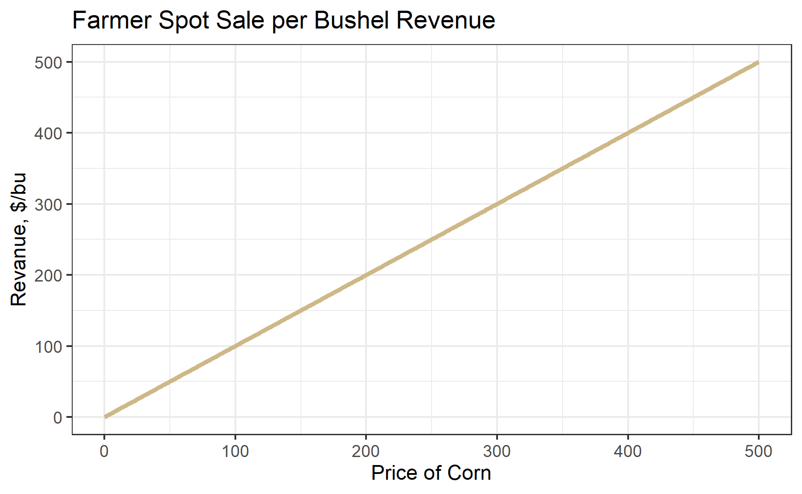
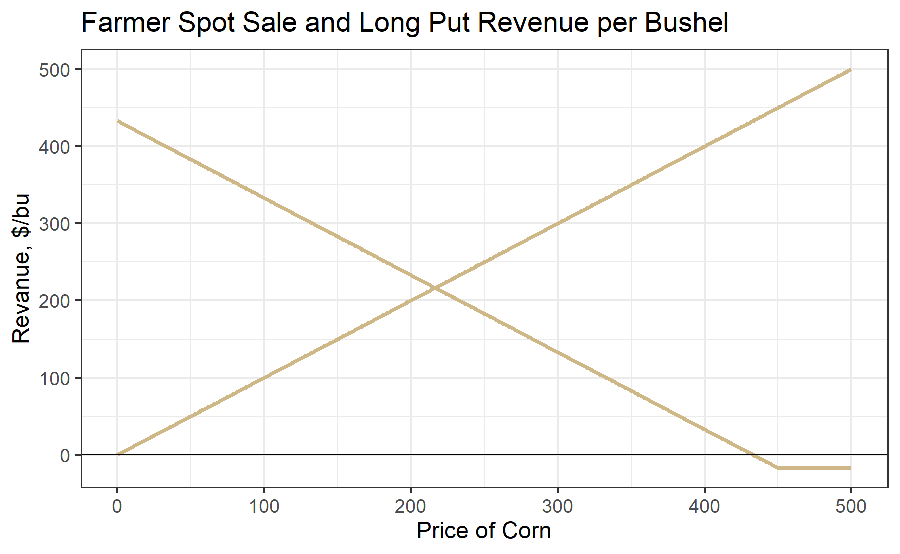
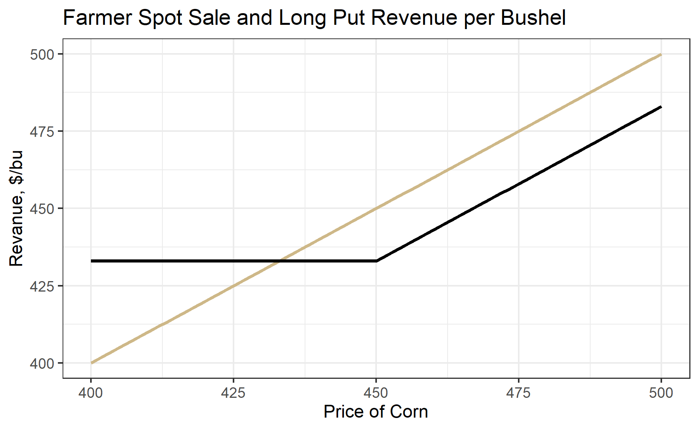
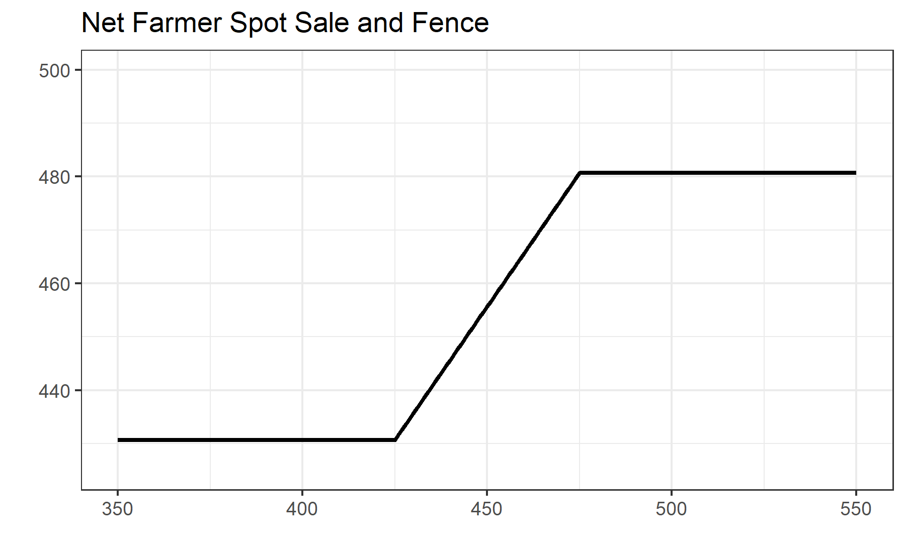

# Hedging with Options

Interested in more? Please let me know by [taking the survey](https://forms.gle/Q3VByCQZHjfQSy9D7)! 

**Highlights**

-   Hedge a speculative position with options
-   Put options can be used to hedge a farmers production risk
-   Hedging with options is costly
-   Farmer's hedge; putting on a fence

**Check Your Understanding**

-   Why does a long put option protect from downside risk?
-   What are the options trades required to lock in a price range?
-   Which of the strategies described in this chapter require one to maintain margin?

## Farmer Hedging Price Risk on Production with a Put Option

We know from chapter 4 that hedging in the financial sense is an activity designed to generate positive cash flows when the main pain position is experiencing a drawdown. The classic example being a farmer who has a crop in the field or in the bin is exposed to price risk and will experience financial loss if crop prices decline. To hedge this risk, they can sell a futures contract. Corn futures prices are highly correlated to the spot price the farmer faces in the local market. So if corn prices decline, the losses in spot sales are offset by gains from the short futures position.

Hedging with futures has the disadvantage of removing exposure to both downside *and* upside price movements. By hedging with a put option, a farmer can eliminate downside risk (save for the risk of a falling basis) while retaining benefits from price increases.

To visualize how it works first recall what a farmer's per bushel revenue looks like as a function of the price of corn. Its simply a 45 degree line radiating from the origin.

Next, add the payoff at expiration of a long 450 strike put option whose premium is 17 cents per bushel.

If we add these two positions together, we get the net position shown by the black line. The three most important things to note about this net position are as follows: 1) Downside risk is capped at the strike of the long put option, 2) Upside potential is preserved, but it is lowered by the amount of the put option premium. That is, everywhere the black line is upward sloped, it is lower than the spot revenue by the amount of the put premium.

The figure below is the same as the previous figure, but zoomed in. Note how the net position now looks a lot like holding a long call option position. Long Spot + Short Put = Long Call.

The strike of the long put should be chosen by considering the trade off between greater downside protection and premium cost. The figure below shows how choosing the 450 strike put (solid line and a higher premium) versus the 425 strike put (dashed line and a lower premium) affects the net position. As above, the gold lines are the individual instrument payoff lines, and the black lines show the net from holding spot and long put positions. Choosing the 425 strike put results in a lower cost in premium paid, so the black dashed line is closer to the gold spot line. However, there is more downside risk associated with the 425 strike put.

A way to mitigate the cost of buying a put option to protect downside risk is to sell a call option whose strike is above the current market prices. Let's suppose current market price is 450, and we buy the 425 put for 7.85 cents premium and sell the 475 call for 13.5 cents premium. You can see these individual positions in the figure below. If we sum payoffs from all three of these separate positions you get the black line. Below 425 there is no downside risk since you are protected by the long put. Above 475 you do not enjoy additional gains because you sold the call. In this case the upward sloped part of the black line is 13.5 - 7.85 = 5.9 cents above the gold spot line. However, whether you are net positive or negative from the call premium collected minus the put premium paid will depend on our strike choice. For example, if you choose a tighter strike for the protective put, your downside is even more limited, but the premium paid will be higher. Similarly, if you choose a higher strike for the sold call you will retain more upside potential, but the premium you receive will be smaller.

## Farmer Hedging by Putting on a Fence

The essence of this strategy is that you are giving up some upside potential to finance your expense in limiting downside risk. The figure below gives a zoomed in view of the net position after putting on the fence. The first kink in the black line is at the strike of the long put, 425. The second kink in the black line is the strike of the short call, 475.

### A Note on Margin

When putting on a fence, you have to keep in mind that your short call position will require margin. If the price goes up, your short call position will be losing money. Maintaining the position open will require posting additional margin. To employ this strategy, you have to be ready to lose the short call position, or have an agreement set up with a lender to post margin in the event the price goes up enough to wipe out your posted margin.

The long put position is fully paid up front, so that position does not require margin posted to the account. As long as you have enough money in your brokerage account to buy the option + fees, you can get into the long put position.

## Wrapping Up

In this chapter we learned how options can be used to hedge spot positions in commodity markets. Downside risk can be protected with put options, but this comes at significant cost in premium paid, especially for options that have expirations longer than a week or two out.
