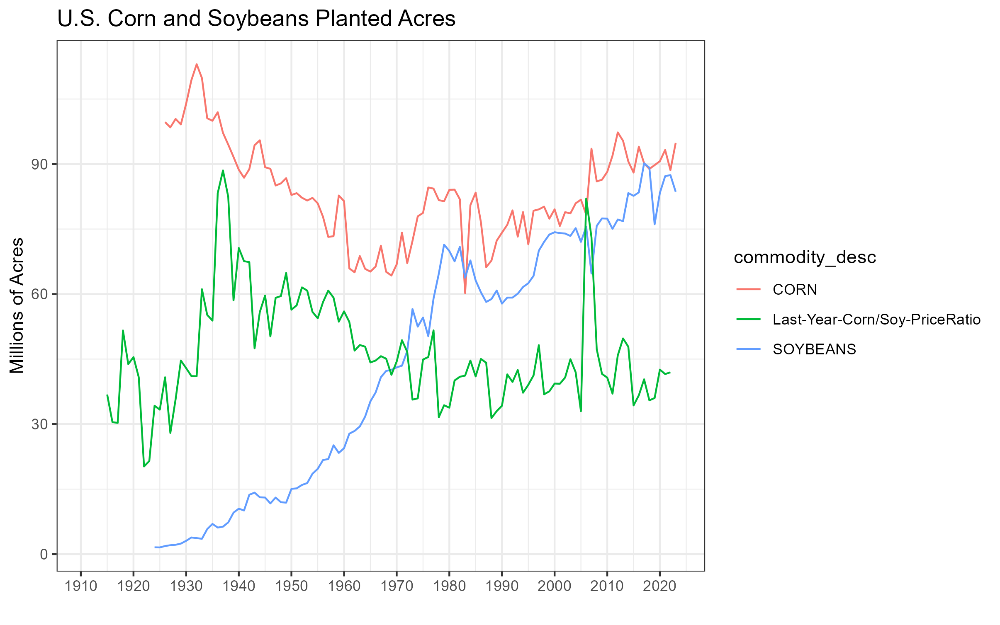
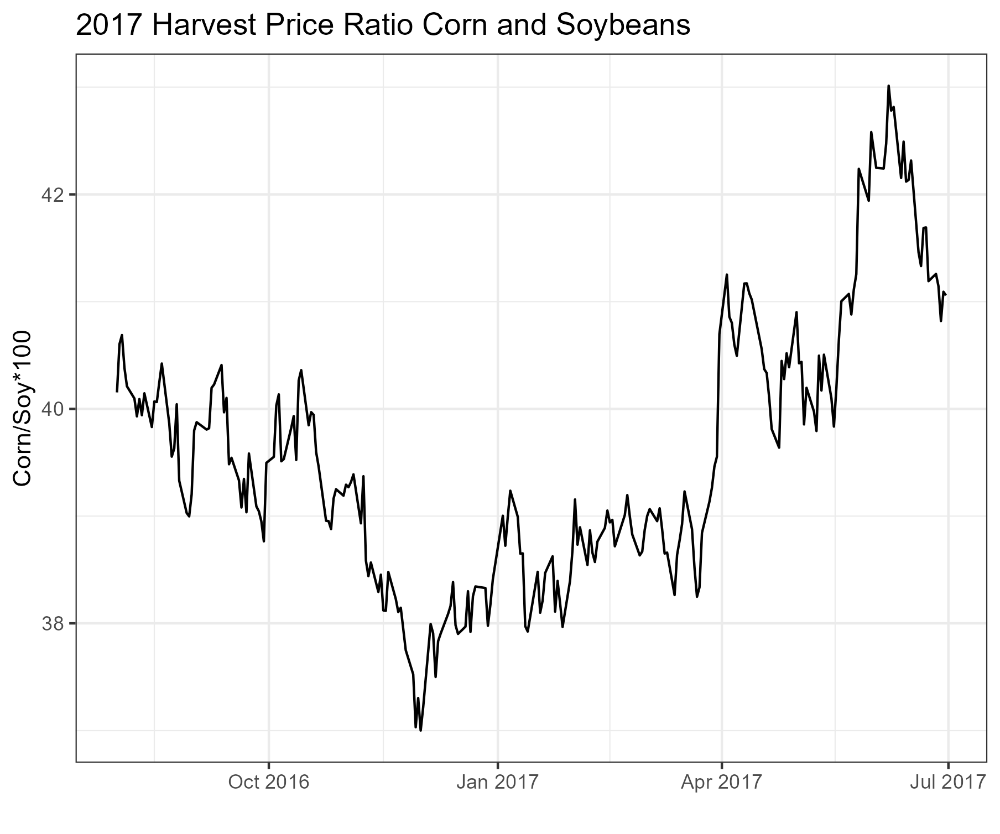

# Forecasting Production

**Highlights**

  + Learn the timeline and tools to estimate acreage and yield. 
  + Learn how the relative price of corn versus soybeans contributes to acreage decisions, and thus production.
  + Learn basic techniques for forecasting yield before and during the growing season.
  
**Check Your Understanding**

  + Can you use NASS data for soybeans to forecast production in a similar manner shown for corn.

The preceding chapters have served as a background about agricultural markets, and important informational events that drive commodity prices. Going forward, we will focus our energy on the more data and technical questions of actually forecasting elements of the balance sheet - and later, short term price changes using time-series econometric techniques. In the remainder of this chapter, the discussion and figures are all for corn.  

Our first task in forecasting a balance sheet will be to get a good estimate of production for the marketing year. 

As we noted before, `Production = Acreage X Yield`. To begin, we will discuss the fundamentals of estimating acreage. 

## Estimating Acreage

Like many other agricultural variables we would like to forecast, our methodology for forecasting acreage depends on the time of year we are making the forecast. Prior to planting season, we can rely on recent trends in acreage from previous years, plus relative profitability of planting competing crops as measured by relative futures prices. 

Historical acres planted and harvested can be found from USDA NASS. 

> ## Steps to download historical acreage data: 
> 1. Go to [https://www.nass.usda.gov/Quick_Stats/Lite/index.php](https://www.nass.usda.gov/Quick_Stats/Lite/index.php)
> 2. Click *Crops* in the menu 
> 3. In the query, choose *Field Crops*
> 4. Choose corn
> 5. Click *Acreage, Yield, Production, and Price*
> 6. Select the years you want. Hold the Ctrl key to select multiple.
> 7. Click *Get Data*. 

The following is a graph of historical corn *Planted Acres* along with the ratio of *Average Prices Received by Farmers* for corn and soybeans.  

The following is a graph of historical corn *Planted Acres and Harvested Acres* generated from the data described above from 2000 to 2014. The left axis shows planted and harvested acres while the right axis shows the difference between the two. Since 2000, you can see that corn acreage has been increasing steadily from 80 million acres to just above 90 million acres. Given this, prior to planting season we might expect a simple trend-line to forecast corn acreage fairly well. However, notice that in a couple of instances there were fairly large deviations from the trend-line.

Aside from historical trends, if one considers the decision the average corn farmer makes, he or she considers the relative profitability of planting corn versus planting soybeans. In years where profitability favors corn, more corn-on-corn acres will be planted, thus increasing the total number of acres planted to corn. In years where profitability favors soybeans, less corn-on-corn acres will be planted, thus increasing soybean acres and reducing the total number of acres planted to soybeans. This pattern is demonstrated in 2008 and 2011 when an increase in the corn-to-soybean price ratio corresponded to an increase in planted acres. 

Figure 4 shows the December 2017 and November 2017 corn and soybean futures prices ratio from 10/1/2016 to 5/1/2017; this roughly corresponds to the time frame when a farmer must make acreage decisions for the next crop year. The acreage decision begins in the fall of the prior year because fertilizer (which is costly) on corn ground is often applied in the fall. Assuming inputs costs were constant, forecasts of corn and soybean acreage for Spring 2017 should take into account the changing profitability profile of corn versus soybeans during this time. When the corn/soy ratio is 'high' corn becomes more profitable relative to soybeans and vice versa.  

Figure 4 shows that during the fall of 2016, the corn/soy price ratio was falling, so acreage expectations should have been shifting slightly from corn toward soybeans. However, in late spring 2017, the corn price gained relative to the soybean price, so some corn acres may have been added back at the last minute that were originally planned for soybean acres. If we compare the 2017 prospective plantings report ([released on 3/21/2017](http://usda.mannlib.cornell.edu/usda/current/ProsPlan/ProsPlan-03-31-2017.pdf)) with the 2017 acreage report ([released on 6/30/2017](http://usda.mannlib.cornell.edu/usda/current/Acre/Acre-06-30-2017.pdf)) we see that this was indeed the case. In the prospective planing report the USDA estimated corn acres to be 90 million, but the acreage report showed plantings were nearly 1 million acres higher at 90.9 million. 

 

### Forecasting Harvested Acres

After forecasting *Planted Acres* one still needs to provide a forecast for *Harvested Acres*. Figure 5 shows historical trends in *Harvested Acres* relative to *Planted Acres*. The difference between these two variables is provided in gray with units along the right axis for convenience. 

Harvested acres tends to be a fairly stable number, averaging 7.6 million acres between 2000 and 2014. Although, years when this variable deviates most from trend corresponds to years of exceptionally poor production. In figure 5, see 2012 and 2002 as examples. These years marginal reductions in production are explained by reduced yield and abandoned acres, so forecasting the harvested acres number accurately becomes very important to accurately forecasting production in shortfall years. 

## Forecasting Yield

Just like in forecasting acreage, we have different procedures for forecasting yield prior to planting. Before the summer growing season gets underway trend yield is usually used. The trouble is, where to start?

USDA has records on yield that go back to 1866. While one often thinks more information is better when forecasting, the old yield estimates are no longer useful for forecasting current yield. Technological progress caused yields to take of in the 1950's and they have been climbing ever since. In the forecasting world, this is called *structural change* or a *structural break*. If *structural change* has occurred, the world looks so different now than it did before the structural change that data from before the break just is not useful for forecasting going forward. 

It turns out that if you estimate a trend-line beginning with 1952, with 1980, or with pretty much any date in between, you will get an estimate that is roughly similar. 

 

 

For example, using the trend-line beginning with 1952 to forecast yield we come up with $Yield^{2015} = 1.9066*2015 - 3677.9 = 163.899$. While, using the trend-line beginning with 1980 to forecast yield we come up with $Yield^{2015} = 1.8619*2015 - 3588.9 = 162.8285$.In other words, yields have been increasing by an average of just under 2 bushels per acre since the 1950's.

## Growing Season Yield Forecasts
 
The USDA undertakes an extensive effort to estimate yield during the growing season. Prior to August, they conduct the **Agricultural Yield Survey** (AYS) which surveys a large number of farmers and asks them to estimate yield. Beginning in August, the USDA conducts what it calls the **Objective Yield Survey**. They take samples from a relatively large number of fields and estimates yield in those fields based on various factors such as counts of plants, ears, and pods (for soybeans) [@good2011yield].

Since commodity futures markets respond to new information in the USDA reports, analysts employed by private advisory firms or proprietary trading shops will try to anticipate the USDA's yield forecast. If they can do this they can capitalize on superior private information by making a well advised business decision or earning speculative profits.

This is difficult because an independent analyst will not have the same level of resources as the USDA does when it compiles its monthly yield estimates; he or she will have to rely on historical data and an understanding of how weather is affecting crop yields across the geographically dispersed growing region.  Figure 8 below plots each year's deviation from trend yield since 1980. The first plot is in levels (i.e., $Yield_t - Trend Yield_t$); whereas the second plot is in percent terms (i.e., $\ln{Yield_t} - \ln{Trend Yield_t}$. Notice that the shape looks roughly the same, but the 2012 drought looks worse expressed in level deviations than the short crops of 1983, 1988, and 1993. This is because yield is trending higher. In percentage terms we see that the 2012 drought was equally as bad as 1983 and not quite as bad as 1988.   

Short of an advanced agronomic model that can take into account planting date, precipitation, [growing degree days](https://en.wikipedia.org/wiki/Growing_degree-day), or ability to estimate yield from remote sensing technology [@unganai1998drought], we will have to resort to the *similar year approach*.  

Analysts often estimate deviations from trend yield by finding year similar to the current one in terms of weather. The assumption is that if the weather patterns were similar then the percent deviation from trend yield should be similar as well. Note here that percent deviation is preferable so you do not need to adjust for the increasing trend in yield as you look backward to a similar year. 

An alternative approach would be to use the *Crop Condition Report* and find a year in recent history that had a similar percent of the crop rated *Good/Excellent*. Figure 9 below shows how *Good* + *Excellent* crop condition ratings relate to percent deviations in trend yield. They should be at least positively correlated, and in fact starting in the late 90's this measure began to correlate strongly with the final yield. 

## Forecasting Production

Once you have an estimate for acreage and yield, you can multiply them to give you an estimate of production for your balance sheet forecast. 

## Conclusion

In this chapter we discussed the basics of forecasting production. First we discussed forecasting acreage, then we moved on to forecasting yield both before and during the growing season. We discovered that estimating yield percent deviations from trend better than the USDA is extremely difficult. Even anticipating whether the yield forecast will go up or down is not an easy task. The *similar year method* has its limitations when used to find similar years in terms of weather or crop conditions ratings. 

## Exercises

1. Use NASS data for soybeans for forecast production in a similar manner we we did in class for corn. 

2. Read and Discuss: [Early Planting and 2015 Corn Yield Prospects: How Much of an Increase?](http://farmdocdaily.illinois.edu/2015/05/early-planting-and-2015-corn-yield-prospects.html)

    - Irwin, S., D. Good, and J. Newton. "Early Planting and 2015 Corn Yield Prospects: How Much of an Increase?" farmdoc daily (5):93, Department of Agricultural and Consumer Economics, University of Illinois at Urbana-Champaign, May 20, 2015.
 

