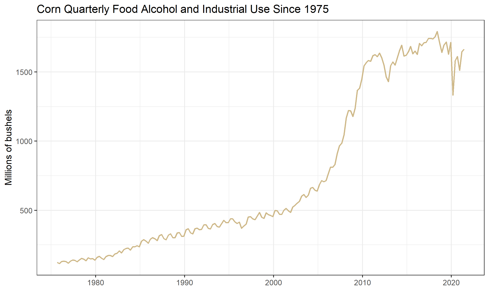
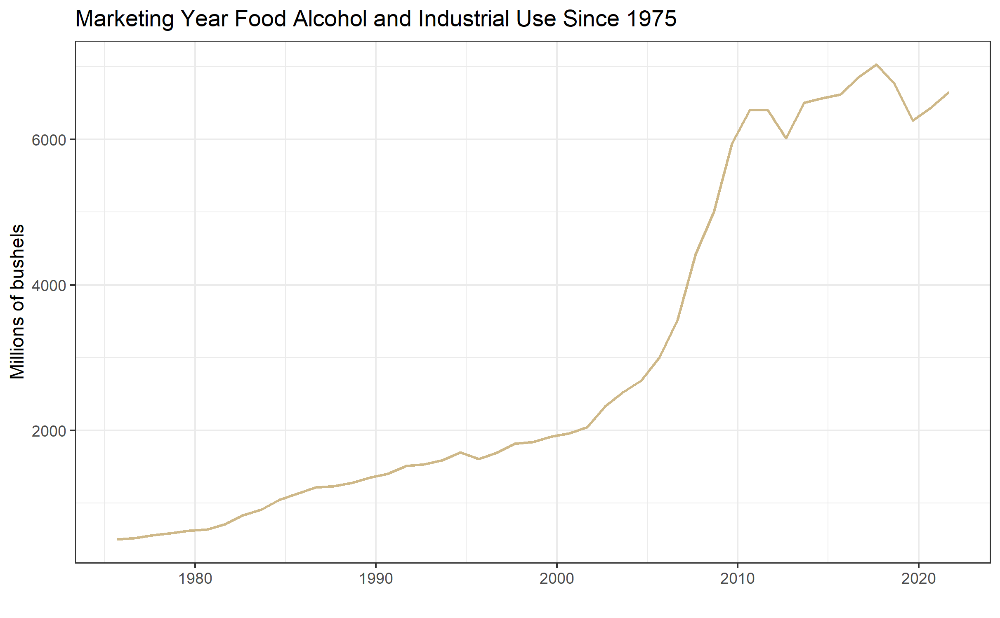
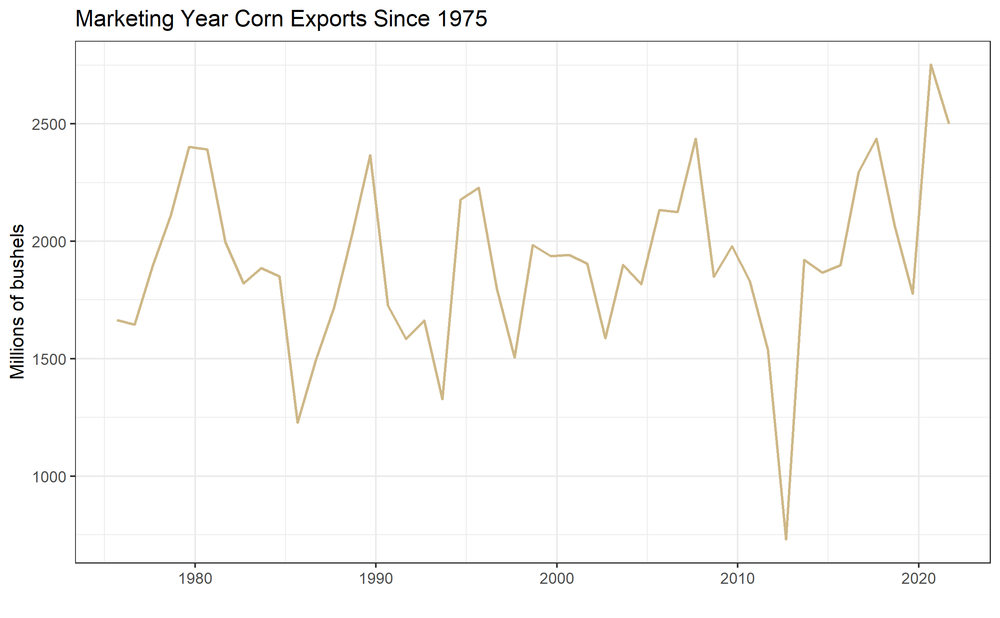
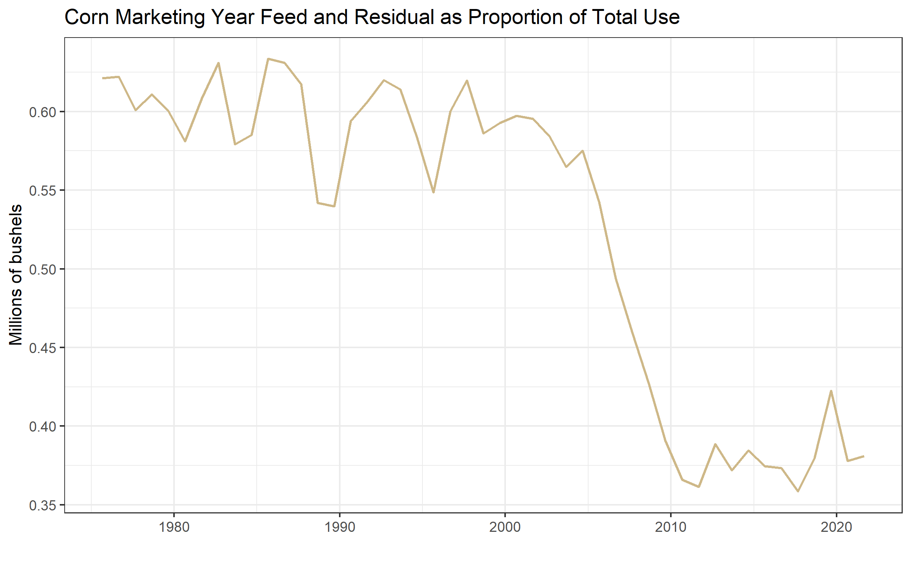

# Forecasting Use of Corn

<span style="color:red">Interested in more? Please let me know by</span> [taking the survey](https://forms.gle/Q3VByCQZHjfQSy9D7)! 


In the WASDE balance sheet for corn there are three use categories. Two
account for domestic consumption - Food, Seed and Industrial, and Feed
and Residual - while exports make up the third category. Ethanol makes
up a large portion of the Food, Seed, and Industrial category, so it is
given its own line in the balance sheet.

As we have noted before, historical use patterns are the first place to
start when trying to forecast use categories for the marketing year.
Looking at quarterly gives you a sense of how use is distributed across
the marketing year in different categories. The annual histories,
however, are probably the most useful.


## Food, Alcohol, and Industrial Use

Let us begin by looking at the Food, Alcohol and Industrial category.
These data were queried from the [Feed Grains
database](http://www.ers.usda.gov/data-products/feed-grains-database/feed-grains-yearbook-tables.aspx#26780)
maintained by the USDA ERS. The categories here are a little more
disaggregated than those presented in the USDA WASDE balance sheets, but
they are roughly the same. For example, in figure 1 below we show the
*Food, Alcohol, and Industrial* use category. This omits seed from the
*Food, Seed, and Industrial* category in the WASDE balance sheet. The
Feed Grains database actually breaks out the seed use as its own column,
but corn used for seed is a very small proportion of production and it
is largely predictable from year to year.

 Source:
[Feed Grains
database](http://www.ers.usda.gov/data-products/feed-grains-database/feed-grains-yearbook-tables.aspx#26780)
maintained by the USDA ERS.

Figure 1 shows a dramatic uptrend in the Food, Alcohol and Industrial
use category. This is due to the dramatic increase in the production of
ethanol starting around 2005/2006 and plateauing around 2010 when U.S.
ethanol consumption roughly hit the 'blend-wall' where ethanol makes up
10% of the retail gasoline supply.


Source: [Feed Grains
database](http://www.ers.usda.gov/data-products/feed-grains-database/feed-grains-yearbook-tables.aspx#26780)
maintained by the USDA ERS.

Figure 2 shows the same data, but the quarterly figures are aggregated
to the marketing year total. In both figures 1 and 2 the rationing
effects of high prices that occurred as a result of the drought in 2012.


Source: [Feed Grains
database](http://www.ers.usda.gov/data-products/feed-grains-database/feed-grains-yearbook-tables.aspx#26780)
maintained by the USDA ERS.

From figure 3 it is easier to see what share of the crop the large
increase in corn use in the Food, Alcohol, and Industrial use category.
In figure 3 this use category is presented as a percentage of that
marketing year's production. In the early 1990's this use category
accounted for over 50% since 2010. The drop in percentage of production
in 2015 occurs because of the large crop in 2015, even though the use
level is flat (shown in figure 2).

## Exports

Quarterly corn exports are displayed in figure 4. Unlike Food, alcohol
and industrial use, exports tend to have a very seasonal or cyclical
pattern. Exports are large in the second quarter of the marketing year,
December to February, right after we harvest the new crop. This is when
stocks are most plentiful and prices are at season lows in years
exhibiting an upward sloped forward curve.


Source: [Feed Grains
database](http://www.ers.usda.gov/data-products/feed-grains-database/feed-grains-yearbook-tables.aspx#26780)
maintained by the USDA ERS.

Displaying the same data in Figure 5, but aggregating to an annual
frequency, we see the marketing seasonality smoothed away.



Source: [Feed Grains
database](http://www.ers.usda.gov/data-products/feed-grains-database/feed-grains-yearbook-tables.aspx#26780)
maintained by the USDA ERS.

On average, it appears that exports follow a constant trend-line with
variation around the mean produced by years of surplus or scarcity. The
drought year 2012, for example is clearly visible as an exceedingly low
export year.

In figure 6 we display annual corn exports as a percentage of corn
production.


Source: [Feed Grains
database](http://www.ers.usda.gov/data-products/feed-grains-database/feed-grains-yearbook-tables.aspx#26780)
maintained by the USDA ERS.

When exports are viewed as a proportion of production, we see a
pronounced downward trend. This is due to the increasing share of
production allocated to the Food, seed, and Industrial category visible
in figure 3. Recall that this category is comprised mainly of corn as
feed-stock for ethanol production.

The year-to-year variation is caused by price fluctuations with low
prices encouraging and high prices discouraging consumption. The
marketing year 2020 has shown a dramatic uptick in expected exports both
in millions of bushels and as a proportion of total use. A dramatic
increase in buying from China relative to previou levels has been the
biggest contributor.

: Table 1: Top 12 Importers of U.S. Corn 2012/2013 through 2016/2017
Marketing Years, Ranked in Descending Order for Marketing Year 2015/2016
(1,000 Metric Tons)

```{r, echo=FALSE, warning=FALSE}

library(knitr)
corn_importers <- read.csv('Excel-files/ForecastingUseof-corn_importers.csv', header = TRUE)
kable(corn_importers, align = 'l',  col.names = c("COUNTRY", "EXPORTS 2016/2017", 	"RANK",	"EXPORTS 2015/2016",	"RANK",	
                                                              "EXPORTS 2014/2015",	"RANK",	"EXPORTS 2013/2014", "RANK"))

```

Source: [USDA FAS](http://apps.fas.usda.gov/export-sales/myrk_rpt.htm)

Table 1 shows the top 12 importers of U.S. corn for the 2016/2017
marketing year. Export totals are given in 1,000 metric ton units.
Clearly Japan and Mexico are the dominant Importers of U.S. corn, with
South Korea being a distant third. The table shows that most countries
rank has remained fairly stable across the marketing years shown.

## Feed and Residual

The final use category is the most difficult to forecast because its
quantity is derived, not estimated. This means the USDA makes estimates
of every other row in the balance sheet. Then, to ensure the numbers add
up, they infer the Feed and Residual category by subtracting the other
demand categories from supply.

$Feed\&Residual = Production + Imports + Beginning Stocks - Ending Stocks - FoodSeed\&Industrial - Exports$

Since each category on the right hand side is itself estimated with some
error, the error for the Feed and Residual category is the sum of the
errors of the other categories. This means that forecast errors from
each of the categories get added together, creating a category with
larger forecast error than all the others. For this reason the Feed and
Residual category is the most difficult to forecast. It should correlate
roughly to livestock feeding units, but does not prove to be that
effective in practice.

$\begin{align} Feed\&Residual = (Production + \epsilon_{prod}) + (Imports + \epsilon_{import}) + (Beginning Stocks + \epsilon_{BStocks}) \\ - (Ending Stocks + \epsilon_{EStocks}) - (FoodSeed\&Industrial + \epsilon_{Food}) - (Exports + \epsilon_{Export}) \end{align}$

Figure 7 below displays the Feed and Residual category since 1990.


Source: [Feed Grains
database](http://www.ers.usda.gov/data-products/feed-grains-database/feed-grains-yearbook-tables.aspx#26780)
maintained by the USDA ERS.

Unlike Exports which saw its biggest quarter of use in the second
quarter of the marketing year (beginning in December), the biggest
quarter of use in the Feed and Residual category is the first (beginning
in September). This is because at the end of summer ranchers 'bring
cattle home from grass' and they begin eating grain and hay instead of
green grass on pasture. This is also when calves born in the spring
begin to be 'fattened' for slaughter.

Figure 8: shows the Feed and Residual category annually and figure 9
shows the category annually as a percent of production.


Source: [Feed Grains
database](http://www.ers.usda.gov/data-products/feed-grains-database/feed-grains-yearbook-tables.aspx#26780)
maintained by the USDA ERS.



Source: [Feed Grains
database](http://www.ers.usda.gov/data-products/feed-grains-database/feed-grains-yearbook-tables.aspx#26780)
maintained by the USDA ERS.

Figure 8 shows that the category has remained roughly constant over the
time-period graphed, but as a percentage of production it has fallen
since 2005. Like the export category, this reflects a proportional shift
in use toward ethanol production.

## Price Sensitivity of Use Categories

Examining annual figures as a percentage of production reveals some
interesting facts about the price sensitivity of the three use
categories.

The least price sensitive category seems to be Food, Seed, and
Industrial. This should be intuitive because this category is composed
primarily of corn for feedstock in ethanol production. Since ethanol
consumption is effectively mandated at a certain level by the Renewable
Fuels Standard, users (gasoline blenders) must purchase a certain amount
of ethanol to blend into the retail gasoline supply. This implies a
significant portion of the corn crop that will be used regardless of the
price.

The second category is Feed and Residual. Although year-to-year
variation can come about due to price responsiveness of the U.S.
livestock industry, this variation tends to be overwhelmed by the
variation due to the aggregate forecast errors in the other categories.

The most price sensitive category is Exports, which is readily visible
in figure 5 and 6. Foreign buyers of corn can substitute to purchase
their corn from other parts of the world like (Argentina comes first to
mind). Also, consumers of meat (exported corn is primarily used as
animal feed in the foreign country) in the less developed world are more
price sensitive and presumably reduce consumption when prices are high.

## Forecasting Use

One method for forecasting the use categories during the marketing year,
is to keep track of how much corn has been used to date in each
category. This pace of use can be compared to the pace of use in
previous years. Alternatively, the pace of use can be expressed as a
percent of the WASDE forecast use. Ideally this percent of WASDE
forecast use would be compared to historical percent of WASDE forecast
use. The idea behind such an exercise being the seasonality we saw in
the historical graphs above is likely to repeat itself. Information
about the pace of use in each category must be obtained from different
sources within the USDA.

### Food, Seed, and Industrial

We discussed above that ethanol production is the primary user of corn
in the Food, Seed, and Industrial Category. This becomes obvious by
comparing figure 10 below, which displays ethanol production and
consumption over time, with figure 1 above.


Source: [EIA](http://www.eia.gov/totalenergy/data/monthly/#renewable)
website. Click the link for access to the raw data.

Ethanol production and consumption begin to increase rapidly around
2005, which is when the Energy Policy Act of 2005 and later the Energy
Security and Independence Act of 2007 created the Renewable Fuels
Standard (RFS). The RFS mandated quantities of ethanol that blenders of
gasoline are required to blend into the retail gasoline supply. These
annual mandates are revised every year, but they were designed to
steadily increase year after year until 2015 when the mandate reached 15
billion gallons per year. This figure came about because gasoline
consumption in the United States was forecast to reach 150 billion
gallons per year by 2015. So the RFS mandates were designed to reach the
point where the entire retail gasoline supply would include 10% ethanol.
Incidentally, 300,000,000 barrels indicated in Figure 10 corresponds to
15 billion gallons (300,000,000\*50gallons/barrel = 15,000,000,000
gallons). The orange line shows that blenders of gasoline have been
blending greater than 15 billion gallons of ethanol since 2010.

Going forward, without significant growth in the consumption of gasoline
in the United States, this corn use category is likely to remain flat
for the foreseeable future. Even so, ethanol blenders sometimes
experience an ethanol-to-gasoline price ratio that is favorable to
blending ethanol even above the levels of the RFS mandate. So conducting
a pace-of-use analysis for this corn use category makes sense as well.
Data on monthly fuel ethanol production can be found at
[EIA.GOV](http://www.eia.gov/totalenergy/data/monthly/#renewable).
Examining the current marketing year's production of ethanol gives some
indication of whether ethanol production is likely to exceed the 15
billion gallon per year mandated level.

### Exports

Two USDA agencies are involved in providing estimates of export sales.
The [USDA Foreign Agricultural Service](http://www.fas.usda.gov/) and
the [USDA Grain Inspection, Packers, and Stockyards
Administration](http://www.gipsa.usda.gov/).

#### USDA FAS Export Sales Reporting System

The [USDA Foreign Agricultural Service](http://www.fas.usda.gov/)
maintains the Export Sales Reporting System, which reports weekly export
quantities and daily reports of large export sales. From the FAS
[website](https://apps.fas.usda.gov/export-sales/FACT%20SHEET.pdf):

<!--downloaded pdf incase usda takes the fact sheet down. -->

> The Export Sales Reporting Program has its roots from the unexpected
> purchase of large amounts of grain by the Soviet Union in 1972, "The
> Great Russian Grain Robbery". The huge, unanticipated purchases of
> U.S. wheat and corn that year depleted U.S. reserve stocks which
> caused a sizable run-up in U.S. food prices.
>
> Furthermore, there was growing concern that some companies might have
> an unfair advantage in situations like this because they had access to
> market-sensitive information that was unavailable to the public. To
> ensure that all parties involved in the production and export of U.S.
> grain had access to up-to-date export information, Congress mandated
> the Export Sales Reporting program in 1973.
>
> Before the program was established, it was difficult for the public to
> obtain information on exports until the products were actually
> shipped. The program helps facilitate price stability by guaranteeing
> that everyone has access to the same information at the same time.

### Daily Reports

Under the export sales reporting system, U.S. exporters are required to
report all large sales of certain designated commodities by 3 p.m.
(Eastern time) on the next business day after the sale is made. The
designated commodities for these daily reports are wheat (by class),
barley, corn, grain sorghum, oats, soybeans, soybean cake and meal, and
soybean oil. Large sales for all reportable commodities except soybean
oil are defined as 100,000 metric tons or more of one commodity in one
day to a single destination or 200,000 tons or more of one commodity
during the weekly reporting period. Large sales for soybean oil are
20,000 tons and 40,000 tons, respectively. \> \#\#\# Weekly Reports
Weekly reports are also required, regardless of the size of the sales
transaction, for all of these commodities, as well as wheat products,
rye, flaxseed, linseed oil, cotton (by staple length), cottonseed,
cottonseed cake and meal, cottonseed oil, rice (by class), and cattle
hides and skins (cattle, calf, and kip), and beef. The reporting week
for the export sales reporting system is Friday-Thursday. The Secretary
of Agriculture has the authority to add other commodities to this list.
Source: [USDA
FAS](http://apps.fas.usda.gov/export-sales/backgrnd.htm#Daily%20Reports)

#### GIPSA

USDA GIPSA mission is "To facilitate the marketing of livestock,
poultry, meat, cereals, oil-seeds, and related agricultural products,
and promote fair and competitive trading practices for the overall
benefit of consumers and American agriculture." From the GIPSA website:

> ### History
>
> The Grain Inspection, Packers and Stockyards Administration (GIPSA)
> was established in 1994 as part of the reorganization of the U.S.
> Department of Agriculture. The formation of the agency resulted from
> the joining of two previously independent agencies: the Federal Grain
> Inspection Service and the Packers and Stockyards Administration.
> Today, GIPSA is part of USDA's Marketing and Regulatory Programs,
> which are working to ensure a productive and competitive global
> marketplace for U.S. agricultural products.
>
> The Federal Grain Inspection Service (FGIS) was established by
> Congress in 1976 to manage the national grain inspection system, which
> initially was established in 1916, and to institute a national grain
> weighing program. The goal of creating a single Federal grain
> inspection entity was to ensure development and maintenance of uniform
> U.S. standards, to develop inspection and weighing procedures for
> grain in domestic and export trade, and to facilitate grain marketing.
>
> Today's Packers and Stockyards Program (P&S) is the progeny of the
> Packers and Stockyards Administration, which was established in 1921
> under the Packers and Stockyards Act. The organization was instituted
> to regulate livestock marketing activities at public stockyards and
> the operations of meat packers and live poultry dealers. Source: [USDA
> GIPSA](http://www.gipsa.usda.gov/about/mission.aspx)

The GIPSA's main objective is to maintain standard in quality grading
and weighing, but as a by-product of their reporting they also produce
[useful statistics](http://www.gipsa.usda.gov/fgis/public_reports.aspx)
on export shipments. Monthly data on grains inspected and weighed for
export by (U.S. region) and destination country is available. Annual
reports are also available.

Since the FAS and the GIPSA come about their export totals through
different processes, they will occasionally differ in their summary
estimates. They have a memorandum of understanding with one another that
differences will be reconciled so that the export totals reported by
each agency will not differ substantially.

### Feed and Residual

While the Residual component tends to dominate the variation in the Feed
and Residual category, the USDA does publish statistics related to
numbers of cattle, hogs, and poultry. Major changes in livestock numbers
produce a detectable impact in the Feed and Residual use category, to it
is worthwhile knowing where to find these estimates.

The USDA releases a monthly [Cattle on
Feed](http://usda.mannlib.cornell.edu/MannUsda/viewDocumentInfo.do?documentID=1020)
report. Tracking this report gives a sense of trends in beef cattle herd
size and production. Similarly, the [Hogs and
Pigs](http://usda.mannlib.cornell.edu/MannUsda/viewDocumentInfo.do?documentID=1086)
report is released quarterly and provides inventory estimates. The
monthly [Poultry
Slaughter](https://usda.mannlib.cornell.edu/MannUsda/viewDocumentInfo.do?documentID=1131)
report contains the number of head and live weight of chickens, turkeys,
ducks and other poultry slaughtered under Federal inspection.

## Readings

[Reviewing the Pace of Corn and Soybean
Exports](http://farmdocdaily.illinois.edu/2015/01/reviewing-pace-of-corn-and-soybean-exports.html)

Newton, J. "Reviewing the Pace of Corn and Soybean Exports." farmdoc
daily (5):14, Department of Agricultural and Consumer Economics,
University of Illinois at Urbana-Champaign, January 26, 2015.
