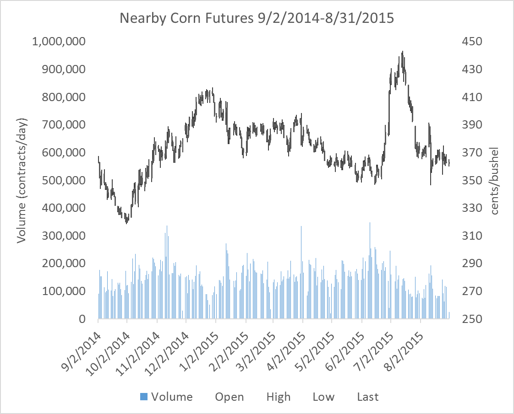
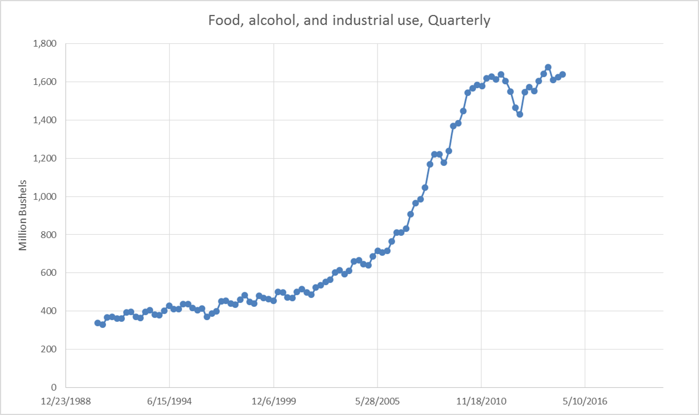
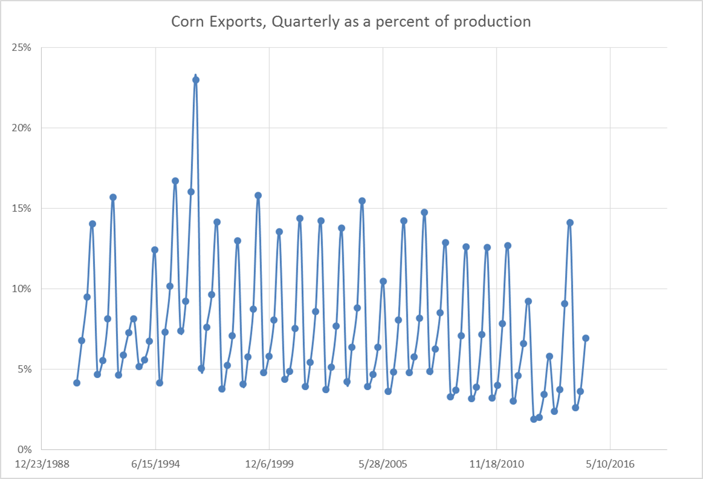
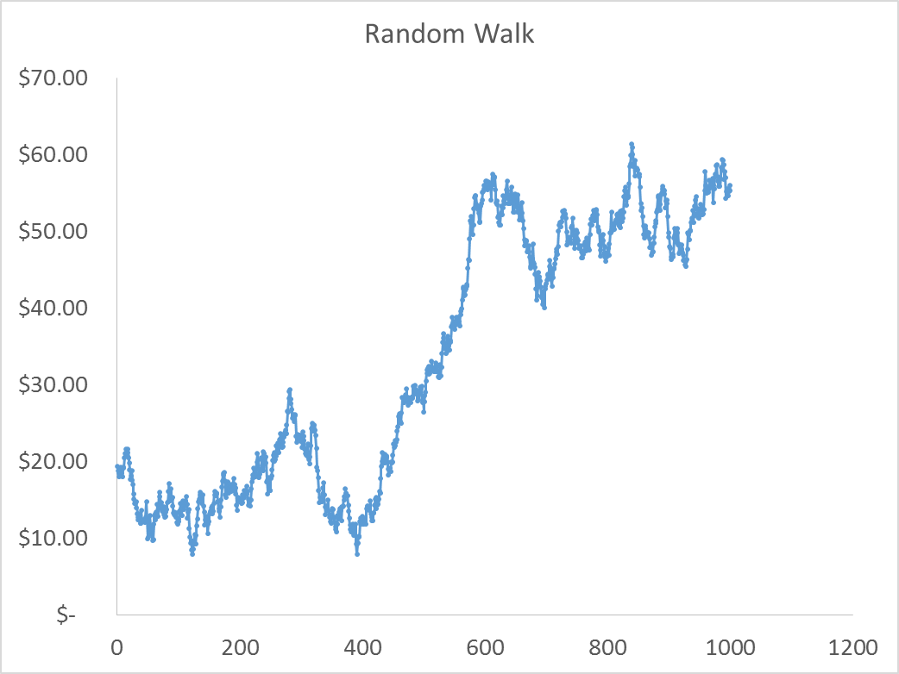
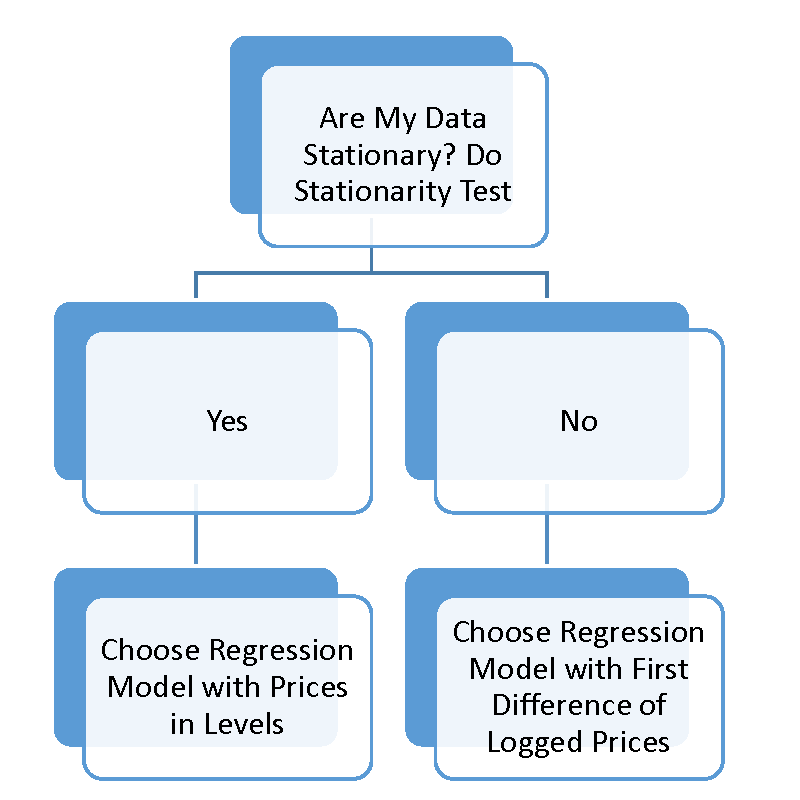

# Appendix: Forecasting with TS Models

Interested in more? Please let me know by [taking the survey](https://forms.gle/Q3VByCQZHjfQSy9D7)! 

<!-- Slightly more rigor and some econometric textbook citations are appropriate here.-->

This chapter marks a break in forecasting philosophy from the approach we have used in previous chapters. In previous chapters we were forecasting from a viewpoint that was very structural and focused on market fundamentals. We built tools and information sources to monitor supply and demand conditions in commodity markets in fairly great detail. We utilized publicly available information and research published by various branches of the USDA.

In this chapter, we will take a reduced-form econometric approach. The focus will be the utilization of basic time-series econometric models to examine and forecast commodity prices. In this chapter time-series-specific concepts are introduced: constructing a series of 'nearby' futures prices, periodicity of data realizations and forecast horizon, trends in data series, inflation and deflating data, seasonality, stationarity, and random walks.

## 'Nearby' Futures Prices

There is considerable interest in the analysis of local or 'spot' prices, but the vast majority of forecasting exercises in commodity markets are focused on forecasting futures prices. Futures markets are much more 'liquid' than local spot markets. A market's liquidity simply refers to the level of trading activity and ease or difficulty with which it is to find a trading partner. Since futures markets are liquid[^introductiontocommodityts-1] and futures contracts are standardized, futures markets attract a diverse set of hedgers, speculators, and liquidity providers.[^introductiontocommodityts-2] Therefore, we will focus on forecasting futures prices, although the techniques covered could be applied to spot prices as well.

[^introductiontocommodityts-1]: The successful futures contracts, anyhow, are liquid and actively traded. Exchanges periodically introduce new futures contracts that have a hard time gaining the interest of traders. Without an initial push of great interest a new futures contract will often fail; that is, fail to attract trading activity.

[^introductiontocommodityts-2]: Liquidity providers are traders whose business model is to place standing orders to buy (at a low price) and sell (at a high price) in the market at all times. They in turn earn a small profit equal to the spread between the two prices. This spread is called the Bid-Ask spread. If volume is high, these trading profits can be significant.

### Trading Volume as Contract Maturity Approaches

Futures contracts do not experience uniform trading volume over the lifetime of the contract. For example, corn futures are listed as available to trade two years before the maturity date, but the contract does not usually attract significant trading volume until it is has one year or less time to contract maturity. Figure 1 shows the December 2014 corn futures contract prices and volume from 10/3/2011 to the last day the contract traded, 12/12/2014.

Figure 1 shows that trading activity begins to ramp up in the months leading up to this contract's expiration. Until the contract is being actively traded, the quality of the information contained in these prices is suspect, since significant periods of time will pass with very few active transactions taking place. For this reason, a series of futures prices for one contract should not be used to conduct a forecasting analysis if the data used covers dates where the contract was not actively traded.

What is typically done is a series of 'nearby' contract prices is constructed by concatenating together the prices of futures contracts nearest to expire. This way, the data always represent contracts that are the most actively traded. For example, consider table 1. Here we see a short snippet of a nearby contract series (in Volume, Open, High, Low, Close format) for corn futures prices from 11/26/2014 to 12/3/2014. The last column of the table records which expiry futures contract the price and volume information represents. Prior to December 1st, the nearby contract is the December 2014 contract, as indicated in the last column. On December 1st, the nearby 'rolls over' to the next-to-expire contract, the March 2015 contract.

|    Date    | Volume | Open  |  High  |  Low   | Close | Contract |
|:----------:|:------:|:-----:|:------:|:------:|:-----:|:--------:|
| 11/26/2014 | 162748 |  374  | 378.75 | 373.75 |  378  |   CZ14   |
| 11/28/2014 | 28899  |  377  | 380.25 | 370.25 |  377  |   CZ14   |
| 12/1/2014  | 149495 |  386  | 391.5  |  383   | 389.5 |   CH15   |
| 12/2/2014  | 154056 |  389  |  391   | 380.75 | 380.5 |   CH15   |
| 12/3/2014  | 93153  | 381.5 | 382.5  | 377.25 | 380.5 |   CH15   |

: Table 1: Example of 'Rolling' the Nearby Contract to the Next-to-Expire

Rolling futures contracts in this way produces a series that always represents actively traded contracts, so the information content should be high.

### When to Roll to the Next-to-Expire?

One technical detail is when exactly should you roll to the next to expire contract? Notice in table 1, the series does not roll to the next to expire contract on the last day the CZ14 contract is traded. Corn futures mature on the 14th day of the month of expiration, or the first business day prior to the 14th if the 14th falls on a weekend or holiday.

Generally, contracts are rolled to the next to expire contract on the first day of the expiration month. As you can see in figure 1, once the 'delivery' or expiration month has been entered volume of trading in the contract quickly falls. This is partly because the corn futures contract is physically settled. If you hold a long position until expiration of the futures contract, you are obligated to buy 5,000 bushels of corn at the futures contract's settle price. And, in fact, the process of preparing for delivery begins the first day of the delivery month. Since most traders do not want to take delivery of 5,000 bushels of corn, they exit their positions in the nearby and roll the position to the next-to-expire if they still want to be long.

For the purposes of generating a series of nearby prices that are meaningful, using contract prices that are within the delivery month may represent transactions in a thin market, so it is best to roll the series at the end of the previous month. Figure 2 below shows the series of nearby futures prices, rolled at the end of the month prior to the expiration month.

Notice in particular that the scale for volume is the same in figures 1 and 2, and in figure 2 volume is strong throughout the series.

## Time-Series Forecasting

Given a time-series of prices that one would like to forecast, the analyst seeks to find a function, $f(.)$, that can take information known at date $t$ and predict the value of the price at date $t+1$. Various kinds of information is known at time $t$ and could be used in a forecasting function, but the most commonly used are time $t$ and earlier prices, time $t$ and earlier prices of substitute or complement commodities, variables directly relevant to the price of interest (like pace of production or consumption), interest rates, or other variables thought to be relevant. Of course, the analyst knows that even in the best case scenario, they will be producing forecasts with an error as shown in the equation below.

(1) $p_{t+1} = f(p_t, p_{t-1}, ..., z_t) + \epsilon_t$

In the equation, $z_t$ represents any variables the analyst believes might have forecasting power other than lags of the commodity's own price. The $\epsilon_t$ term represents the forecast error term. In practice, the function $f$ will be determined by estimating a regression model of $t+1$ prices on lagged prices and other important variables contained in $z_t$.

Using a regression approach requires that the future look somewhat like the past, in econometric terms, the error term must be stationary. This means $\epsilon_t$ must be represented well by a single probability distribution, for example normal with a constant mean and variance. The bulk of time-series analysis consists of verifying that your data is stationary so that this assumption holds, or performing transformations on your data so that the stationarity assumption holds for the transformed data. This concept may seem abstract now, but the coming chapters and exercises will reinforce this point over and over again.

## Properties of Time-Series Data

Some properties of commodity prices occur frequently: trends, seasonality, and stationarity.

### Trends

A lot of time series data will exhibit clear trends. The Food, Alcohol, and Industrial Use category from the corn balance sheet comes to mind.

This series is clearly not stationary, a clear upward trend guarantees that the conditional mean of a subsample from early in the time-series is lower than the conditional mean of a subsample from later in the series. The trend can be easily removed, or 'detrended' and therefore forecast fairly easily well with a simple linear trend, log trend, or exponential trend model.

### Inflation

In any long series of prices, inflation can be a concern. Inflation is the phenomenon that explains why \$20 today will not buy as much as \$20 thirty years ago. Inflation is a special kind of trend that is dealt with by 'deflating' the price series by an inflation index. Figure 4 from the Dallas Federal Reserve Bank shows three price indices growing over time.

Source: [Dallas Federal Reserve Bank](http://www.dallasfed.org/research/basics/nominal.cfm)

If your analysis involves any kind of comparison of prices or price changes across long spans of time, a price deflator should be used to put values at different dates into comparable real terms. The [Consumer Price Index](http://www.bls.gov/cpi/data.htm) and the [Producer Price Index](http://www.bls.gov/ppi/data.htm) can be downloaded from the Bureau of Labor Statistics.

(2) $Real Value = \frac{Nominal Value}{Price Index}$

### Seasonality

Some variables have a natural pattern through time. Often data pertaining to production or consumption will exhibit predictable seasonal patterns. We saw this with quarterly exports of corn for example.

The seasonal pattern ensures that the conditional mean and variance of this variable is not constant through time. Seasonality is fairly easy to address in a regression model, and we will see some popular methods for removing the predictable seasonal component so that the resultant series is stationary.

## Stationarity

Price series often seem to follow a random walk. That is, the price at $t+1$ appears to be a random deviation from the price at time $t$. More formally,

(3) $p_{t+1} = p_{t} + \epsilon_t$

Using Excel's random number generator I drew 1,000 draws from a Standard Normal distribution and simulated a series of prices with the equation above and assuming a $p_0$ of \$20.00. The random draws and the simulated price path are shown in figure 6 and 7.

If this is a reasonable model for how prices evolve, it will be a problem to estimate a regression model where we regress current prices on past prices. The random walk equation clearly shows that the distribution of $\epsilon_t$ depends on the current price, which is not constant over time. The simulated price series in figure 6 is definitely not stationary.

However, it is clear that the first difference of prices from the random walk equation above is stationary. The error term is just draws from the standard normal distribution in this case (Shown in figure 7).

(4) $p_{t+1} - p_{t} = \epsilon_t$

Figure 7 motivates the most common 'fix' when price data appear to be non-stationary. Taking the first difference of prices often will yield a series that is stationary.

The only problem with the random walk model in terms of understanding stationarity of prices is that there is nothing preventing the random walk model from producing negative prices. Since negative prices are, generally, impossible, the standard random walk model does not work very well for prices. A simple modification will solve this problem, however.

### The Log-normal Price Model.

If we modify the random walk model as follows, we guarantee a model that will produce non-negative prices.

(5) $\ln{p_{t+1}} = \ln{p_{t}} + \epsilon_t$

This is true because, if we wanted to recover the price level from this model we need to exponentiate both sides.

(6) $e^{(\ln{p_{t+1}})} = e^{(\ln{p_{t}} + \epsilon_t)}$

             $p_{t+1} = e^{(\ln{p_{t}} + \epsilon_t)}$

Since the exponential function cannot take on a negative value, this model cannot produce negative prices.

The figure 8 and 9 show 1,000 random draws from a normal distribution $\epsilon_t ~ N(0, .02)$, and the simulated price distribution that results from the log-normal price model and those random draws.

As was the case with the random walk model, the first difference of the log of prices is stationary. This means that if we specify a regression forecasting model and we believe the prices we wish to forecast are log-normally distributed then we will use log differences of our prices. In the coming chapters we will discuss how to formally test whether prices are stationary in levels or differences.

The log-normal price model can be expressed in difference form as

(7) $\ln{p_{t+1}} - \ln{p_{t}} = \epsilon_t$

It turns out that the log-difference of price is approximately equal to the percent change in price, especially for small changes. Percent changes of $p_{t+1}$ versus $p_t$ are also the returns one would get from holding a long position in the asset or commodity from time $t$ to time $t+1$, and the log-normal price model says that returns are normally distributed. If this is true, forecasting is an impossible job; price returns are an unpredictable random draw from a normal distribution.

In figure 10 the log-differences of the nearby corn futures price series (shown in figure 2) are plotted. Just visually, it seems a difficult task to anticipate what the next day's return will be in the context of trying to decide whether to buy or sell, for example.

## Time Series Econometrics Technical Details

It turns out that if data are non-stationary and you try to run a typical OLS regression with the data in levels, the regression will be what is call *Super Consistent*. Practically, this means no matter what you put on the left hand side and right hand side of the regression, everything will appear statistically significant with a regular t-test. The relationships however, may just be spurious and not meaningful.

In time series econometrics the first thing you have to do is understand whether or not your data are stationary or not. Data that are non-stationary are said to have a *unit root*. Data is typically tested for stationarity versus unit root with an Augmented Dickey Fuller test (or one of several other unit root tests).

For a deeper discussion of how to implement these tests, please see [Primer for Time Series Econometrics in R](http://mindymallory.com/R-Companion-Price-Analysis/) chapter 4.

If your time series data are non-stationary (have a unit root), then typically taking the first difference of logged prices (as shown in equation 7) will result in a stationary time series. This means transforming your data to percent returns (thats the same thing as first difference of logged prices) usually produces a stationary time series on which you can safely run typical regressions.

In sum, the beginning of any time series data analysis consists of the following workflow.

## Efficient Market Hypothesis

The Efficient Market Hypothesis (EMH) states that all the information available regarding an asset is incorporated into its price [@fama1970]. If the EMH were true, forecasting would be a hopeless endeavor because one could never use current and past information to predict future prices - as in the Log-normal price model. There is a large debate about the whether or not this hypothesis is true, or how and when it deviates from being true.

While a large literature in finance argues that it is not strictly true, markets are 'close to efficient' most of the time. I say this because making a forecast that one can actually profitably trade with is difficult. We will explore several forecasting models in the subsequent chapters, and we will find it difficult to find a forecasting model were our 95% confidence interval around our forecast of percent return does not contain 0.0%. If one cannot produce a forecasting model that does that, your model is not giving a clear 'buy' or 'sell' signal.

The Efficient Market Hypothesis is related to the concept of stationarity because the Efficient Market Hypothesis states that futures returns are not predictable. Anything information useful for forecasting would have been discovered by someone, and arbitraged away. In other words, if you have information that makes you sure the price of an asset or commodity will go up, then you will buy it until the price goes up so that there is no discrepency between what the price 'should be' and what the price is. Because there is a strong financial incentive to arbitrage away any of these kind of discrepancies, even if markets are temporarily inefficient, traders will correct the inefficiency by pushing the price up or down.

## Exercises

1.  Download the corn futures contracts CZ2014, CH2015, CK2015, CN2015, and CU2015. Replicate the series of nearby contracts depicted in figure 2 by concatenating prices of the appropriate dates for each contract. As a Check, replicate figure 2.

"Deflating Nominal Values to Real Values" Federal Reserve Bank of Dallas. <http://www.dallasfed.org/research/basics/nominal.cfm>
