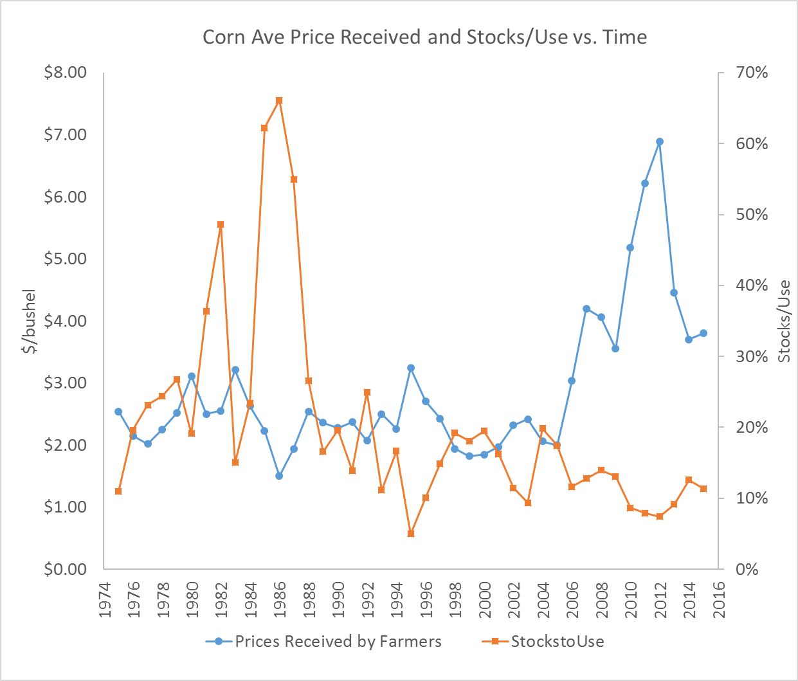
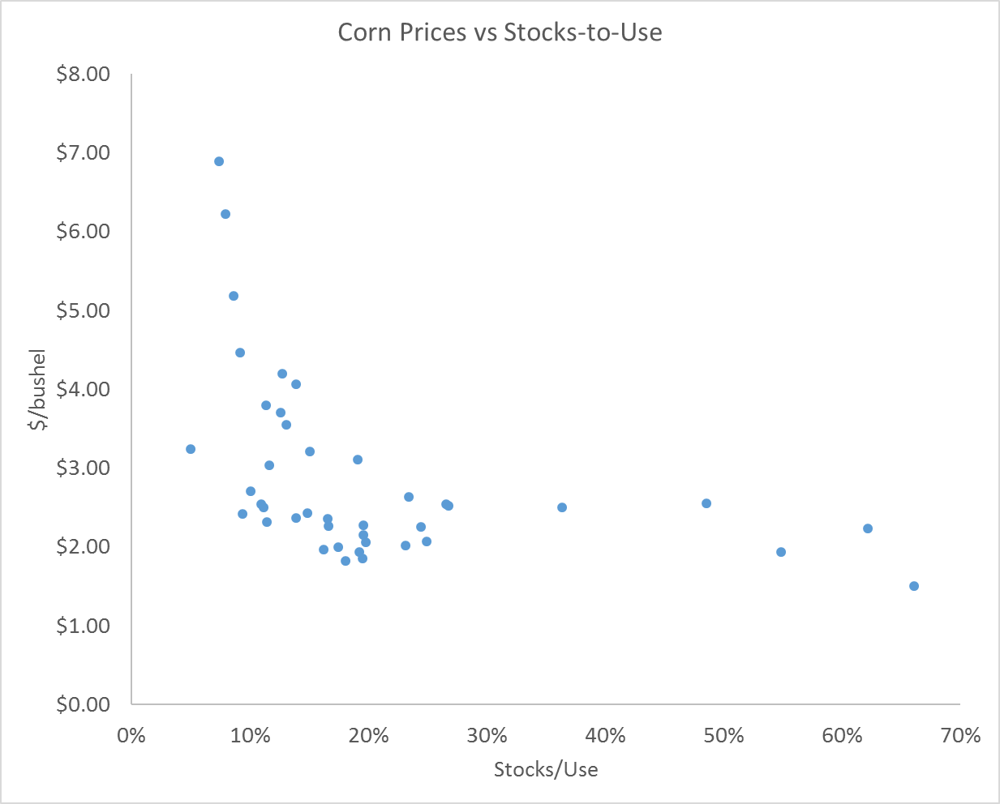
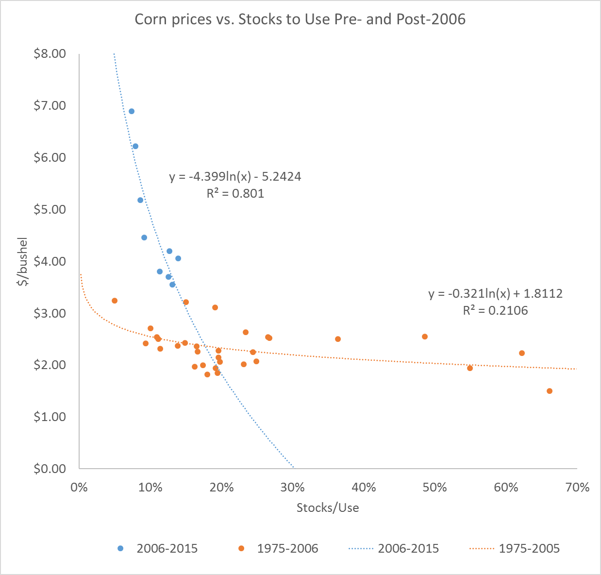

#  Ending Stocks and Generating a Price Forecast from the Balance Sheet

Over the course of the last several chapters we have covered each category of supply and use. In tables 1 and 2 below, that literally means we covered how to forecast the numbers in each row of the USDA WASDE balance sheet. Subtracting total use from total supply gives an estimate of marketing year ending stocks. For example, in table 1, 

$Supply, Total - Use, Total = 16,909 - 14,500 = 2,409 (Million bushels) = Ending Stocks;$


: Table 1. September 2016 USDA WASDE Balance Sheet for Corn

```{r, echo=FALSE, warning=FALSE}
library(Kmisc)
library(knitr)
aug15wasdec <- read.csv('Excel-files/FundamentalAnalysisand-aug15wasdec.csv')
kable(aug15wasdec, align = 'l', col.names = c("Corn", "Marketing Year 2014/2015", "Marketing Year 2015/2016 Est.", "Marketing Year 2016/2017 July Projection", "Marketing Year 2016/2017 August Projection"))

```

and 

# Soybeans 

: Table 2. September 2016 USDA WASDE Balance Sheet for Soybeans

```{r, echo=FALSE, warning=FALSE}
library(Kmisc)
library(knitr)
aug15wasdes <- read.csv('Excel-files/FundamentalAnalysisand-aug15wasdes.csv')
kable(aug15wasdes, align = 'l', col.names = c("Soybeans", "Marketing Year 2014/2015", "Marketing Year 2015/2016 Est.", "Marketing Year 2016/2017 July Projection", "Marketing Year 2016/2017 August Projection"))

```

in table 2[^adding]

$$Supply, Total - Use, Total = 4,426 - 4,061 = 365 (Million bushels) = Ending Stocks$$

[^adding]: Recall that WASDE balance sheets do not always add perfectly due to rounding.  


# Introduction

- However, this still leaves a lot to be desired because the most compelling reason to keep a detailed balance sheet and forecast future supply and use is to come up with a reasonable expectation for price. 
- After all our work on forecasting the components of the balance sheet, we have not made much headway in that regard. 
- In this chapter, we cover one approach for taking a forecast of ending stocks and translating that into a forecast of price. 

# Using Forecast of Ending Stocks to Forecast Price

- Arriving at an estimate of ending stocks gives one a sense of the degree of scarcity (or lack-thereof) in the market. 
- It is still difficult to infer the marketing year average price from that, because the prevailing price that should coincide with the forecasted ending stocks is a function of the elasticities of demand for different use categories. 
- These can be difficult to estimate, and we are not guaranteed that elasticity is constant from one year to the next. 

# Using Forecast of Ending Stocks to Forecast Price

Figure 1 below is reproduced from the farmDoc Daily (fdd) article by Good and Irwin, "The Relationship between Stocks-to-Use and Corn Prices Revisited"


Source: [FarmDoc Daily](http://farmdocdaily.illinois.edu/2015/04/relationship-stock-to-use-and-corn-prices.html)

# Using Forecast of Ending Stocks to Forecast Price

- Structural Supply, Demand, and Stocks models

[Price Determination for Corn and Wheat: The Role of Market Factors and Government Programs](http://www.ers.usda.gov/media/1761745/tb1878.pdf)

> ### Quote from Westcott and Hoffman
> The relatively simple structure of the estimated price models and their small data requirements lend themselves to use in price-forecasting applications in conjunction with market analysis of supply and demand conditions. In particular, the models are used within USDA as part of the Department’s short-term market analysis and long-term baseline projections activities. In these applications, the models provide an analytical framework for forecasting prices, as well as a vehicle for making consistency checks among supply, demand, and price forecasts.
>

# Using Forecast of Ending Stocks to Forecast Price

- Since the supply curve shifts from year-to-year and the demand curve shifts from year-to-year due to a myriad of factors, one cannot count on estimating a single supply or demand curve from a series of price and quantity pairs. 
    - Need exogenous shifters of supply to estimate demand, and need exogenous shifters of demand to estimate supply


Source: [FarmDoc Daily](http://farmdocdaily.illinois.edu/2015/04/relationship-stock-to-use-and-corn-prices.html)

# Using Forecast of Ending Stocks to Forecast Price

- However, once we have entered a marketing year; i.e., we have harvested the domestic supply in the balance sheet, we can count of total supply being quite inelastic. 
- We can be confident of this because imports are historically a very small part of domestic total supply for corn, and after the domestic harvest, imports would be the only way to shift the supply curve. 
- Further, if one had some confidence that the demand curve was more or less constant through time, a time-series of prices and exogenously varying quantities would approximately trace out the demand curve.
    - (on board)


# A Closer Look at the Data

- This section continues to draw heavily on the Good and Irwin fdd article referenced above. 
- First let us take a look at the average price received for corn over time and the stocks-to-use of corn over time in figure 2. 
- These data can both be obtained from the [USDA NASS Quick Stats](http://www.nass.usda.gov/Statistics_by_Subject/?sector=CROPS) database, 
    - although you have to download the *stocks* and *use* separately and create your own stocks-use-variable. 

# A Closer Look at the Data
- Wescott and Hoffman argue that we do not need to estimate a supply or demand curve, in equilibrium we should be able to estimate the relationship between price and stocks to use. 



# A Closer Look at the Data

- Perhaps the first thing that one notices in this figure is the pronounced stocks-to-use spikes that occurred in the 1982/1983 and 1985/1986, 1986/1987, 1987/1988 marketing years. 
- Those exceptionally high stocks relative to use was a result of government commodity programs designed to keep prices from falling too far. 
- Specifically, the stocks were help primarily in the Farmer-Owned-Reserve or by the Commodity Credit Corporation. 
- Both programs were designed to keep bushels off the market and thus buoying prices. 
- During periods of prolonged excesses, however, it becomes very costly for the government to procure and store large quantities of the commodity and it has a continuing depressing effect on market prices because the market knows the government holds large stockpiles. 
- Farm legislation ('The Farm Bill' is re-negotiated every four years by congress) has trended toward more market-oriented approaches to supporting agriculture, and one can observe a marked decline in stocks-to-use over time. 

# A Closer Look at the Data

- Aside from the the wild swings in the 1980's, the series still seem to show a negative relationship between stocks-to-use and prices, as one would expect. Figure 3 graphs these two series as a scatter-plot with stocks-to-use on the x-axis. 


# A Closer Look at the Data
- A clear negative relationship emerges, but the relationship when stocks are less than 20% of use is less clear. To help clarify, figure 4 highlights years before and after 2006. 


# A Closer Look at the Data



- Highlighting the data and pre- or post-2006[^post2006] clearly shows a wide range of prices over a relatively narrow range of stocks-to-use realizations. 
- Given that 2006 is the beginning of the ramp-up in ethanol production, this should not be surprising. 
- Suddenly there was a large and very inelastic demander of corn in the market. 
- This ensured supply would have to be rationed by price to keep stocks from falling to low levels. 

[^post2006]: The year 2006 here is assumed to be a transtion year and dropped from the figure. In 2006, stock-to-use was 11.63% and average price was $3.04. Examining this data-point on Figure 4 suggests 2006 does not fit either regime well. 

# A Closer Look at the Data


- Also in figure 4 trendlines are fitted for the two subsets of the data. 
- Since both scatterplots appear to display a curvature, the price data are regressed on the log of the stocks-to-use data. 
- Also, this specification provided the highest $R^2$ of the regression specifications available in the defalt Excel options. 
- The regression in the post-2006 period explains 80% of the variaiton in the price data, which suggests it is a reasonable starting point for forecasting price using ending stocks and the balance sheet approach.   


# References

Good, D., and S. Irwin. "[The Relationship between Stocks-to-Use and Corn Prices Revisited](http://farmdocdaily.illinois.edu/2015/04/relationship-stock-to-use-and-corn-prices.html)." farmdoc daily (5):65, Department of Agricultural and Consumer Economics, University of Illinois at Urbana-Champaign, April 9, 2015.


