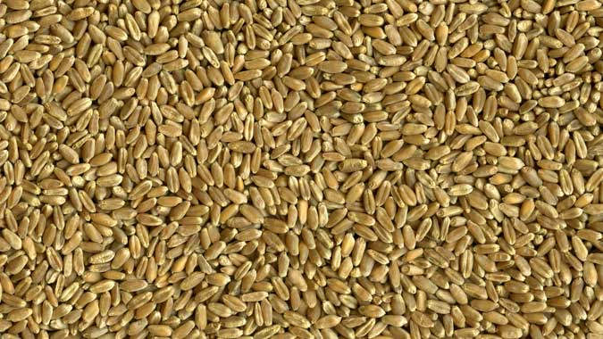
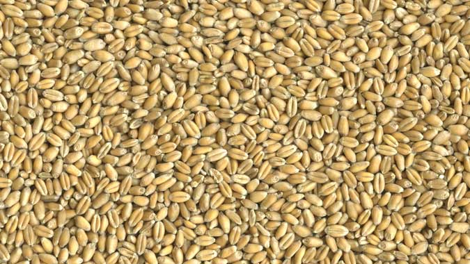

# [Return to Book Homepage](http://mindymallory.github.io/PriceAnalysis/)

# Introduction 

Since commodities are natural things that are subject to biological processes, you must first understand the basic biological processes involved in the commodity's production in order to understand and anticipate what happens to it's price. This chapter introduces the basic production processes and timeline for major grains and oilseeds: Corn, Soybeans, Hard Red Winter Wheat (KC wheat), Hard Red Spring Wheat (Minneapolis wheat), and Soft Red Winter Wheat. 

# Corn

What's the difference between Sweet Corn one buys from the grocery store and field corn (the focus of much of this course)?

Sweet corn has been bred so that the kernals contain a high sugar content. It is harvested green (as you probably knew), and must be consumed quickly, or processed by canning or freezing within a few hours. After a few hours, the sugars in the kernals begin to turn to starch.

Since sweet corn is harvested green and deteriorates rapidly, harvest must take place quickly from start to finish.

[Sweet Corn Harvest](https://www.youtube.com/watch?v=4WEYDx82fG8)

 
# Field Corn

In the Corn Belt corn is planted from about March to May, and harvested from September to October. Pollination usually occurs in July. Since pollination is key to production and yield, new crop futures prices tend to be highly variable in the months of June and July as weather patterns and realizations of heat and rainfall mean the difference between a high yielding year and low yielding year. 

Of lesser concern, but still followed by market participants is the weather during planting and harvest. Sometimes it is too wet, making it difficult to get acreage planted in a timely manner. If corn is planted too late it may suffer a yield penalty. Also, weather during harvest can impact prices. If harvest time is very wet, it can make it difficult to get the crop out and dry before it is damaged. 

[Field Corn Harvest](https://www.youtube.com/watch?v=zuGVeXqTIaM)

## Recent Trends in Acreage, Yields, Production, and Use

Corn planted acres in the U.S. has varied from just under to just over 90 million acres in recent years. Farmers in the corn belt decide how much of their land to plant to corn and how much to plant to soybeans. So sometimes it is said in the spring that corn and soybeans are 'competing for acres' based on the relative new crop futures prices of corn and soybeans. If corn is more profitable, farmers will shift some acres toward corn, and if soybeans are more profitable farmers will shift some acres toward soybeans. Because of this, years with high corn planted acres tend to have lower soybeans planted acres and vice versa.

Seed hybrids and genetic modification have lead to dramatic increases in yield over the last 100 years. Although, corn planted acres have been relatively flat for a very long time, production has skyrocketed. 

The following figures [come from](http://www.ers.usda.gov/topics/crops/corn/background.aspx) the USDA's Economic Research Service (ERS). 

Corn prices can be quite volatile, with prices and production highly inversely related to one another. 

Corn is used in the U.S for a variety of purposes. Largest use categories are feed (for livestock), and alcohol for fuel use (ethanol blended with gasoline). 

Corn is a global commodity, and the U.S. is the worlds largest producer and exporter of corn. 

# Soybeans

Soybeans are planted later than corn, from about April to June. Weather affects soybean production prospects and generates similar price responses as it does for corn. Soybean prices, therefore are highly dependent on what happens during the summer months. The following figures [come from](http://www.ers.usda.gov/topics/crops/soybeans-oil-crops/background.aspx) the USDS ERS.

## Recent Trends in Acreage, Yield, Production, and Use

Soybeans did not begin to be commercially grown in the U.S. until the mid 20th century, but once it was introduced, acreage expanded rapidly. Soybeans have also benefited from improved yields due to biotechnology. 

Soybeans consumed in the U.S. are almost exclusively processed into soybean meal and soybean oil, a process referred to as 'crushing'. Soybean meal is high in protein and used as an ingredient in livestock feed. Soybean oil is used for a variety of things, but the bulk of it is consumed as edible oil. 

About half of the soybeans produced in the U.S. are exported, and more than half of soybeans exported are [imported by China](http://farmdocdaily.illinois.edu/2015/03/footprint-of-chinese-demand-for-us-soybeans.html). 

# Wheat 

There are three main types of wheat grown in the U.S. Hard Red Winter Wheat (HRW/KC Wheat), Hard Red Spring Wheat (HRS/Minneapolis wheat), and Soft Red Winter Wheat (SRW/Chicago Wheat). Each of these types of wheat have its own futures contract, are grown in distinct regions of the country, and have different end uses. The main distinction between the types of wheat is how much protein is contained in the kernels. This variation in protein also determines what the variety of wheat is ultimately used for. 

(Source [USDA-ERS](https://wayback.archive-it.org/5923/20120310141642/http://ers.usda.gov/Briefing/Wheat/maps.htm))

Blue = HRW  
Gold = HRS  
Red  = SRW  

## Hard Red Winter Wheat 

HRW wheat is planted in the fall and lays dormant or grows very little during the winter. As temperatures rise in the spring, wheat plants start to grow. It looks like grass before it is mature. During April and May the wheat plants make 'heads' where the wheat kernels grow. When the plants die the grain is harvested. 

HRW wheat is primarily used to make bread flour.

Hard Red Winter Wheat is sometime called Kansas City Wheat because the Kansas City Board of Trade had a HRW wheat futures contract. The KCBOT was recently bought by the CME Group, but HRW continues to be known as KC wheat.  

  

(Source [USDA-GIPSA](https://www.gipsa.usda.gov/fgis/commgallery/gr_hrw.aspx))

## Hard Red Spring Wheat

Hard red spring wheat is planted in the spring, around April or May and is harvested in the fall, around September. It has the highest protein content (13-16%) of all the major wheat varieties, making it high in gluten content, which is good for baking bread. It also is used to blend with lower protein wheat flour varieties to increase the protein content. 

HRS wheat is referred to as Minneapolis Wheat because the [Minneapolis Grain Exchange](http://www.mgex.com/) offers a futures contract in HRS wheat.

(Source [USDA-GIPSA](https://www.gipsa.usda.gov/fgis/commgallery/gr_hrs.aspx))

## Soft Red Winter Wheat
 
Soft Red Winter Wheat is planted in the fall, and is harvested in the late spring, like HRW wheat. Soft red winter wheat is lower in protein which makes is suitable for use in cakes, cookies, and crackers, where high gluten content is not required. 

SRW wheat is referred to as Chicago Wheat because the Chicago Board of Trade offers a futures contract for SRW wheat. 

(Source [USDA-GIPSA](https://www.gipsa.usda.gov/fgis/commgallery/gr_srw.aspx))

# Protein Premiums and Wheat Spreads

If you follow wheat markets for long, you will hear discussion of 'protein premiums', that is because flour millers rarely use just one kind of wheat to make their flour. They blend different types of wheat together to make flours of varying protein and gluten levels. 

Different varieties of wheat naturally have different protein levels, as mentioned above. However, there is also a link between yield and protein levels. When yields are high, wheat protein is lower. This means during years where lower protein winter wheat has good yields, there is plenty of wheat, but not neccessarily enough protein. This causes the price of higher protein wheat, like spring wheat, to rise against the price of winter wheat. If winter wheat crops are smaller around the world, the protein content is higher, and spring wheat may not enjoy a large premium agianst winter wheat. 

Because of this dynamic, the relative prices of Minneapolis, Kansas City, and Chicago wheat futures are closely followed by stakeholders in any of the wheat markets. 

