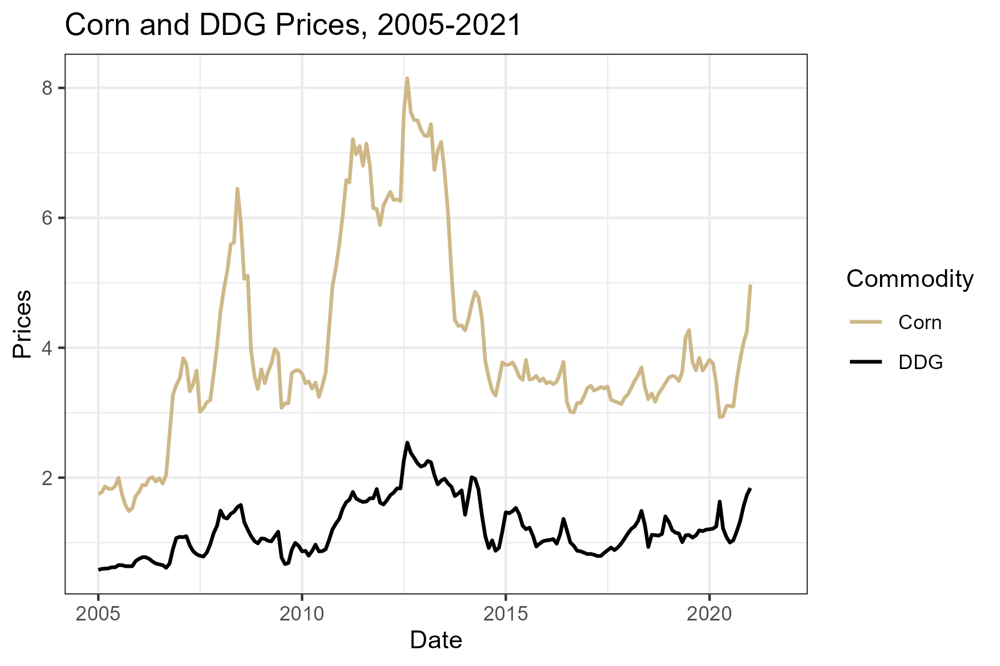
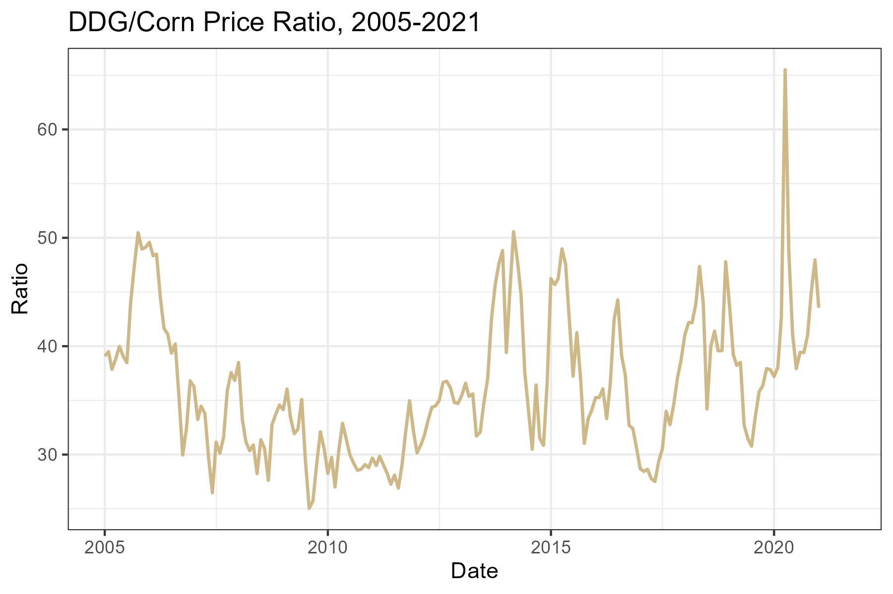
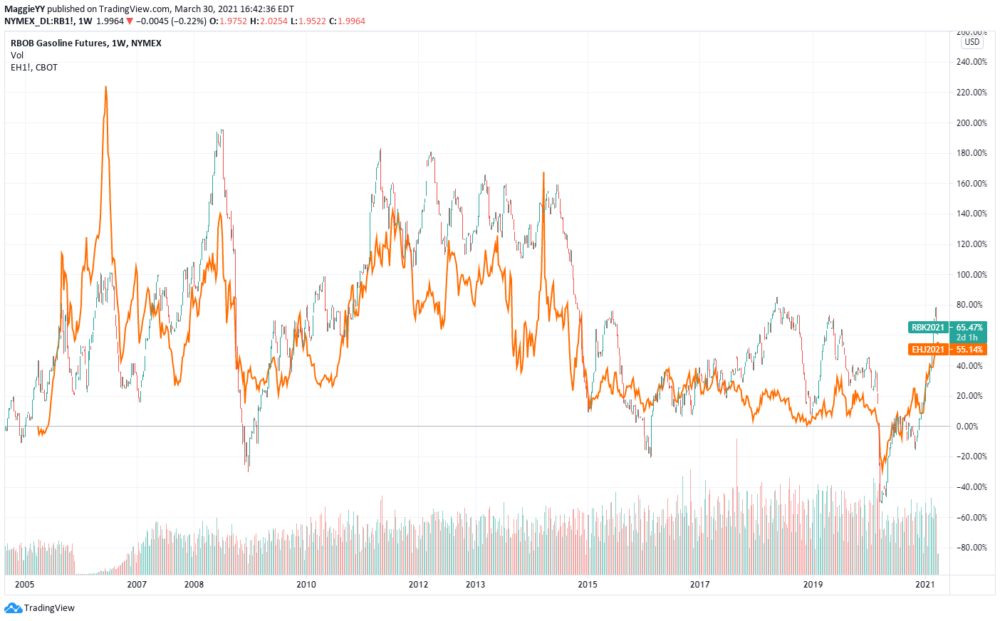
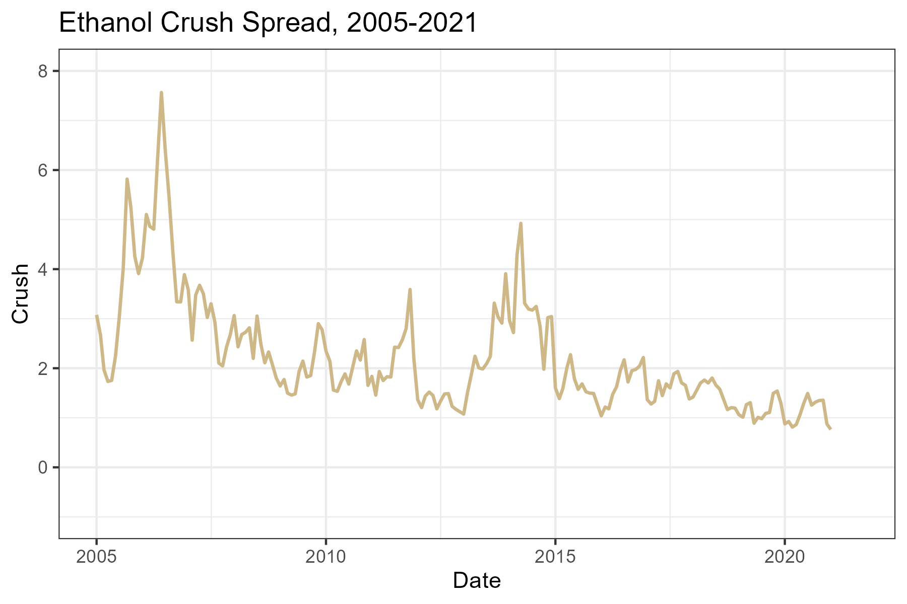

# Ethanol 

Ethanol production and consumption begin to increase rapidly around 2005, which is when the Energy Policy Act of 2005 and later the Energy Security and Independence Act of 2007 created the Renewable Fuels Standard (RFS). The RFS mandated quantities of ethanol that blenders of gasoline are required to blend into the retail gasoline supply. These annual mandates are revised every year, but they were designed to steadily increase year after year until 2015 when the mandate reached 15 billion gallons per year. This figure came about because gasoline consumption in the United States was forecast to reach 150 billion gallons per year by 2015. So the RFS mandates were designed to reach the point where the entire retail gasoline supply would include 10% ethanol. 

The EPA released [proposed rules](https://www.epa.gov/renewable-fuel-standard-program/proposed-renewable-fuel-standards-2017-and-biomass-based-diesel) regarding RFS for volume requirements of biofuels for 2014, 2015, 2016, and 2017 on May 31, 2016. 

|                                         | 	2014 |	2015	|  2016  |  2017    | % Reduction in Greenhouse Gas Emissions |
|:----------------------------------------|:------:|:------:|:------:|:--------:| :--------:|
| Cellulosic biofuel (million gallons)   	|  33    |  	123 |  	230	 |   312    | > 60%     |
| Biomass-based diesel (billion gallons)  | 1.63   | 	1.73  | 	1.90 |	2.00    | > 50%     |
| Advanced biofuel (billion gallons)      | 	2.67 | 2.88	  |  3.61  |  4.0     | > 50%     |
| Total Renewable fuel (billion gallons)      	| 16.28  |	16.93 |	18.11  | 	18.8  | > 20%  |

: Table 1: Renewable Fuel Mandated Volumes for 2014, 2015, 2016, and 2017 

: Table 1: Renewable Fuel Mandated Volumes for 2014, 2015, 2016, and 2017 

Note: Units for all volumes are ethanol-equivalent, except for biomass-based diesel volumes which are expressed as physical gallons.|

Advanced biofuel is defined as fuel made from renewable sources that provides greater than 50% reduction in greenhouse gas emissions than the renewable fuel they replace. Cellulosic biofuel and biomass-based diesel are considered advanced biofuels, so the cellulosic and biomass-based diesel requirements comprise 2.13 billion gallons of the 3.61 billion gallon advanced biofuel requirement. This leaves 1.48 billion billion gallons in undifferentiated advanced biofuel in the mandate. This will most likely be fulfilled by importing sugarcane-based ethanol from Brazil, since the greenhouse gas emission reductions for sugarcane-based ethanol is accepted as an advanced biofuel and considered to have greater than 50% reduction in greenhouse gas emissions. 

Since ethanol production is a significant user of corn, and has important price impacts, it is useful to calculate the implied corn usage under the RFS mandates. First, with an 18.11 billion gallon total renewable fuel requirement, and a 3.61 advanced biofuel requirement, that leaves $18.11 - 3.61 = 14.5$ billion gallons of the total renewable fuel requirement than can be met with conventional biofuel, like corn-based ethanol. Assuming an ethanol plant yields 2.8 gallons of ethanol per bushel of corn, that is an implied usage mandate of 5.17 billion bushels corn. This is spot on with the November 2015 WASDE's estimate of Ethanol usage for the 2015/2016 marketing year of 5.175 billion bushels. 

In the sections that follow the basic ethanol production process is presented. We discuss the by-product of ethanol production, distillers dried grains (DDGs), and its importance to the livestock industry. Then we will discuss some important price relationships involving ethanol, including the ethanol-RBOB gasoline price relationship, and the ethanol-corn-natural gas-DDGs price relationship. 

## Ethanol Production

Ethanol production[^wikiinfo] takes place at biorefineries [all across the country](http://www.ethanolrfa.org/resources/biorefinery-locations/), but production is concentrated in the corn belt. Ethanol plants take advantage of the plentiful supplies of corn and the relatively favorable basis in the corn belt. Some plants are located close to major livestock feeding operations. If you click the source link for the map below and zoom in to look more closely at Kansas you will see a few ethanol plants located in the vicinity of the cattle feedlots we explored in an earlier chapter.  

[^wikiinfo]: The information about ethanol production predominately comes from the [corn ethanol](https://en.wikipedia.org/wiki/Corn_ethanol) Wikipedia page. 

Source: [Renewable Fuels Association](http://www.ethanolrfa.org/resources/biorefinery-locations/)

Corn-based ethanol can be produced via two methods. Dry grind, and wet grind. 

### Dry Grind Ethanol Production

In dry grind ethanol production, the entire kernel of corn is ground into a meal and mixed with water to create a slurry. Then enzymes are added to convert the starches in the slurry to simple sugar. Ammonia and yeast are added, and the yeast ferments the slurry and converts the slurry into ethanol and carbon dioxide. The ethanol is dehydrated to 200 proof and then a little gasoline is added to make the product undrinkable. 

What is left over after the sugars have been converted to ethanol is called stillage. This product is dehydrated and sold as livestock feed called DDGs. The drying process usually is implemented with natural gas fueled furnaces, so natural gas is a significant input expense for dry grind ethanol plants. So dry-grind ethanol production involves two revenue streams, ethanol and Dd Gs. More on the economics of Dd Gs in the section that follows.  

"<a href="https://commons.wikimedia.org/wiki/File:Ethanol_plant.jpg#/media/File:Ethanol_plant.jpg">Ethanol plant</a>". Licensed under Public Domain via <a href="//commons.wikimedia.org/wiki/">Wikimedia Commons</a>.

Follow the link to a Google Maps satellite view of [Lincolnway Energy LLC, Ames, IA](https://www.google.com/maps/place/Lincolnway+Energy+LLC/@42.0259566,-93.5094383,1084m/data=!3m1!1e3!4m2!3m1!1s0x0000000000000000:0xe75269d9c81692ab!6m1!1e1). Note the location. The ethanol plant is located directly next to Key Cooperative, and both have access to a rail-head. 

### Wet Grind Ethanol Production

Unlike dry grind ethanol production, in the wet grind process whole corn kernels are steeped in a combination of sulfuric acid and water to separate the kernel into its components: pericarp (or skin), the endosperm (which contains the starch), and germ (which contains the oil). Pre-processing the corn in this way allows fermentation to be done on the starchy part alone, and corn oil and corn bran (from the pericarp) can be extracted separately. The wet-grind ethanol production involves three revenue streams, ethanol, corn oil, and corn bran. 

Wet grind ethanol production is more costly than dry grind, so the majority of corn-based ethanol production capacity is of the dry grind type. 

## Distiller's Grains

DDGs are a by product of the dry grind ethanol production process that is valuable as a livestock feed. DDGs have about 26% protein, 8% fat, and significant metabolizable energy (kcals), so it can be used to replace both energy (typically corn) and protein (soybean meal or other) requirements in feed rations. 

[Images of DDGs](https://www.google.com/search?q=ddgs&source=lnms&tbm=isch&sa=X&ved=0ahUKEwj4udmomr7JAhWF2B4KHailApcQ_AUICCgC&biw=1920&bih=1031#)

### DDG Prices

DDG prices tend to follow the trend of corn prices, although not perfectly because the two are not perfect substitutes. In figure 3, DDG and corn prices are compared using monthly U.S. average price received by farmers for corn (cents per bushel) and the average wholesale bulk price for Central IL ($/ton). We put corn prices in cents per bushel so the units are comparable on one axis. 

It is also informative to look at the price ratio of DDG and corn prices. This is displayed in figure 4. 

The price ratio is fairly variable, but appears to follow a stationary and possibly mean reverting pattern. DDG prices seem to range from 30% to 50% of corn prices. 

## Ethanol Prices

Since ethanol is used as a liquid motor fuel, it makes sense that demand follows the same general trend that other energy products like crude oil and gasoline. This intuition is complicated, however, by the fact that ethanol is both a substitute and a compliment for gasoline. Blending ethanol at 10% with retail gasoline displaces, or substitutes for some quantity of gasoline. Also E85, 85% blend of gasoline, clearly substitutes for gasoline, although the size of the E85 market is small relative to the size of the retail gasoline market. 

Ethanol is also a compliment with gasoline because it acts as an oxygenate. Oxygenates are added to retail gasoline to reduce carbon monoxide emissions and soot.  By blending ethanol into retail gasoline blenders do not have to add other costly oxygenates derived from fossil fuels, such as MTBE (which is outlawed in California and New York among others) or [others](https://en.wikipedia.org/wiki/Oxygenate).

## Ethanol and Gas Prices

That said, it is difficult to anticipate whether Ethanol prices will exhibit a relationship consistent with a substitute or consistent with a complement good. In figure 5, ethanol and RBOB gasoline prices are graphed together for comparison. 

It appears that ethanol and Los Angelos spot RBOB have a positive relationship consistent with substitute goods, but ethanol prices are usually discounted relative to gasoline prices. Geographical differences in transport costs likely explain part of this, but also, a gallon of ethanol has about 75% of the energy content of a gallon of gasoline. So gasoline with ethanol blended into it will yield fewer miles per gallon. This is particularly true for E85. 

## Ethanol Crush Spread

The price relationship between ethanol, its coproduct DDGs and its inputs, corn and natural gas, is also closely followed by the industry. Since we have recently ended a period of rapid expansion in the ethanol industry, 'blending margins' or the profitability of a typical ethanol plant were closely monitored to gauge how fast or slow we might expect future expansion. Although expansion has slowed, industry participants still follow the margin closely to determine the health of the industry and whether we can expect any idling of capacity or expansion. 

Iowa State University Extension maintains an excellent spreadsheet model of ethanol economics. If you are involved in the commodity of ethanol industry, you will want to state up to date with the contents of the ISU model and what it says about economic conditions for ethanol production.

[Iowa State University Ethanol Plant Economic Model](https://www.extension.iastate.edu/agdm/articles/hof/HofJan08.html)

Similar to the soybean crush, cattle crush, and crack spread, there exists futures contracts for ethanol, corn. This means that much of the ethanol production margins can be hedged or speculated on as we saw in the spreads of previous chapters. There are some limitations to this crush spread. The ethanol futures contract does not attract high trading volumes, which increases trading costs through higher Bid-Ask spreads. Also, there is no ddg futures contract, which means to hedge this revanue stream you have to use a cross hedge with with corn futures.

The ethanol producer's profit is roughly, 

1. $P_{eth}*q_{eth} + P_{DDG}*q_{DDG} - P_{corn}*q_{corn}$

A bushel of corn will yeild 2.8 gallons of ethanol and 17 lbs of ddgs, when processed into ethanol. Also, DDGs prices are quoted in $/tons, so we will need to convert that price to lbs (as we did for soybean meal). To calculate the Ethanol Crush, or the Gross Processing Margin (GPM), in terms of $/bushel of corn processed we need to to convert the prices of ethanol, and DDGs similarly to what we did for the soybean crush. 

2. $P_{eth}*2.8 + P_{DDG}*17/2000 - P_{corn}$

Equation 2 gives the GPM per bushel of corn processed into ethanol. Dividing $17/2000 = 0.0085$ yields 

3. $P_{eth}*2.8 + P_{DDG}*0.0085 - P_{corn}$

Note: Prices come from ISU Ethanol Profitability Model

## Hedging the Crush Spread

Like soybean crushers, ethanol producers can use futures contracts to hedge their profitability. Ethanol producers buy corn and sell ethanol and DDGs, so the appropriate hedge trades would be to buy corn futures and sell (one month later) ethanol futures. An ethanol futures contract is for $29,000$ gallons of ethanol (the amount that will fill one typical train car).

Then two corn futures contracts produces just about one ethanol futures contract worth of ethanol, since 

$10,000$ bu corn $= 10,000*2.8$ gallons, or $28,000$ gallons of ethanol.  

Therefore a 2-1 ratio of corn to ethanol contracts hedges the purchase of corn and the sale of ethanol, which will reduce the variability in GPM.

In this case, however, the sale of DDGs would remain unhedged. Since one bushel of corn weighs about $56lbs$ and one bushel of corn yeilds $17lbs$ of DDGs, by weight, the producer gets back $17/56 = 0.30$ in DDGs and the price of DDGs tracks the price of corn closely as we observed above. Intuitively, by hedging the purchase of corn and not the sale of DDGs, the ethanol producer would effectively be overhedged on the purchase of corn. With no viable futures contract for DDGs, the producer cannot directly solve this problem. Instead they can use a **cross hedge**. 

## Cross Hedging 

When there is no futures contract for exact product or commodity that one needs to hedge, another futures contract whose price is highly correlated with the commodity you need to hedge can be used. In our case, we already observed above that the prices of DDGs and corn futures are highly correlated, so it may be beneficial to use corn futures to hedge the sale of DDGs. 

### Minimize the Variance of Cash Flow with Optimal Hedge Ratio for DDGs and Corn Futures

To develop the concept of a *cash flow variance minimizing* optimal hedge ratio, lets step back to the simpler example of a farmer hedging a crop of grain. We saw that the spot prices a farmer recieves is not exactly equal to the futures price for corn. Factors like transportation cost and local supply and demand conditions in the spot market make the basis, or the difference between spot and futures prices, variable. If this variability is too high, it may not be optimal to hedge with a 1-1 cash and futures position, even for the simple case of a farmer's short hedge. 

The farmer's hedged cash flow

$CashFlow(t) = S(t) - b[F(t) - F(0)]$  
$CashFlow(t) = S(0) + S(t) - S(0) - b[F(t) - F(0)]$  
$CashFlow(t) = S(0) + \Delta S(t) - b\Delta F(t)$  

where $S(t)$ is the spot price at time $t$, $F(t)$ is the futures price at time $t$, and $b$ is the number of futures contracts used to hedge one 'contracts' worth of grain. Now examine the variance of this cash flow. 

$Var[CashFlow(t)] = Var[S(0) + \Delta S(t) - b\Delta F(t)]$  
$Var[CashFlow(t)] = Var[\Delta S(t) - b\Delta F(t)]$  
$Var[CashFlow(t)] = Var[\Delta S(t)] + b^2Var[\Delta F(t)] - 2bCov[\Delta S(t),\Delta F(t)]$

Now, naturally we want to minimize the variance of cash flow, so we can minimize this with respect to $b$ (take the derivative with respect to $b$), and find the optimal number of futures contracts to use to hedge. 

First order condition: 

$0 = 2bVar[\Delta F(t)] - 2Cov[\Delta S(t),\Delta F(t)]$  

Solving for $b$, 

$b = \frac{Cov[\Delta S(t),\Delta F(t)]}{Var[\Delta F(t)]}$

This, you may recognise, happens to be the coefficient estimate if we were to use linear regression to regress changes in spot price on changes in futures prices. 

$\Delta S(t) = \beta_0 + b\Delta F(t) + \epsilon(t)$

This means we can use historical prices to estimate the relationship between spot and futures prices, which yields the optimal hedge ratio for hedging the spot price with futures. 

## Exercises 

The exercises for this chapter have you compute the optimal hedge ratio for using corn contracts to hedge DDG sales. Skills learned include: 

+ How to compute an optimal hedge ratio given price data.  

+ How to run a regression in Excel. 

1. Compute the optimal hedge ratio for DDGs and corn futures.

In a similar manner, we can determine the optimal hedge ratio for hedging DDG sales with corn futures by regressing changes in spot DDG prices on changes in corn futures prices. Open the .csv file provided. 

[Cash Ethanol, DDG, and Corn Prices](http://mindymallory.github.io/PriceAnalysis/Excel-files/Ethanol-Prices.csv)

Source: [ISU's ethanol plant profitability model](https://www.extension.iastate.edu/agdm/articles/hof/HofJan08.html)

2. State the trades you should make to hedge one month's production of ethanol for a plant that produces 100 millon gallons per year, with constant production throughout the year. Assuming we use the cross hedge determined in 1 to hedge the sale of DDGs. 

## Readings

1. [Corn for Ethanol Crush Spread by CMEGroup](http://www.cmegroup.com/trading/agricultural/files/AC-406_DDG_CornCrush_042010.pdf)

