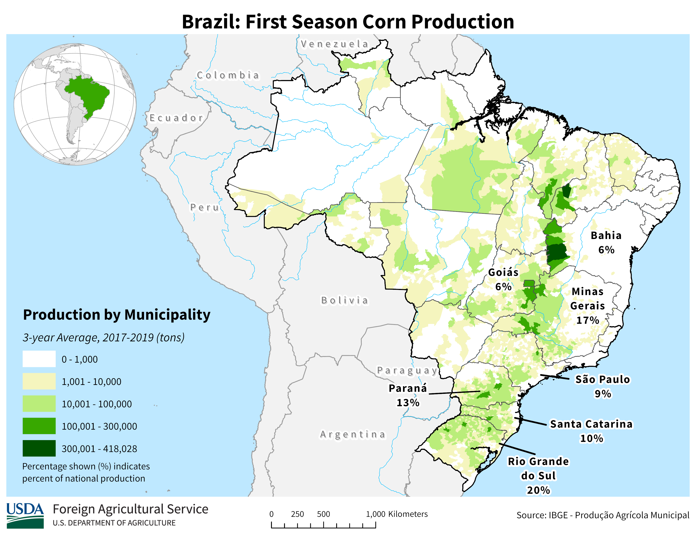
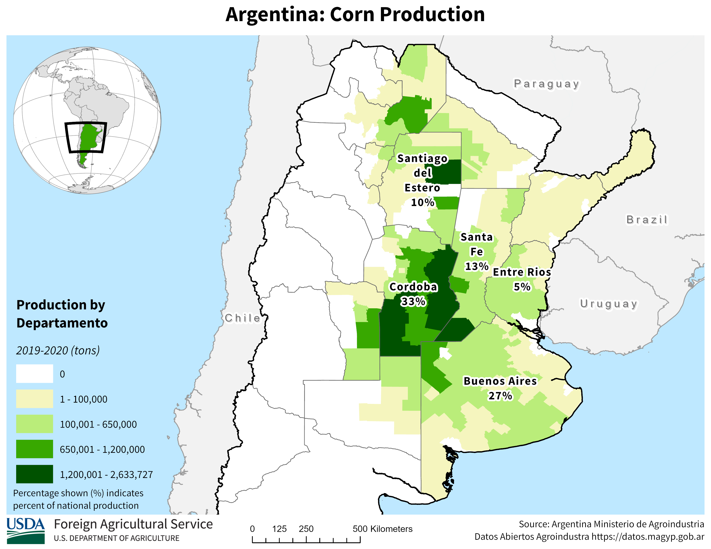
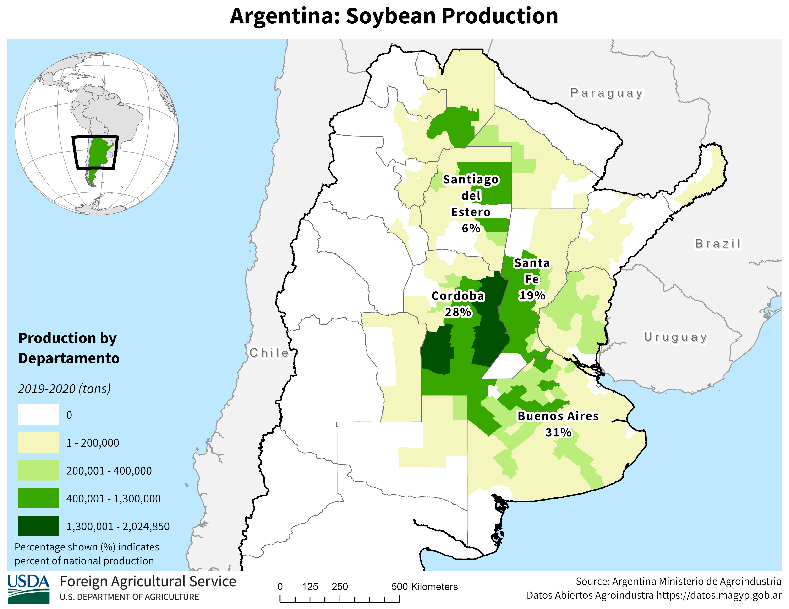

# South American Production

Over[^a-south-american-production-1] the last twenty years Brazil and Argentina have grown in prominence on the world stage and are currently among the most important growers of soybeans and corn, particularly so for soybeans.

[^a-south-american-production-1]: Many thanks to Felipe Grimaldi Avileis, my teaching assistant for ACE 427 in 2017, for getting me up to speed on the basics of production in South America, and for showing me where to access supply and demand reports for Brazil and Argentina.

In figure 1 we have plotted the production since 1990 of the world's top five producers of corn. Argentina, Brazil, China, the European Union, and the United States round out this group. A clear pattern of increases over time is notable particularly for the U.S., China, and Brazil, generating a dramatic upward trend in the production from this top group.

## Production of Corn

Data for figures 1-4 come from the [USDA FAS World Production Supply and Demand](https://apps.fas.usda.gov/psdonline/app/index.html#/app/downloads) historical data-sets for grains and oilseeds.

Figure 2 plots the top five countries by exports. Here we see China and the EU dropping out of the top five with Russia and Ukraine taking their place. While U.S. exports have been mostly flat over this time period, exports from Brazil have been expanding rapidly since about 2004.

Next, in table 1, we present the top producers of corn in 2017.

  

Table 1: Top 10 World Producers of Corn, 2020

## Production of Soybeans

Now we turn our attention to the soybean market. In figure 3 we present production since 1990 from the top five countries. Here, the importance of Brazil and Argentina is much more obvious. While production in the U.S. has a visible upward trend, Brazil and Argentina are really increasing at a rapid rate.

In figure 4 we plot the exports from the top five countries. From figure 3 to 4 China and India drop out and are replaced by Canada and Paraguay. The growth in soybean exports from Brazil is quite remarkable in this chart.

Table 2 shows the top ten producers of soybeans in the World. Here we see that Paraguay and Bolivia are present in the top ten as well.

  

Table 2: Top 10 World Producers of Soybeans, 2020

## South American Production Seasons and Trade Flows

Since South America experiences summer when we in the North America experience winter and vice versa, North American and South American production is nicely complementary in providing corn and soybeans for the export market. We noted in Chapter 9 and 10 that U.S. corn and soybean exports are at their highest levels during the 2nd quarter of the marketing year - right after harvest. During this time, the planting and growing seasons are underway in South America, and the heavy export season from harvesting the previous crop is winding down.

Then, South American farmers are harvesting during our planting and growing seasons (March through June).

The seasonality is a boon for importers because they have the opportunity to buy for seasonally low harvest-time prices twice per year rather than just once per year.

### Brazil

Brazil, being quite close to the equator, enjoys the ability to double crop most every year. Typically, farmers plant soybeans as the first crop because if they plant soybeans first they get a second crop of corn. If they plant corn first, there is not enough time to get a second crop of soybeans. However, yields of first crop corn are higher then yields of second crop corn due to when the rainy season comes, so in some places farmers choose to plant one crop of corn and forego double cropping.

Figure 6 show production intensity of soybeans by state, and also provides a calendar of when planting and harvest activity of first crop soybeans are taking place.

Figure 7 shows the same for second crop corn.

While figure 8 shows the regional production intensity of first crop corn. Notice the highest production of first crop corn is located in regions that have no second crop in figure 7. This shows that in the east, where managing a second crop is more difficult, farmers are more apt to plant a single crop of corn.

### Where to find information on Brazilian Crops

For information about Brazillian production the [National Supply Company (Conab)](http://www.conab.gov.br/index.php) is the main resource. They publish crop reports monthly, just like the USDA's WASDE report. Typically, the Brazillian report is released a couple of days before the WASDE report, so if there is information from Brazil that will affect world stocks or production, these reports will move prices in the U.S.

### Argentina

Argentina is more similar to the U.S. in latitude, so they are only able to plant a single crop. Planting of corn begins in September and harvest runs from March until May.

Planting of soybeans begins in November and harvest runs from April to May.

### Where to find information on Argentinian Crops

The [Bolsa de Cereales](https://www.bolsadecereales.com/) is the grain exchange in Argentina. They undertake the responsibility of producing crop reports. The reports most closely followed are the Weekly Agricultural Report, which tells the planting or harvest progress, and gives a general update about market conditions. The other report is the Esdtado Y Condition de Cultivos (ECC), which is released once per month. This has more detailed estimates about planting and growing conditions.

With Google Translate to translate web pages reports can be found and understood by English-only speakers.
