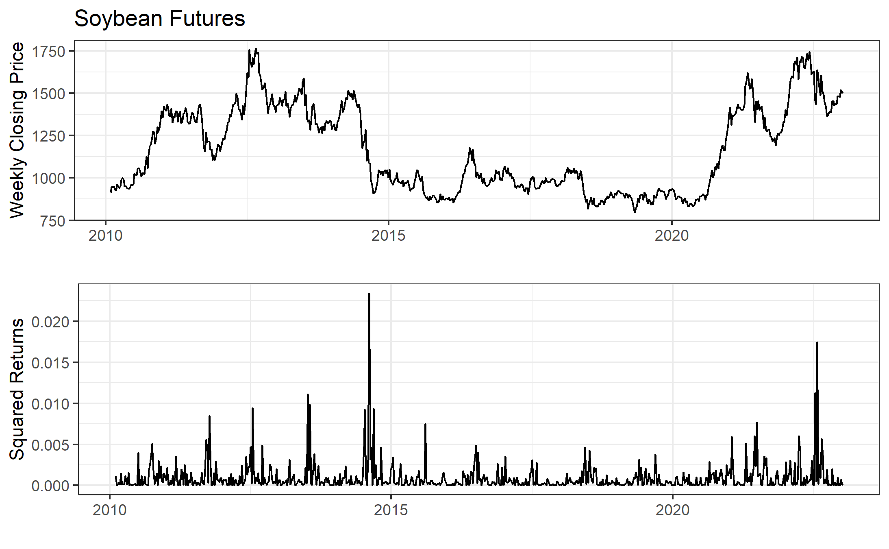
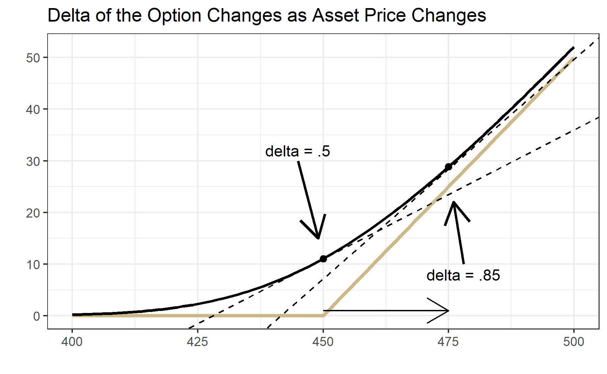

# Advanced Option Topics

Interested in more? Please let me know by [taking the survey](https://forms.gle/Q3VByCQZHjfQSy9D7)! 

**Highlights**

-   Black-Scholes and the Black 1976 option pricing models

-   Put-Call Parity and no arbitrage conditions

-   Implied volatility

-   Option Greeks

**Check your Understanding**

-   How can you create a synthetic put option?

-   How do time to maturity and volatility impact an option's gamma?

In this chapter we will cover some more advanced concepts in options markets. First we will learn the Black-Scholes option pricing model. Then we will learn Put-Call Parity; we will discuss implied volatility; then we will learn "The Greeks", or how option prices are impacted by different market variables. We will learn that the Black-Scholes model is not perfect and hear some of the most important criticisms of the model. Lastly, we will learn the concept of delta hedging and how options positions can be used as a hedging tool in the underlying market.

## Black-Scholes Option Pricing Model

The Black-Scholes option pricing model provides the price of a European call and the price of a European put on a non-dividend paying stock. The options we generally are focused on in the context of this book, namely options on commodity futures on CME Group exchanges, are American options. Since American options have all the rights of a European option plus the right to exercise at any time, an American option cannot be less than the price of the otherwise identical European option. Nevertheless, this distinction is often small or zero, so the intuition we glean from the Black-Scholes model works for the American options we focus on in this book.

In this book we present the Black-Scholes option pricing model without proof. Since we only provide an introduction to the concepts of option markets a proof is beyond the scope of this book. However, there are many well explained and free resources on the internet. The original papers by Fischer Black, Myron Scholes and Robert Merton were published in 1973[@black_pricing_1973; @merton_theory_1973]. The classic text by John Hull also provides a detailed explanation [@hull2017].

The most basic form of the Black-Scholes model is for options on non-dividend paying stock. We will present this model, then we will show the slight modification required for options on futures contracts.

### Assumptions

First, we need to establish the assumptions required in order for the Black-Scholes model to hold true. [@blacksc2020]

*Assumptions About Assets*

-   There exists a **riskless asset** that returns a constant **risk free rate**

-   The stock price exhibits instantaneous returns that are log normal. More formally, the stock price follows a geometric Brownian motion and volatility and drift are constant. Without writing out the mathematical equation for the geometric Brownian motion, the drift term defines how much the stock price appreciates on average.

*Assumptions about the Market*

-   There are no arbitrage opportunities

-   There are no restrictions on borrowing and lending at the risk free rate

-   Market participants can buy or sell unlimited quantities of the stock

-   There are no transactions costs

### Notation

-   $C$ = Call Option Price

-   $P$ = Put Option Price

-   $S$ = Current Stock Price

-   $K$ = Strike Price

-   $r$ = Risk free rate

-   $\sigma$ = Standard deviation of the stock price returns

-   $t$ = Time to maturity (in fraction of a year)

-   $N$ = Standard normal cumulative distribution function

-   $d_{1} = \frac{ln(\frac{S_{t}}{K}) + (r + \frac{\sigma^{2}}{2})t}{\sigma \sqrt{t}}$

-   $d_{2} = d_{1} - \sigma \sqrt{t}$

The formula for a call option on a non-dividend paying stock with strike price $K$ that has time to maturity $t$ is:

$$C = S_{t}N(d_{1}) - K e^{-rt} N(d_{2})$$

The price of a similar put option is:

$$
P = N(-d_{2}) K e^{-rt} - N(-d_{1}) S_{t}
$$

### Option Pricing Formula for Futures Contracts

Black [-@black_pricing_1976] derives a version of the Black-Scholes model that is appropriate for pricing futures contracts. The key difference between the two option pricing models is that stock trading requires that the full value of the stock be spent upfront. Thus, the $S_{t}$ in the Black-Scholes equations above is referencing expenditures at the current time, and do not need to be discounted. Futures contracts differ in that entering into a futures contract does not require expenditure upfront (besides posting margin). Therefore, the price of the underlying should be discounted, bringing the future value of the expenditure related to the futures contract to the present. The Black equations for pricing call and put options on commodity futures are therefore as follows:

$$
C = F_{t} e^{-rt} N(d_{1}) - K e^{-rt} N(d_{2})
$$

and

$$
P = N(-d_{2}) K e^{-rt} - N(-d_{1}) F_{t} e^{-rt}
$$

## Put-Call Parity

Put and call options of the same strike price and same expiration have to follow a specific relationship. That means that if you know the price of a call option, the price of the put option with the same strike and expiration is determined or there is an arbitrage opportunity.

To illustrate why this must be true consider the example below in the embedded Google Sheets file. The cells in gold are editable so that you can play around with the put-call parity result. The default values are shown in row 3, replace the default values if the values in gold do not match the defaults. If you would rather work with the full size Google sheet you can find it at [Put-Call Parity Sheet](https://docs.google.com/spreadsheets/d/1ivvTGqC9R4L3zkG8c4ApDg8dC1LHj4v_8uLjgiurxX0/edit?usp=sharing).

Suppose that the price of the underlying is 470 cents, and a call option with strike price of 450 cents has a premium of 25 cents. In the table we consider underlying price ranges from 400 to 500 cents. Then we calculate the profit at expiration from the call option in the second column of the table. From 400 cents to 450 cents the profit would be -25 cents. Then as the price of the underlying increases from 450 to 500 cents the profit of the call option at expiration increases one for one. Clicking in `B7` shows the formula for the call option profit at expiration to be `=max(0-$B$2, A7-$C$2-$B2`. In the plot the call option profit is the 'hockey stick' shaped line in black.

In the third column we have the profit from a short position in the underlying futures contract where the position was initiated at the current price of the underlying (470 cents). Clicking in `C7` shows the formula for the profit of this position is `=$D$2-A7`. Being a short position, this position makes money as the price of the underlying falls. This position is shown by the straight black line that crosses the x-axis at 470 in the figure.

The fourth column shows what your profit at expiration would look like if you bought the call option and also sold the underlying futures for 470. Clicking on `D7` shows that the formula for this payoff is simply `=B7+C7`, or the sum of the profit in each position. This profit function is shown in gold.

<iframe src="https://docs.google.com/spreadsheets/d/1ivvTGqC9R4L3zkG8c4ApDg8dC1LHj4v_8uLjgiurxX0/edit?usp=sharing" title="Put-Call Parity" width="100%" height="950">

</iframe>

Notice that the gold line looks exactly like the profit at expiration of a put option with strike equal to 450 cents! This is called a synthetic put position. So, it must be that the put option premium in this example is 5 cents, otherwise you could buy the synthetic and sell the real put or vice versa and make a riskless profit. This relationship between the call and put price is called put-call parity.

Take a minute and play around with different values of call option premium. For example, try 50, 30, and 10. What is strange about premium = 10 cents?

As an aside, note that you can create a synthetic call option by buying a put option and buying the underlying.

## Implied Volatility

Notice that of all the variables that go into the option pricing model, the only ones we don't know beforehand are the option price and $\sigma$ (the standard deviation of returns of the underlying). That means if we plug in all the numbers we know into the option pricing formula and then make a guess, or a good estimate of what $\sigma$ should be the formula will give us an estimate of what the option should be worth as well.

In practice we usually do the opposite because we can observe the markets where these options are trading and know what prices the option is being bought and sold for at any moment the markets are open. If instead we take these prices that are actually trading in the market and use that in the formula, then we can solve for $\sigma$ and we get a measure of the volatility 'implied' by the prices at which the option is currently trading for.

Implied volatility is an important measure because it tells you how much of a move traders expect the underlying could make. Implied volatility is normalized to units of % per annum so that you might see and implied volatility of 16% which means that option market participants think the underlying could move (in either direction) 16% per year[@ganti]. The implied volatility is always changing though. In fact, that is one criticism of the Black-Scholes model. The model requires the underlying to have constant volatility, which is clearly not the case for any asset.

In the next sections we will explore how the different variables in the option pricing model affect option prices. We will see that implied volatility has a big impact. High implied volatility means high option prices all else equal.

## Option Prices Compared to the Profit Diagram

In the Google Sheet embedded below we have plotted in gold the price of a call and put option with strike price of 450 cents along with the intrinsic value of the option plotted in black. Remember that the intrinsic value of the option is what the option is worth at expiration given the value of the underlying, not considering the premium paid. Therefore, if we take the profit diagrams we considered from the previous chapter and moved the flat part of the hockey stick diagram to the x-axis we get the intrinsic value of the option.

Notice a few things about the option price line. First of all, for every value of the underlying the call price is above the black line. That is because the price of an option prior to expiration must be worth at least as much as its intrinsic value, with a little bit extra to account for the uncertainty in price that could change the moneyness of the option before it expires.

Further, notice that the option differs from its intrinsic value most near the strike price; this is because the option price must smooth out the kink in the intrinsic value diagram.

<iframe src="https://docs.google.com/spreadsheets/d/1hvLorMPGFuMJqGJ2xKiR6TswvU4aGuaF6tyesDKcXyY/edit?usp=sharing" title="Put-Call Parity" width="100%" height="950">

</iframe>

## Option Greeks

In this section we will learn the option 'greeks'. This, along with the second derivatives, will do more than anything to give you a better understanding of how option prices really work. As you read this section keep looking back to the embedded plot of option prices in section \@ref(option-prices-compared-to-the-profit-diagram)

**Delta**

The delta of a call option is $\Delta = \frac{\partial C}{\partial F}$ , and the delta of a put option is $\Delta = \frac{\partial P}{\partial F}$, or how much the value of a call option changes as the underlying changes. Literally, this is the slope of the line representing the option price. The main thing is to notice that as the price of the underlying moves larger the call option is more in the money, and the delta of the call option approaches +1. As the price of the underlying moves larger the put option moves more out of the money and the delta of the put option approaches 0. As the price of the underlying moves lower, the delta of the call option approaches 0 and the delta of the put option approaches -1. Also, notice that at the money, the delta of the call option is +0.5 and the delta of the at the money put option is -0.5.

**Gamma**

The gamma of a call option is $\gamma = \frac{\partial^2 C}{\partial F^2}$ and the gamma of a put option is $\gamma = \frac{\partial^2 P}{\partial F^2}$, that is it tells you the curvature of the option price with respect to the underlying. Which is to say, how much additional $\Delta$ do you get as the underlying price increases. Looking above at the price of the call option, notice that at an underlying price of 425 the option line is pretty flat (low delta), while at an underlying price of 475 the option line is pretty steep and nearly equal to the slope of the black line which is 1. The curvature in the line that is required to get from a flat slope to a steep slope is the $\gamma$ of the option.

An option's $\gamma$ is the friend of speculators who use options. Large $\gamma$ allows a trader to buy a cheap out of the money option on an underlying they know will move up or down. If they are right their position enjoys convex gains. The higher the $\gamma$ the better it is for the directional speculator using long option positions. However, we will see that $\gamma$ is counter-balanced by the next greeks we will learn.

**Theta**

Option's lose value as expiration nears due to reduced uncertainty related to where the price of the underlying will be relative to the strike. This 'time decay' is made explicit by the theta of the option. Theta of a call option is $\theta = \frac{\partial C}{\partial t}$ and the theta of a put option is $\theta = \frac{\partial P}{\partial t}$. Theta is how option sellers make money and theta is the enemy of long option holders. Theta is usually quoted in terms of how much the option will lose value per day, all other things equal. Go back to the embedded Google Sheet in \@ref(option-prices-compared-to-the-profit-diagram). Play around with the time value in the option premium by putting in some larger and smaller values for time to maturity. Remember, the units of time to maturity is fraction of a year. So if you put in 0.5 that is the same as six months, and 0.02 is about one week.

For reference, focus on the at-the-money call and put options with strike of 450. With time to maturity = 0.5, the call option is worth 19.89 cents (or 4.4% of the value of the underlying contract) while the put option is worth 28.89 cents (6.4% of the value of the underlying contract). With time to maturity = 0.02, the call option is worth 4.06 cents (0.90% of the value of the underlying contract) and the put option is worth 4.42 cents (0.98% of the value of the underlying contract).

Another thing to notice is how the pace of theta decay accelerates as time to maturity approaches. Try setting the time to maturity cell (E2) to `=180/365` then to `=173/365` and notice how much the gold lines of the option prices shift down. Compare that to how much the gold lines shift down when you do `=10/365` and `=3/365`. In both cases one week passed between the first and second time calculated, but the option lost a lot more value both nominally and in percentage terms in the second case.

**Vega**

Vega measures sensitivity of the option value to changes in the volatility. In other words, Vega $= \frac{\partial C}{\partial \sigma}$ in the case of call options and Vega = $= \frac{\partial P}{\partial \sigma}$ in the case of put options. An increase in volatility will cause an increase in options prices, all other things equal. Play with different values in \@ref(option-prices-compared-to-the-profit-diagram) try volatility as low as 10 and as high as 100. Also, see what impact changes in volatility has for different time to maturity values.

**Other Greeks**

There are other greeks (including Rho, Vanna, Vomma, and more) that become important if you are involved in managing a large book of options positions, but we will not cover them in detail. The [Greeks Wikipedia page](https://en.wikipedia.org/wiki/Greeks_(finance)) is a good place to start if you are interested.

**How other Volatility and Time-to-Maturity Impacts Gamma**

For a couple of the greeks we mentioned how they interact with each other, or react to different times to maturity. Here I just want to point out a bit more about this mechanics. I mentioned that $\gamma$ is the friend of the option buyer and it is the foe of the option seller because of the convex shape of the return profile you get with large gamma.

So what makes $\gamma$ large? Biggest things giving large $\gamma$ would be short time to maturity and low volatility. However, both of these have drawbacks for the option buyer. When time to maturity is short, $\theta$ decay is fast, which works against the option buyer. Regarding volatility, sure low volatility produces large gamma, but option buyers get the most benefit from gamma by buying slightly out of the money options prior to a significant move in their favor. Thus, periods of low volatility make a significant move less likely.

So even though the option buyer can create countless profit scenarios over many price ranges, at the end of the day, profitable option buying for speculation requires anticipating a significant price move to pay off.

## Criticisms of the Black-Scholes Pricing Model

We should be aware that while the Black-Scholes option pricing model is very elegant and easy to work with, it has some limitations. Most limitations stem from unrealistic assumptions underpinning the model.

Recall the model assumptions from earlier:

> *Assumptions About Assets*
>
> -   There exists a riskless asset that returns a constant risk free rate
>
> -   The stock price exhibits instantaneous returns that are log normal. More formally, the stock price follows a geometric Brownian motion and volatility and drift are constant. Without writing out the mathematical equation for the geometric Brownian motion, the drift term defines how much the stock price appreciates on average.
>
> *Assumptions about the Market*
>
> -   There are no arbitrage opportunities
>
> -   There are no restrictions on borrowing and lending at the risk free rate
>
> -   Market participants can buy or sell unlimited quantities of the stock
>
> -   There are no transactions costs

These assumptions are at odds with several commonly observed attributes of real markets . In particular, assets commonly have the following characteristics:

1.  Heavy-tailed returns
2.  Positively correlated volatility, volatility clustering, variable volatility

The first item means that extreme market movements (up or down) happen more often than implied by the normal distribution. Since option prices depend on the full probability distribution of potential outcomes, a model that assumes a normal distribution will chronically under-price options.

The second item reflects the tendency in markets for volatility events to be clustered together. That means if we have a large price movement, it will likely be followed by large price movements in the near future. We cannot predict whether it will be up or down, but we can be sure it will be volatile. In the figure below we plot continuous series of weekly soybean futures since 2010 in the first panel. In the second panel we plot squared log differences of prices, which is one way to calculate volatility. You can clearly observe the positive correlation and volatility clustering in this market. Once there is an event that spikes volatility, it takes a while for volatility to 'calm down'.

This explains the limitation of the Black-Scholes model along the volatility dimension. Another practical matter is that the model requires one to continuously maintain a perfectly hedged portfolio of an option and the underlying asset. This can be impossible when prices experience 'jumps' or non continuous movements. These can occur in due to unexpected information hitting the market and traders pulling their standing orders in the market. But, it also occurs during routine market closures. The overnight jumps can be substantial in cases where a lot of information is revealed overnight.

## Delta Hedging

One proof of the Black-Scholes option pricing formula shows that if one can continuously hedge the sale of an option contract with the underlying asset so that the position is 'delta neutral' then the hedged portfolio (the short option and long stock) is riskless and therefore must earn the 'risk-free rate'. This implies that if you know the price of the stock and you know the risk free rate, then you can deduce what the price of the option should be at any time. Solving that yields the Black-Scholes equation.

Let's discuss the delta neutral concept more fully. Recall that the $\Delta$ (delta) of an option is $\Delta = \frac{\partial C}{\partial F}$, or how much the price of the option changes if the price of the underlying asset increases by one unit. A position is said to be 'delta neutral' if options and the underlying asset are held in a proportion such that for small changes in the underlying asset's price, the value of the position is unchanged.

**Example**

Suppose the price of the nearby corn futures contract is 450 cents. A trader might sell 100 the 450 strike call options that are trading for 11 cents. The trader is hoping to profit from theta decay, as the price of the option decreases over time. They do not want exposure to the changing price of the futures contract, however.

1.  How many futures contracts should they buy/sell to make their position delta neutral?

**Answer**: Consider the figure above. The gold 'hockey stick' line represents the payoff of the call option to someone long the option. The thick black line is the Black-Scholes price of the option at the current time, for different values of the underlying (indicated on the x-axis). The dashed black lines show that at 450, the slope of the option price curve is .5 and at 475 the slope is .85. These are the delta's of the option price when the underlying is 450 and 475, respectively.

Since the $\Delta$ of the 450 strike option is 0.5 that means that the price of the option increases (decreases) by .5 times the futures price increase (decrease). Another way to think about it is selling the 100 of the 450 strike call options is like being short 50 of the futures; with a delta of .5 every 1 cent change in the underlying results in a .5 cent change in the option. So, if the trader does not want price exposure, they can **buy** 50 futures contracts at the same time they **sell** the call options. Now, for small changes in the futures price around 450, they are fully hedged.

As an example consider what happens to their delta-hedged position for a modest price increase of 2 cents in the futures contract from 450 to 452. This will imply the call option increases to 12.18 cents, all else being equal. Walking through the profit an loss calculations in this case, we see the trader loses \$600 from this price movement. Recall, they are short the premium of \$55,000 that they are hoping to pocket as time eats away at the premium. They do experience a loss from this, but it will likely be outweighed by the premium decay if the price does not continue to rise too fast.

+---------------------+------------------------------+----------------------------------+
|                     | Short Calls                  | Long Futures                     |
+=====================+==============================+==================================+
| t = 0               |                              |                                  |
+---------------------+------------------------------+----------------------------------+
| Price               | 11.06 cents per contract     | 450                              |
+---------------------+------------------------------+----------------------------------+
| Quantity            | 100 contracts                | 50                               |
+---------------------+------------------------------+----------------------------------+
| **Value**           | (11.06/100)\*100\*5000 =     | (450/100)\*50\*5000 =            |
|                     |                              |                                  |
|                     | **\$55,300**                 | **\$1,125,000** (notional value) |
+---------------------+------------------------------+----------------------------------+
| t = 1               |                              |                                  |
+---------------------+------------------------------+----------------------------------+
| Price               | 12.18 cents per contract     | 452                              |
+---------------------+------------------------------+----------------------------------+
| Quantity            | 100                          | 50                               |
+---------------------+------------------------------+----------------------------------+
| **Value**           | (12.18/100)\*100\*5000 =     | (452/100)\*50\*5000 =            |
|                     |                              |                                  |
|                     | **\$60,900**                 | **\$1,130,000** (notional value) |
+---------------------+------------------------------+----------------------------------+
| **Profit/Loss**     | 55,300 - 60,900 =            | 1,130,000 - 1,125,000 =          |
|                     |                              |                                  |
|                     | **-\$5,600**                 | **+\$5,000**                     |
+---------------------+------------------------------+----------------------------------+
| **Net Profit/Loss** | 62,500 - 89,000 = **-\$600** |                                  |
+---------------------+------------------------------+----------------------------------+

: Change in value of delta-hedged position after small price move

2.  Suppose now that the futures price experiences a big increase to 475 from close of the day session to open of the night session. Is the trader's position still delta neutral? What should they do to get their position delta neutral?

**Answer**:

To recap, our trader is short 100 of the 450 call options and bought 50 futures contracts against it when the futures price was 450 to get their position delta neutral. Then the price of the futures contract went to 475 between the close of the day session and open of the night session, so they could not adjust their hedge gradually. The price 'jumped' to 475. That means that the option position now has a delta of -.85\*100 (negative because our trader is short the option) and only has +1\*50 delta from the long futures position (the outright futures position always had a delta of 1). To get delta neutral the trader needs to buy an additional 35 futures contracts to get the delta of their futures position to +1\*.85, but doing so does not erase the loss they experienced from the rise in price from 450 to 475, it just gets them delta-hedged against small price movements going forward.

### Why is delta-hedging not fool-proof?

Delta hedging only works if traders can continuously re-balance their option and futures positions to keep delta neutral as prices change. There are a couple major problems with this.

First is that it is costly to re-balance. Traders face trading costs from commissions, fees, and/or the bid-ask spread. Re-balancing too often would quickly eat into whatever profit they hoped to earn from theta-decay.

Second, sometimes market prices move in significant 'jumps'. Whether this comes from information hitting the market that causes resting orders on the order book to be canceled and resent at much higher (or lower) prices, or from prices changing significantly from the market close to open, the result is the same for the delta neutral trader. They will have to re-balance their position after a large discrete jump. If the price jump goes against them, they will lock in a loss.

In our example above, if the move from 450 to 475 happens from between market close and the next market open, the traders position will have a bigger loss on the short call option position than gain in the long futures position, due to the significant change in slope (or delta) of the option price.

+---------------------+---------------------------------+----------------------------------+
|                     | Short Calls                     | Long Futures                     |
+=====================+=================================+==================================+
| t = 0               |                                 |                                  |
+---------------------+---------------------------------+----------------------------------+
| Price               | 11.06 cents per contract        | 450                              |
+---------------------+---------------------------------+----------------------------------+
| Quantity            | 100 contracts                   | 50                               |
+---------------------+---------------------------------+----------------------------------+
| **Value**           | (11.06/100)\*100\*5000 =        | (450/100)\*50\*5000 =            |
|                     |                                 |                                  |
|                     | **\$55,300**                    | **\$1,125,000** (notional value) |
+---------------------+---------------------------------+----------------------------------+
| t = 1               |                                 |                                  |
+---------------------+---------------------------------+----------------------------------+
| Price               | 28.86 cents per contract        | 475                              |
+---------------------+---------------------------------+----------------------------------+
| Quantity            | 100                             | 50                               |
+---------------------+---------------------------------+----------------------------------+
| **Value**           | (28.86/100)\*100\*5000 =        | (475/100)\*50\*5000 =            |
|                     |                                 |                                  |
|                     | **\$144,300**                   | **\$1,187,500** (notional value) |
+---------------------+---------------------------------+----------------------------------+
| **Profit/Loss**     | 55,300 - 144,300 =              | 1,187,500 - 1,125,000 =          |
|                     |                                 |                                  |
|                     | **-\$89,000**                   | **+\$62,500**                    |
+---------------------+---------------------------------+----------------------------------+
| **Net Profit/Loss** | 62,500 - 89,000 = **-\$26,000** |                                  |
+---------------------+---------------------------------+----------------------------------+

: Change in value of delta-hedged position after big price move

### Famous Blow-Ups in Delta-Hedging Operations

Large unexpected price movements, have a storied history of blowing up hedge funds who focus on selling volatility. Several articles are linked below for the interested reader.

1.  ["Epic Failures - Lessons from Volatility Funds Blow-Ups." Harel Jacobson](https://volquant.medium.com/epic-failures-lessons-from-volatility-funds-blow-ups-6f4226c8334f)
2.  ["Turbulent Markets Upend Volatility Hedge Funds." Laurence Fletcher and Richard Hendarson, FT.](https://www.ft.com/content/b8ddbf92-c9b4-4a81-a167-ef9ee80962a5)
3.  ["How to Lose a Billion Dollars Without Really Trying." Leanna Orr. Institutional Investor.](https://www.institutionalinvestor.com/article/b1m6kkzscgqrl0/How-to-Lose-a-Billion-Dollars-Without-Really-Trying)

> History doesn't repeat itself, but it often rhymes. --- Mark Twain

> Its like picking up pennies in front of a steamroller. --- Unknown

These stories have a common theme. A fund engages in a strategy of selling volatility (selling calls, selling puts, selling vix futures, etc) with high leverage. The high leverage and nature of volatility premium mean these funds make spectacular returns for as long as there is not a 'volatility event'. One day, the volatility event arrives and anyone with a highly leveraged short volatility position is highly likely to blow up (total loss of trading capital).
