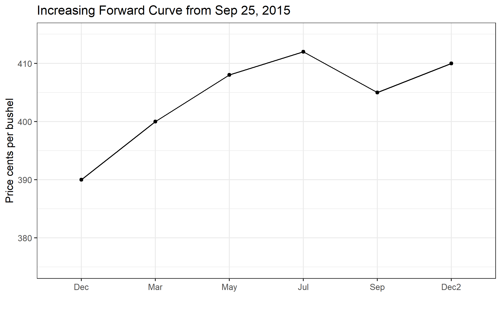
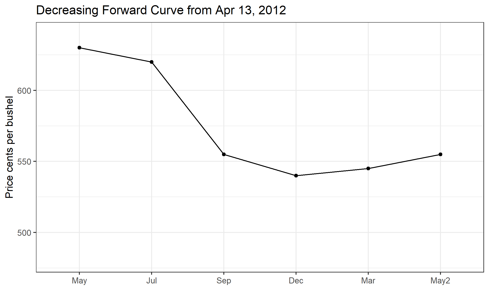
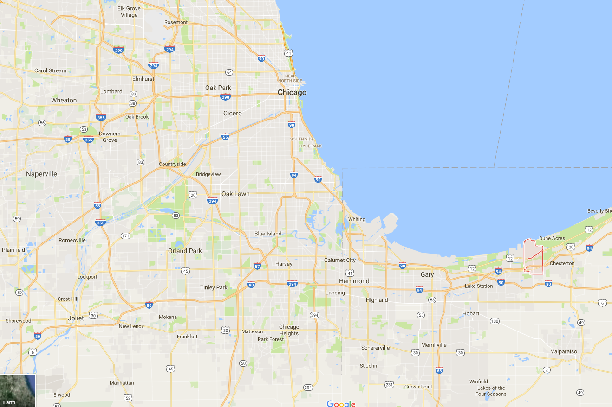
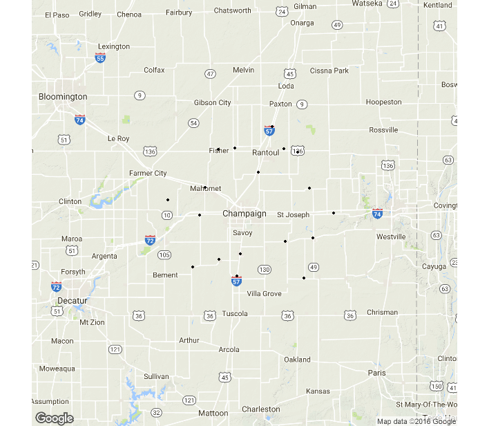

# Prices Over Space and Time

Interested in more? Please let me know by [taking the survey](https://forms.gle/Q3VByCQZHjfQSy9D7)! 

**Highlights**

-   Learn the costs of storage for farmers.
-   Learn how the forward curve in the futures market provides incentive to store that can be 'locked in'.
-   Learn how to calculate financial full carry and spread as a percent of full carry.
-   Learn how to interpret the percent of full carry as a measure of incentive to store.
-   Learn what drives variation in the basis.

**Check Your Understanding**

-   Can you calculate the percent of full carry yourself, given only futures prices and financing costs?

In this section we cover how commodity prices behave over time and space. We have discussed frequently that commodity futures contracts have an expiration, that there are always several contracts trading at any given time with maturities that are increasingly farther into the future, and that these contracts will eventually expire and no longer be traded.

The contract that is next to expire is called the **Nearby** contract, the contract that expires next is called the **First Deferred** contract, the contract that expires after that is the **Second Deferred** contract. The different contracts trading at any given time make up make up what is called **The Forward Curve**, etc. There is valuable information in the forward curve because it is the market's best guess of what returns to storage will be.

We saw in Chapter 4 how a farmer can use the December futures contract to hedge the sale of their harvest. Similarly, the March (of the next year) contract is the next to expire after the December contract. If the market price of the March contract is high enough, some farmers (and other commercial stockholders[^pricesspacetime-1]) will decide to store until late February and hedge their cash sale with the March futures contract. This is costly so the price increase from waiting until March must be high enough to cover these costs or the farmer will just sell everything at harvest.

[^pricesspacetime-1]: Stockholder here means an entity who is storing grain (or oilseed). In other-words, they are holding stocks of the grain.

## Storage Costs to the Farmer

Storage costs include the following:[^pricesspacetime-2]

[^pricesspacetime-2]: For more [see](https://www.extension.iastate.edu/agdm/crops/pdf/a2-33.pdf)

1.  Opportunity cost of money. If they sell at harvest they can use the money for other things; so waiting to sell involves an opportunity cost of money.
2.  Interest. By deferring the sale of grain, the stockholder may need a bank loan to cover expenses since their main revenue stream is deferred.
3.  Storage fees. Some farmers or stockholders have their own storage space, but many will need to rent storage space (from an elevator like the one depicted in Royal, IL in chapter 4).
4.  Drying costs. Grain that is just harvested can be around 15% moisture, but must be dried down to closer to 13.5% moisture to safely store for long periods. This involves running a grain dryer that uses fuel and/or electricity.
5.  Shrinkage. When grain is dried, it actually shrinks leaving less bushels to sell after storage. The shrink factor can be 1.25 to 1.4 percent.
6.  Quality deterioration. If the grain is not stored under proper condition, quality can deteriorate, and result in dockage (a price discount) being applied by the buyer at the time of sale.
7.  Cost of handling. Getting the grain into and out of storage results in some costs as well.

Iowa State University Extension estimated in 2015 that storing grain until March costs a farmer roughly \$0.45 per bushel, while storing until December cost roughly \$0.30 per bushel, \$.15 cents per bushel less than storing until March. Considering only this, the price of the March contract would need to be more than \$0.15 per bushel higher than the December contract to cause much grain to be stored until March.[^pricesspacetime-3]

[^pricesspacetime-3]: Ed Usset with the University of Minnesota Extension has a nice series of articles in Corn and Soybean Digest about *carrying charges*, [here](http://www.cornandsoybeandigest.com/marketing/understand-carrying-charges), [here](http://www.cornandsoybeandigest.com/carrying-charges-part-1), and [here](http://www.cornandsoybeandigest.com/carrying-charges-part-2).

## An Increasing Forward Curve

Figure 1

The reason that the forward curve represents return to storage is that it shows how much extra money can be made by storing to a later date, rather than selling in the cash 'spot' market today. December corn is worth 330 cents per bushel and March corn is worth 340 cents per bushel, then you can make an extra 10 cents per bushel by selling the March futures and selling into the cash market later.

When stocks are plentiful the market offers a premium to those who are willing to keep grain off the market for awhile. This prevents prices from plunging too much right after a big harvest, since many choose to wait for better prices later in the marketing year. Also, since these price relationships are 'discovered' and change every day, if it turns out grain is coming onto the market too fast or too slowly, the shape of the forward curve changes to alter the incentives so that supply and demand can remain in equilibrium throughout the whole marketing year even though we only harvest once per year (in North America).

This kind of market environment is sometimes called a *carry market* or *contango market*, or sometimes it is said that the market is *in full carry*. This means that the market is offering returns to storage that covers the cost to rent warehouse space, insure, and finance storing grain in until a later date. The year of 2016 was certainly a full carry market. Record production and a high forecast of ending stocks make this the classic market environment where returns to storage would be positive.

As another example, the forward curve is shown for 2015 in figure 2.

This example illustrates a phenomenon that often occurs. Here we saw that the forward curve is upward sloped until September. Then it flattens and returns to storage go away. This makes sense because in September we begin to see some of the next year's crop come onto the market. So in 2015, the market was basically asking farmers to keep storing through July, but no longer. Anyone planning to hold grain from July to September and beyond could expect to lose as much as 4 cents per month.

## A Decreasing Forward Curve

Next we will consider a year that was characterized by a decreasing forward curve. You will recall that 2012 was a significant drought year that resulted in poor yields, high prices, and low forecasted ending stocks for the marketing year. In this kind of market environment, where supplies are tight, the forward curve tends to be downward sloped. The implication of this is that anyone who decides to hold grain will lose money because it is worth more today than it is tomorrow. The market is incentivising everyone to bring grain onto the market.

We will look at the forward curve and return to storage in steps for 2012. On 4-13-2-12 the forward curve are as shown in figure 3. This is in the spring, before the drought has happened.

In this case, supplies were already tight going into 2012. The forward curve is downward sloped, sometimes called *inverted* or *backwardated* market. So returns to storage are negative, as shown in Figure 6 through the summer of 2012, even before we had the drought realized. However, it is apparent from the forward curve that as of 4-13-2012, the market 'thought' that the 2012 harvest would be good, because price levels drop substantially in the September and December contract, and the return to storage between December 2012 and March 2013 is positive on 4-13-2012.

Next, lets look at the forward curve on 8-01-2012. By August 1, it is clear that we are in the midst of a major drought, yields will be low, and ending stocks for the coming marketing year will be low as well.

Now, the forward curve is downward sloped for the entire marketing year until the next harvest, in 2013, is expected. On 4-13-2012, the market was offering about 5 cents per month to store from December 2012 to March 2013, by 8-01-2012, the market was offering -1 cent for storage during the same time period.

Now, just to illustrate how the forward curve changed between August and December 2012, the time in which harvest occurred and we learned exactly how bad yields turned out to be, we show the forward curve on 12-03-2012 in figure 5.

## Forward Curve Cases with Hypothetical Data

When prices move up or down, the front end of the forward curve generally is more responsive than the back end of the forward curve. We will illustrate this with both increasing prices and decreasing prices. The examples below show the first five contracts on the forward curve plotted on four consecutive days of price changes in one direction. The price data in these examples are hypothetical, but represent what usually happens to the forward curve when prices increase or decrease.

**Prices Increasing**

Figure 6. Forward Curve with Prices Increasing, Contango to backwardation

On day 1, the market is clearly in contango, as the forward curve is upward sloped. As time moves from day 1 through day 4 prices are rising each day, with the front end of the forward curve exhibiting the largest changes each day. On day 4, prices have risen enough that the market is now in backwardation with the front month higher than the first deferred.

**Prices Decreasing**

Figure 7. Forward Curve with Prices Decreasing

On day 1 the market is in contango in this example as well. As time progresses from day 1 to day 4, prices are falling. From day 1 to day 3 the forward curve is getting steeper because price declines in Dec are larger than the price declines in March. In turn, the price declines in March are larger than the price declines in May, and do on. This indicates that from day 1 to day 3, the market is not yet at full carry; as prices are declining, the returns to storage keep increasing (reflected by the steeper forward curve). From day 3 to day 4, however, we can see that the market is at full carry because the price decline is constant all the way up the forward curve. Even though prices continue to fall, the market is already offering enough incentive to store to cover storage costs, so the price differences between contracts cannot widen any further.

**Some Caveats**

The effect of price changes on the shape of the forward curve as described above is typically observed. However, there is nothing requiring the market to react exactly this way, and there can be fundamental changes in the market (perhaps a major demander of the commodity reduces or increases consumption during a specific time of the year) that affect parts of the forward curve more than others. This could cause a larger price change in the middle or back end of the forward curve. Usually though, the front end of the forward curve will be more volatile than the back end of the forward curve as depicted in figures 6 and 7.

## Financial Full Carry

We discussed at the beginning of this chapter that one of the costs of storage to the farmer is the opportunity cost of money resulting from deferring a sale, and how this makes it impossible to predict with certainty any individual farmer's decision to store. However, there is a concept called **financial full carry** that simply includes interest costs and the premium charges on shipping certificates that we discussed in Chapter 4.

$$Financial \text{  } Full \text{  } Carry  = ndays(\frac{i}{360}*F + P)$$

where $ndays =$ the number of days between the first delivery day in the nearby contract and the first delivery day in the deferred contract. $i =$ the three month LIBOR interest rate + 200 basis points,[^pricesspacetime-4] $F =$ futures price, and $P =$ the current premium charge on shipping certificates. For example, there are 90 days between delivery period of the December contract and the delivery period of the March contract. If the LIBOR rate is .3% and financing costs are 200 basis points above LIBOR, the corn futures price is \$3.50 per bushel, and the premium charge on shipping certificates is 0.165 cents per bushel per day, then financial full carry is:

[^pricesspacetime-4]: The CME Group uses simple interest to calculate the financial full carry in other contexts, so we adopt it here for our definition of financial full carry.

$$Financial \text{  } Full \text{  } Carry = 90*(0.023/360*350 + 0.165 = 16.86 \text{ cents per bushel}) $$

Then financial full carry between the December contract and the March contract would be 16.86 cents. It is called financial full carry because in theory, the spread between the December and March contracts cannot be wider than this amount. If it were wider, say 30 cents, then a storage arbitrage would be possible. You could buy a December futures contract and sell a March futures contract, take delivery of December contract, receive the shipping certificate and hold it until March 1st at a cost to you of 16.86 cents per bushel. Then use the shipping certificate to deliver on your short March futures position. Your futures trades just earned 30 cents, while holding the shipping certificate only cost 16.86 cents, leaving you with a profit of 13.14 cents per bushel.

Of course, the concept of financial full carry is really just a benchmark. Most importantly, any individual's ability to capitalize on the arbitrage in this example is predicated at the ability to borrow for 200 basis points over LIBOR. It is useful as a metric for how much of a carry market we are in. Percent of full financial carry is a metric that is widely followed ($\text{Percent of Full Carry } = 100*\frac{Futures \text{  } Calendar \text{  } Spread}{Full \text{  } Financial\text{  } Carry}$), because it gives similar information as the shape of the forward curve in an easier metric to compare across time. In our example, percent of full carry $=100*30/16.86 = 177.94\%$ (remember this was an extreme example to illustrate the potential for arbitrage).

## Calendar Spreads

The prior discussion has viewed the forward curve and returns to storage from the perspective of a farmer or other who holds physical stocks of grain. Speculators watch the price spread between futures contracts and trade them to bet on whether or not returns to storage will increase or decrease. These kinds of spreads are called *Calendar Spreads* and they are done by performing the following type of trade.

Following the same logic about expected scarcity of stocks, returns to storage, and incentives for the market to bring stocks to the market, if the price goes up, the nearby contract and front end of the forward curve react the most strongly, deferred contracts will also go up, but by a lesser amount. Likewise, if the price goes down, the nearby contract will change the most; the deferred contract will also go down, but less so.

So, a speculator places the following trades if they are bullish (bearish):

### Bullish - think prices are going up

Buy Nearby: Dec 2017, Sell Deferred: March 2018

Then you are betting that prices in general will go up, but the nearby will go up more than the deferred contracts. Any information event that suggests supplies will become tighter should make prices go up in general, and should reduce the incentive to store. Thus, making this a profitable calendar spread trade.

### Bearish - think prices are going down

Sell Nearby: Dec 2017, Buy Deferred: March 2018

The opposite logic is at work here. You are betting that prices will go down in general, but that the nearby will go down more than the deferred contracts. Any information that suggests supplies will become more plentiful should make prices go down in general, and should increase incentives to store. Thus making the bearish calendar spread profitable.

To see today's forward curves in Corn and Soybeans visit [here](https://mindymallory.shinyapps.io/ForwardCurves/).

## Price Variation Over Space

Most of our time in this course has focused on what impacts futures prices for commodities. However, a futures price represent the expected future price of the commodity in a very specific location - the locations that are 'regular' for delivery. A location that is regular for delivery is a location that is designated by the commodity exchange where stocks of a commodity represented by a futures contract may be delivered in fulfillment of the contract. This is where the spot, or cash, price must come together, or converge, with the futures price.

(Source [Google Maps](https://www.google.com/maps))

(Source [Google Maps](https://www.google.com/maps/place/Burns+Harbor,+IN/@41.740398,-87.7248706,10.5z/data=!4m5!3m4!1s0x8811bc3712ab828d:0x98301a46014d10b5!8m2!3d41.6258708!4d-87.1333676))

Since the price of the futures contract is represents the expected future price only at these locations (technically whichever is cheapest to deliver) then the degree to which the futures price is indicative of the expected future spot price at locations far from Northern Illinois can vary.

Throughout the rural U.S., grain elevators, ethanol plants, soybean crushers, feed yards and biodeisel manufacturers dot the landscape every few miles. These entities buy essentially all of the grain and oilseed crop that is not used on-farm for livestock feeding. They post bids to buy every day they are open. They offer to buy as a cash sale, or on forward contract for delivery one to three months ahead. In the case of the forward contract, the farmer will go in to the elevator and sign a contract to deliver a specific number of bushels within a specified window of time. Usually, the prices quoted by grain elevators and other prices is relative to the futures contract price, or basis.

In figure 13 the elevators around Champiagn, IL are shown.

Depending on how far the location is from the Illinois river, this difference may be large, but still the futures price is the reference point. The basis is often quoted as 'over' or 'under' the futures price. For example, an elevator might post bids to buy for $-27$ cents. This means $27$ cents under the futures price. A bid of $31$ would be read as $31$ cents over the futures price.

## Definition of Basis

Basis is always defined as Spot Price minus Futures price.

$$Basis = Spot - Futures$$

Basis reflects the price differential over space relative to the futures price. Basis is influenced by

-   Transportation Costs
-   Local Supply and Demand Conditions
-   Interest and Storage Charges (this reflects that there is also a small time component as well as spatial)
-   Other Handling, Shipping and other Costs

Transportation costs are built into basis because large users of grain are not necessarily located in large production region. E.g., cattle feed yards in Western Kansas and Nebraska; Chickens in the South; and Hogs in North Carolina. Grain is shipped by rail and/or truck to locations across the country. Areas of grain surplus generally have a negative basis, the spot price is less than the futures. Areas of grain deficit generally have a positive basis, the spot price is greater than the futures.

Local supply and demand conditions are also important. Occasionally, there will be localized production problems. The biggest recent example comes from the demand side, however. The expansion in ethanol production in the U.S. was felt greatest in Iowa. As literally billions of gallons of capacity in ethanol production came online in Iowa, the corn basis was affected. With additional large consumers of corn located throughout Iowa, there was more localized demand for corn. The ethanol plants and grain elevators had increased localized competition, and local basis bids started to rise between 2005 and 2010.

## Terminology

Farmers and grain handlers alike watch the basis closely, so discussion of changes in the basis is common. When the basis is increasing, in most cases that means becoming 'less negative', we say the basis is **stregthening**. When the basis is decreasing, or becoming 'more negative', we say the basis is **weakening**.
