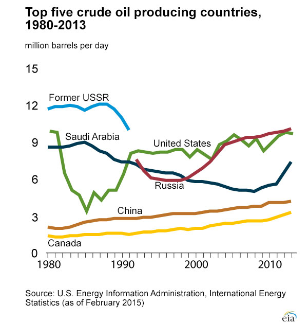
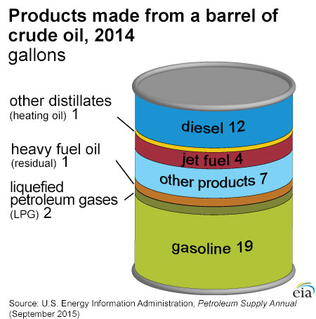
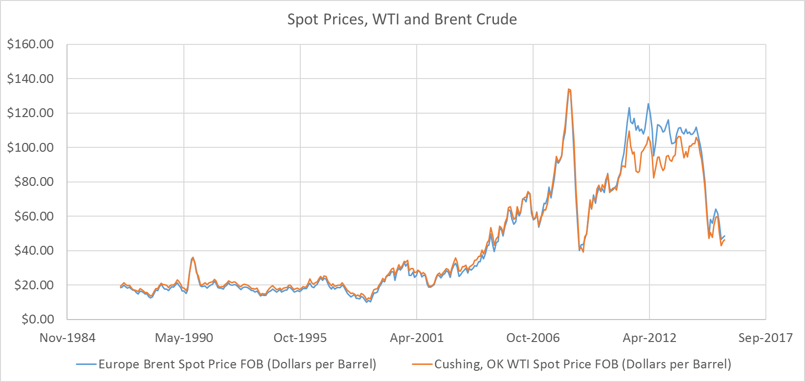
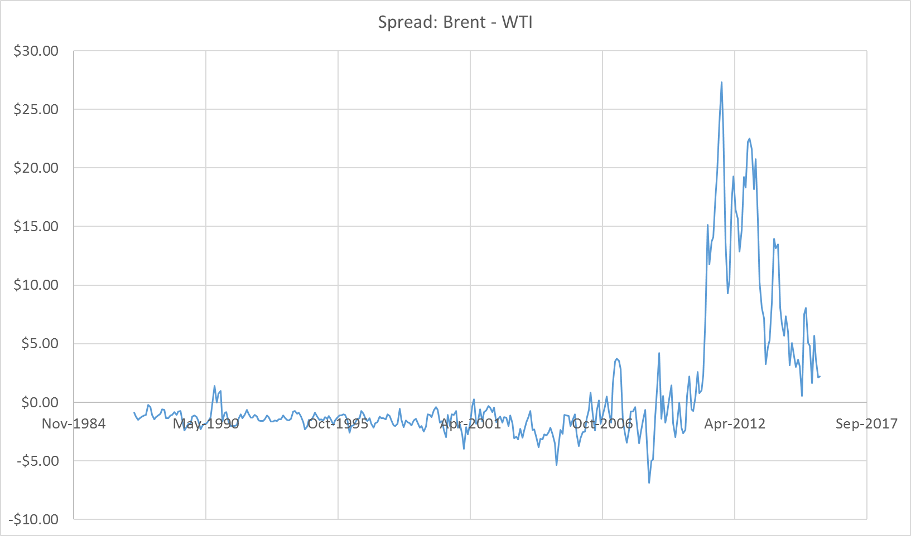
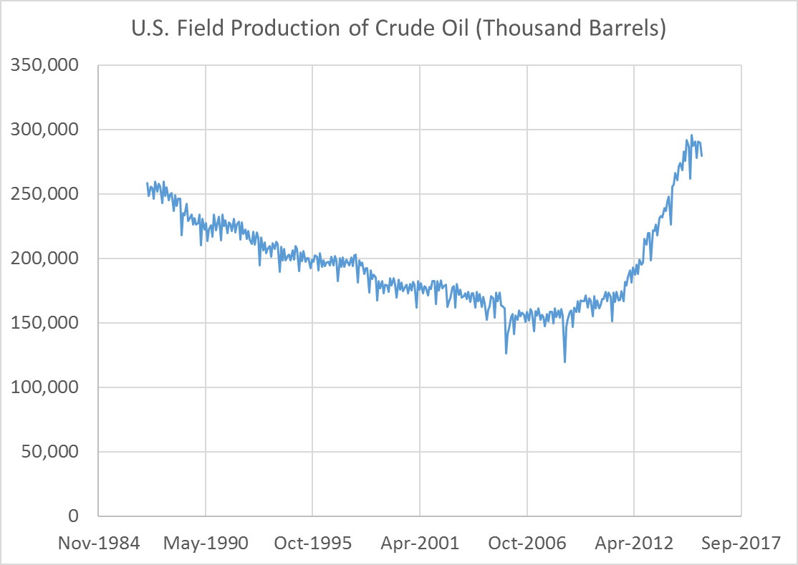
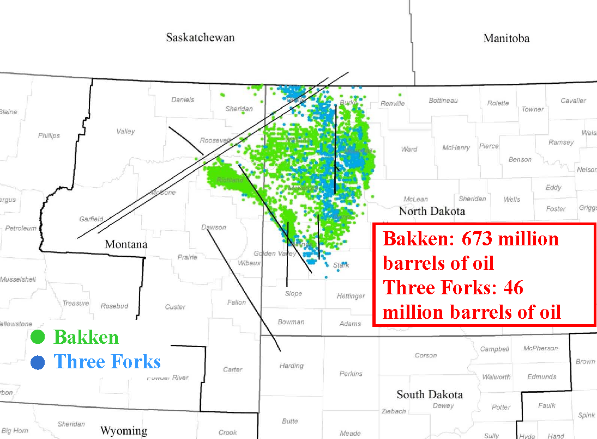

# [Return to Book Homepage](http://mindymallory.github.io/PriceAnalysis/)

# Introduction

Crude oil is an extremely important commodity. Much of the world's economic activity is dependent on the energy products derived from this commodity. Crude oil was formed long ago when biological material fell to the bottom of ancient oceans. Over time the material was exposed to heat and pressure and transformed the material into crude oil.  Crude oil is composed of a mix of different hydrocarbons, molecules that contain both hydrogen and carbon atoms. When these molecules are broken down and then recombined in different configurations, different materials like gasoline, diesel fuel, heating oil, jet fuel, and kerosene can be made. Obviously, crude oil and its derivative products are valued for the energy stored in the hydrocarbon molecules. 

[Introduction to Crude Oil by The Atlantic](https://www.youtube.com/watch?v=62LvVYYqUFA)

# Classifying Crude Oil: Light versus Heavy and Sweet versus Sour

Not all crude oil is created equal. The components that make up the material can vary greatly affecting what kinds of products crude oil can be refined into. For example, if the crude oil is composed of large hydrocarbon molecules, it is referred to as *heavy* crude oil. Crude oil that has mainly smaller molecules is called *light* crude oil. Light crude oil can be more easily turned into higher valued gasoline and distillates while heavy crude oil produces more lubricating oil and coke. 

# Classifying Crude Oil: Light versus Heavy and Sweet versus Sour

Light crude oil flows more freely, while heavy crude oil is more viscous. Specifically, the American Petroleum Institute gravity (API gravity) is a measure of how heavy crude oil is compared to water. If API gravity is greater than 10 the crude oil will float on water. If it is less than 10 the crude oil will sink. Crude oil is considered light if it has an API gravity higher than 31.1 degrees.      

# Classifying Crude Oil: Light versus Heavy and Sweet versus Sour

Crude oil is also classified as *sweet* or *sour*. This refers to the sulfur content of the crude oil. Sweet crude oil contains less than 0.5% sulfur. It is easier to refine because sulfur does not need to be removed. Sulfur content of diesel is regulated and diesel fuel in the US and Europe have limited the quantity of sulfur allowed, so sweet crude oil is valued more highly than sour crude oil. 

# Classifying Crude Oil: Light versus Heavy and Sweet versus Sour

Sulfur is also highly corrosive, increasing the cost of maintaining refineries, and exposure to hydrogen sulfide is dangerous, so it must be removed from sour crude oil before transporting. 

## Light, Sweet: WTI and Brent Crude Oil

Because of its desirable qualities, light sweet crude oil is the most valuable classifications of crude oil in the world. When you hear people talk about crude oil prices, they almost always are referring to the price of light sweet crude oil, because of its importance in producing the majority of the worlds liquid transportation fuel and a significant portion of heating fuel. 

WTI Crude Oil Price

:    The West Texas Intermediate crude oil price is a benchmark price for light sweet crude oil produced in North America. The NYMEX futures contract for [*Light Sweet Crude Oil*](http://www.cmegroup.com/trading/energy/crude-oil/light-sweet-crude.html) is the WTI price delivered at [Cushing, OK](https://www.google.com/maps/place/Cushing,+OK+74023/@43.8498418,-87.2836175,5.17z/data=!4m2!3m1!1s0x87b169f80014c5c1:0xfe855f1914b195a).

The EIA states that crude oil is produced in 31 U.S. states and in U.S. coastal waters. In 2014, about 65% of U.S. crude oil production came from five states:

- Texas (37%)
- North Dakota (13%)
- California (6%)
- Alaska (6%)
- Oklahoma (4%)

Source: [US Energy Information Administration](http://www.eia.gov/Energyexplained/index.cfm?page=oil_home) 

## Light, Sweet: WTI and Brent Crude Oil

Brent Crude Oil

:    The Brent Crude Oil price is the benchmark for light sweet crude oil extracted from the North Sea. Since it is slightly more sour than WTI crude, it often trades at a discount to WTI crude, but the spread can be affected by local supply and demand factors. 

.png)

Source: [US Energy Information Administration](http://www.eia.gov/countries/cab.cfm?fips=UK) Public domain, via Wikimedia Commons

# Production

Globally, the top five oil producing countries are: Russia, the United States, Saudi Arabia, China, and Canada. 

Source: [US Energy Information Administration](http://www.eia.gov/Energyexplained/index.cfm?page=oil_home) 

# Refining Crude Oil

The exact proportions of refined products that can be produced from a barrel of oil can be varied by changing to refining process if one product is preferred over another. However, higher valued products are more costly to produce, and the proportions can only be varied to an extent. Refiners could never produce 100% gasoline from a barrel of oil, for example. 

# Refining Crude Oil

The characteristics of the oil described above (light/heavy and sweet/sour) impact the proportion of products possible. The figure below shows the rough yield of various refined products from a 42 gallon barrel of oil. 

Source: [US Energy Information Administration](http://www.eia.gov/Energyexplained/index.cfm?page=oil_home) 

## Gasoline

Gasoline is the refined product that most people are familiar with because it is the dominant liquid fuel for the automobiles driven by the average American consumer.

## Distillates: Diesel, Heating Oil, Jet Fuel, Kerosene

Distillates are lesser known among the general public. However, [Diesel](http://www.eia.gov/Energyexplained/index.cfm?page=diesel_home), which is most familiar to consumers, is chemically very similar to [heating oil](http://www.eia.gov/Energyexplained/index.cfm?page=heating_oil_use), jet fuel, and kerosene. 

Heating oil is used to heat homes in the Northeast U.S., whereas in other parts of the country natural gas, propane, and electricity are more prominent fuels for home heating.

# Historical Price Trends

The following figure shows WTI and Brent monthly spot prices from May 1987 to October 2015. 

Prices experienced a dramatic uptrend then downtrend in 2008-2009 that was experienced across many commodities. Most recently, crude oil prices have been in a severe downturn. The recent downtrend has been characterized by a historically unprecedented divergence between WTI and Brent crude oil prices. 

# Historical Price Trends

Recall that WTI is a North American benchmark for light sweet crude oil, while Brent is a European benchmark for light sweet crude oil. In the next section we will discuss how rapidly increasing production in the U.S. Bakkan formation of North Dakota has contributed to weak price levels and historically weak WTI price compared to the Brent price. 

# Fundamental Factors Important for Price Analysis

A number of supply and demand statistics are maintained by the Energy Information Administration. Information on prices, crude reserves and production, refining and processing, imports, and movements, and stocks can be found at the [EIA website](http://www.eia.gov/petroleum/data.cfm).

## Production of Crude, Gasoline, and Distillates

The figure below shows U.S. field production of Crude oil in thousand barrels per day. Production was in a downward trend since the mid 1980's, but since about 2008 production has rapidly increased. This is due to extensive drilling in the Bakkan formation after hydrolic fracturing techniques were developed to enable cost effective extraction. 

## Production of Crude, Gasoline, and Distillates

The figures below show the number of wells in 2008 and 2013 and demonstrates the rapid development of the crude oil extraction industry in the region. 

Source: ["Bakken Wells 2008" by US Geological Survey](https://commons.wikimedia.org/wiki/File:Bakken_Wells_2008.png#/media/File:Bakken_Wells_2008.png) -  Licensed under Public Domain via Commons

Source: ["Bakken Wells 2013" by US Geological Survey](https://commons.wikimedia.org/wiki/File:Bakken_Wells_2013.png#/media/File:Bakken_Wells_2013.png), 2013 - Licensed under Public Domain via Commons 

## Inventories of Crude, Gasoline, and Distillates

The figure below shows weekly U.S. ending stocks of Crude oil in thousands of barrels. You can see a dramatic spike in stocks starting at the beginning of 2015. This supply glut culminated in the weak prices over the summer. An export ban on U.S. crude oil makes the effect even stronger.

## Geopolitical Events

Occasionally political unrest will occur in prominent crude oil producing regions causing a temporary supply disruption or fear of supply disruption that can cause short term spikes in crude oil prices. 

# The Crack Spread

The **Crack Spread** is a spread trade in crude oil, gasoline, and ultra low sulfur diesel futures contracts that roughly mimics the refiners margin. Like the soybean crush and cattle crush, it can be used to hedge or speculate on these margins. The spread trade consists of a 3-2-1 ratio. Three contracts of crude oil, two contracts of RBOB gasoline, and one contract of Ultra low sulfur diesel. 

Source: EIA

# Readings

# Refrences