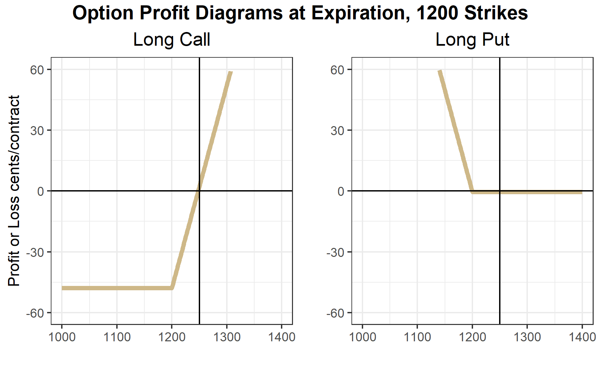

```{r setup, include=FALSE}
options(htmltools.dir.version = FALSE)
purduegold <- '#CEB888'
colorscheme <- purduegold
```

```{r xaringan-themer, include=FALSE, warning=FALSE}
library(xaringanthemer)
style_duo_accent(
  #base_color = purduegold,
  primary_color = colorscheme,
  secondary_color = "black",
  header_font_google = google_font("Josefin Sans"),
  text_font_google   = google_font("Montserrat", "300", "300i"),
  code_font_google   = google_font("Fira Mono")
)
```

---

# Introduction to Option Contracts

**Highlights**

-   Learn the basics of call and put options

-   Learn what is moneyness and how it affects option prices

-   Learn about intrinsic value of options

**Check your Understanding**

-   Which option has a 'high' premium, an in-the-money or an out-of-the-money option?

-   Does a long put position have unlimited upside potential? What about a long call position?

-   Suppose you are a farmer with unpriced grain that you will harvest in October. Why would why would a long put option be a hedge?

---

# What is an Option Contract?

- An option contract gives the holder the right, but not the obligation to a position in the underlying contract by a certain date 

- Every option contract is tied to another asset or financial instrument. 

- The purchaser of an option contract will accept the position in the underlying only if it is advantageous to do so.

---

# Derivatives

- Futures and Options are examples of derivatives

---

# Call Options Vs Put Options

- Call options give the holder the *right to buy* the underlying 
  - at the strike price 
  - by the expiration date of the contract
  
- Put options give the holder the *right to sell* the underlying 
  - at the strike price
  - by the expiration date 
  
---
  
# Exercise of an Option Contract 

- The holder of a **call** option contract may take a long position in the underlying asset at the strike price

- The holder of a **put** option contract may take a short position in the underlying asset at the strike price

---
  
# American vs European Option Contracts

- American options **can be exercised at any time** prior to or at expiration

- A European contract can only be **exercised at the option contract's expiration**


---

# Option Contract Components

All option contracts must specify the following details.

-   **Expiration Date**: The date at which the option contract either must be exercised or left to expire worthless. Sometimes call maturity.

-   **Strike Price**: The strike price defines the price at which the holder may buy the underlying (in the case of a call option) or the price at which the holder may sell the underlying (in the case of a put option). Sometimes call exercise price.

-   **Exercise**: To exercise the option is to elect to take the position in the underlying (buy at the strike for a call option or sell at the strike for a put option).

-   **Underlying**: The asset or financial instrument on which the option is based. In the case of our class we will be talking about options on futures contracts.

-   **Premium**: Price paid upfront to the seller. This is because the inherent right, but not obligation of an option contract means that they hold a position with no downside risk. An upfront payment, the price or premium of the option is required to entice sellers to trade these contracts.

---

# What are the Obligations of Option Sellers?

- **Call Option Seller:** The call option seller must be ready to deliver a long position in the underlying to a call option buyer  

  - That means that they must be ready to sell the underlying at the strike price 
  
  - The rational call buyer will only exercise if the price of the underlying is above the strike price of the option contract. 

- **Put Option Seller:** The put option seller must be ready to deliver a short position in the underlying to a put option buyer 

  - The put option seller must be ready to buy the underlying at the strike price  
  
  - The rational put option buyer will only exercise their option if the price of the underlying is below the strike price. 


---

### **Profit and Loss Diagrams for Option Positions**

The specifics: Strike = 450.00 cents;  Premium = 10 cents


<style>
.aligncenter {
    text-align: center;
}
</style>
<p class="aligncenter">
    
</p>

---

<style>
.aligncenter {
    text-align: center;
}
</style>
<p class="aligncenter">
    
</p>


---

# Moneyness of an Option

- **Moneyness**: how near the price of the underlying is to the strike price 

- **Out-of-the money**: The price of the underlying is far below the strike of a call option and far above the strike of a put option 

  - When the price of the underlying is in the flat part of the option profit diagrams 
  
- **In-the-money**:  The price of the underlying is far above the strike of the call option and far below the strike of the put option

  - The price of the underlying falls in the sloped part of the option profit diagram
  
- **At-the-money** or **Near-the-money**: when the price of the underlying is near the kink of the option profit diagram.

---

# Option Prices (Premium)

- Option prices  are determined by buyers and sellers in options markets

- Option contracts are like insurance policies. 

  - Insurance for your car 
  
  - Pay a small amount at the beginning of the policy period  
  
  - Insurance company will pay damages in the (hopefully unlikely) event that you crash your car. 
  
  - You buy the insurance to protect yourself financially in the event you need to unexpectedly replace your car
  
  - Over your lifetime of car ownership you will probably pay more in car insurance than you collect in insurance claims 
  
  - But for most of us, the comfort of not having to worry about a surprise $20K expenditure is worth it. 
  
---

# Intrinsic Value


<style>
.aligncenter {
    text-align: center;
}
</style>
<p class="aligncenter">
    
</p>

---

# Margin Requirements

- Long option position: does not require margin  

  - Full downside risk paid upfront
  
- Short option position: does require margin

 - Large downside exposure
 
 - Ability to withstand losses must be proven by maintaining margin
 
 - Amount set by exchange and broker based on recent volatility
 
 - protects the exchange and broker, not you!


---

# Size of the Underlying

- Option contracts specify how much of the underlying the contract is associated with 

- Stock options: standard is 100 shares of the underlying 

  - So if you buy 1 call option with a premium of $1.00 and a strike of $120 on company XYZ, for example, you have purchased the right to buy 100 shares of XYZ at a price of $120. Making the actual cost to buy the option 100*$1.00 = $100.


- Futures Options: Standard is 1 futures contract
 
  - So if you buy 1 call option on CBOT corn for 30 cents, the cost of the option is 30*1*5,000 = 150,000 cents = $1,500


---

## Reading Option Quotes

Recall that soybeans are quoted to the eight of a cent, so the 1249'0 means $1249 + \frac{0}{8} = 1249.00$ cents. While the PRIOR SETTLE price of 1243'6 means $1243 + \frac{6}{8} = 1243.75$ cents.

---
- Read Prices
- Notice Moneyness
- Notice Volume


[](https://www.cmegroup.com/trading/agricultural/grain-and-oilseed/soybean_contract_specifications.html)

---
- Draw hockey stick diagrams

[](https://www.cmegroup.com/trading/agricultural/grain-and-oilseed/soybean_contract_specifications.html)

---


Hockey stick diagram; the call and put with 1200 cent strike and the option premium shown in the table above 





---

# Closing an Option Position

- Two ways to close or 'get out of' an option position: 
 
  - take the opposite position 
  
  - or exercise (in the case of option longs) or get exercised upon (in the case of option shorts) 
  
---

# Exercise and Assignment

- Note that you only have control over this case when you are long the option  

- If you are long the option and it is in-the-money you have the option to exercise at any time (in the case of American options which most options trading in the United States are American)

---

# Exercise and Assignment


- Though you would only want to if the option is in the money  

  - When you exercise, you receive the corresponding position in the underlying.  
  
  - For example, if you are long one call option on CME March corn futures that is in-the-money and you exercise it, you receive a long position of one contract in the March corn futures with your purchase price being the strike of the option  
  
  - Likewise, if you are long a put option that is in-the-money and you exercise it you receive a short position in the underlying at the strike price of the option. 
  
  - Note that if you are long an option and you decide to exercise, you will trade a position with zero margin requirements to having to post margin for the futures position, because you will no longer have a position with no downside risk.

---

# Exercise and Assignment

- If you are short an option contract that is in-the-money you should be ready to be assigned (exercised upon) at any time.  
 
  - If a long party indicates to the exchange that they want to exercise and you are matched with them then you must provide them with the position in the underlying at the strike price. 
  
  - For example, suppose you are short a March Corn put with a strike of 450 cents 
  
  - Price goes to 445 and you get assigned. That means you will have a long position in the March corn futures with a purchase price of 450 
  
  - This is because as the option seller you have to be the other side of the person who exercised their right to sell at 450.

- If markets were perfect with no liquidity cost, no one should ever exercise an option position early, since they could sell the option for at least as much as the intrinsic value of the option. 

- But, markets are not perfect 
  - Wide bid-ask spread

--- 

# Option Expiration

Options on futures usually expire a few weeks before the underlying futures contract expires. In most cases, the exchange will automatically exercise in-the-money options that are held to expiration
