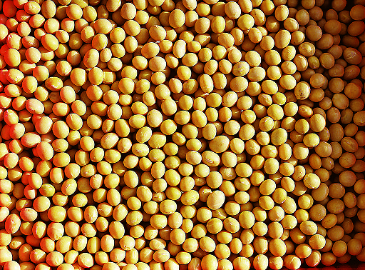
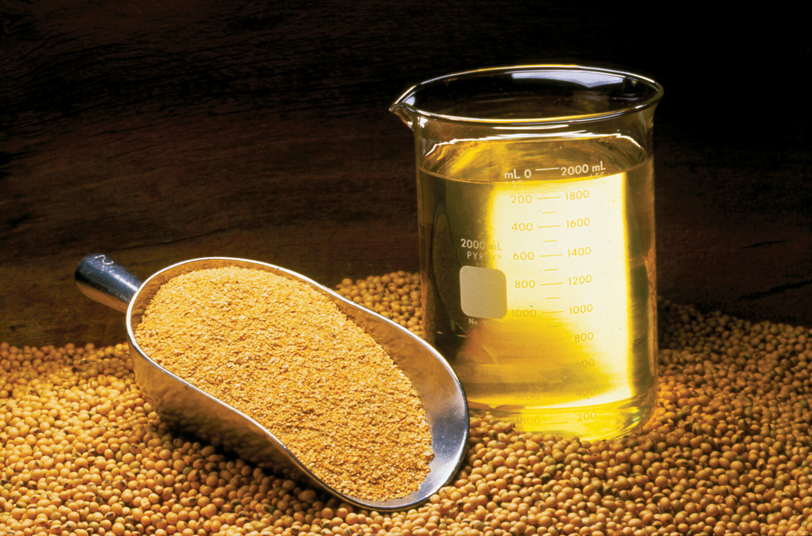

```{r setup, include=FALSE}
options(htmltools.dir.version = FALSE)
purduegold <- '#CEB888'
colorscheme <- purduegold
```

```{r xaringan-themer, include=FALSE, warning=FALSE}
library(xaringanthemer)
style_duo_accent(
  #base_color = purduegold,
  primary_color = colorscheme,
  secondary_color = "black",
  header_font_google = google_font("Josefin Sans"),
  text_font_google   = google_font("Montserrat", "300", "300i"),
  code_font_google   = google_font("Fira Mono")
)
```


---

# Highlights


  + Describe the physical process of converting soybeans into meal and oil. 
  
  + The price relationship is maintained between these highly related commodities. 
  
  + Approximately half of the supply of soybeans in the U.S. is crushed into soybean meal and oil. 
  
  + Nearly all of the remainder soybean supply is exported and most of it will be crushed abroad.
  
---







---

## Oilseed Processing

  + Most prevalent method for crushing soybeans is a method that uses a solvent to extract the oil from the soybean. 
  
  + Soybeans are pre-treated, then flaked to destroy the cell walls so the solvent can get at the oil in the cells. 
  
  + A crude oil is then further processed refined to remove the solvent and other compounds like glycerin, leaving only pure soybean oil. 
  
  + The soybean flakes, minus the oil are then ground in to meal that can be used as a high protein livestock feed. 

---

## Oilseed Processing (CONT...)

  + Historically, soybeans were processed by feeding soybeans into a mechanical press that literally squeezed the oil out. 
  
  + This process is less efficient and more time consuming - thus more costly. 
  
  + Nearly all commercially crushed soybeans are done with with the solvent extraction method. 

---

## Soybean Oil Uses

  + Soybean oil is used primarily as a food-grade product. 
  
  + It is not usually found in grocery stores as 100% soybean oil, but it will be present in oil sold as Cooking Oil, or Vegetable Oil. 
  
  + It is blended with other edible oils like corn oil and canola (also known as rapeseed) oil. 
  
  + Composition of cooking oil can vary from one purchase to the next. 
  
  + Producers of cooking oil can blend the edible oil components based on relative prices.
  
---

## Soybean Oil Uses (CONT...)

  + Soybean oil also can be further processed into partially hydrogenated soybean oil. 
  
  + This is accomplished by literally adding hydrogen to the vegetable oil. 
  
  


---

## Soybean Oil Uses (CONT...)

  + The resulting product is widely used in processed food such as baked goods, crackers, frozen foods. 
  
  + It is used in a lot of processed foods and a perfect ingredient in processed foods. 
  
  + It is solid at room temperature, and essentially never goes bad. 
  
  + If natural vegetable oils were used in processed foods the oil would go rancid in a short period of time. 

---


## Soybean Oil Uses (CONT...)

  + Use of partially hydrogenated vegetable oils has decreased a lot. 
  
  + Partially hydrogenated vegetable oils are examples of what is commonly referred to as **Trans Fat** in nutritional articles. 
  
  + Trans fat has been shown to [increase LDL cholesterol and heart disease]. 
  
  + The FDA announced a ban on most added trans fats in processed foods; the ban is set to take effect by 2018.
  
  
  
---

## Soybean Meal Uses

  + Soybean meal is used exclusively for livestock feed as a high protein component. 
  
  + Beef cattle, dairy cattle, hogs, and poultry use soybean meal in feed rations. 
  
  + Soybean meal provides a good source of protein, and combined with cereal grains like corn allow a complete balance of essential amino acids that hogs and poultry must have. 
  
---

# Price Relationships 

  + The input (soybeans) and outputs (oil and meal) are all commodities. 
  
  + The production technology is fairly widely understood and replicable. 
  
  + The oilseed crushing business is a very competitive one. 
  
  + Recall from intermediate microeconomics in the long run firms in a competitive market with identical technology should not expected to earn economic profits or losses in the long run. 
  
  + If short-term profits exist, firms enter the market. 
  
  + Shifting the supply curve out and reducing the equilibrium price until there is no more incentive to expand. 

---

# Price Relationships (CONT...)

  + This simple prediction has implications for our expectations about the relative prices of these commodities. 

  + An soybean processor's profit is roughly, 

1. $P_{oil}*q_{oil} + P_{meal}*q_{meal} - P_{soybean}*q_{soybean}$

  + where $q_{oil}$ and $q_{meal}$ are the quantities of oil and meal produced from $q_{soybeans}$. 
  
---


# Price Relationships (CONT...)

  + An soybean processor's profit is roughly, 

1. $P_{oil}*q_{oil} + P_{meal}*q_{meal} - P_{soybean}*q_{soybean}$
  
  + The quantities in this profit expression are always in fixed proportion to the amount of soybeans processed. 
  
  + Crushing 1 bushel of soybeans yields about 11 lbs of oil and 44 lbs of meal
  
  + We can replace the quantities with $q_{oil} = 11$ and $q_{meal} = 44$ to get profit per bushel of soybeans processed. 
  
---

# Price Relationships (CONT...)

2. $P_{oil}*11 + P_{meal}*44 - P_{soybean}*1$
 
  
  + One consideration we need to adjust are the units of the prices. 
  
  + Soybean oil is quoted in dollars per lb so the $P_{oil}*11$ does not need further adjustment. 
  
  + Soybean meal is quoted in dollars per ton, so to put the price on a $lbs/bushel$ basis. 
  
  + We need to divide by 2000lbs, $P_{meal}*44/2000$ or $P_{meal}*0.022$.

  + Adjusting equation 2, we get the expression for the Crush Spread. 
  
---

# Price Relationships (CONT...)

3. $P_{oil}*11 + P_{meal}*0.022 - P_{soybean}$

  + This represents the **Gross Processing Margin** (GPM) for the soybean crushing plant. 
  
  + This spread is followed by industry participants as a gauge of profitability in the industry. 
  
  + As a signal of whether to expect expansion or contraction in the crush business. 

---

## The Board Crush

  + Since soybeans, soybean oil, and soybean meal all have actively traded futures contracts. 
  
  + The oil processing GPM calculated with futures prices is widely followed. 
  
  + The local crush spread oil processors would earn in their local cash markets. 
  
  + When the Crush Spread is calculated with futures prices instead of spot prices it is called the **Board Crush** short-hand for the **Board of Trade** Crush. 
  
  + Speculators trade this spread by selling (buying) oil and meal and buying (selling) soybeans. 
  
---

## The Board Crush (CONT...)

  + Oil processors use the Board Crush to hedge their positions in the cash markets for oil, meal, and soybeans and to 'lock in' processing margins. 

  + In the cash market, a soybean crusher buys soybeans and sells meal and oil, to hedge they will buy soybeans and sell meal and oil. 

  + This futures spread will make money crushers losing money in the cash market (as is the design of the hedge). 
  
  + The spread makes money, if the cost of the business (buying soybeans) becomes higher. 
  
  + Relatively speaking - and the revenue of the business (selling meal and oil) becomes smaller. 

---

## The Board Crush (CONT...)

  + To get the spread right, you need to buy soybeans and sell oil and meal in the correct proportions to mimic the business of crushing soybeans.
  
  + 1 bushel of soybeans equals to 11 lbs of oil and 44 lbs of meal. 
  
  + There are two versions of the spread that are fairly widely followed, the 1-1-1 spread and the 9-11-10 spread. 
  
  + The 1-1-1 spread is not as accurate in getting the proportions right, but it is easier to remember and implement as a trade. 
  
  + It would be cheaper to implement with brokers who charge commission per contract. 

---

### The 1-1-1 Spread

**The 1-1-1 spread and it requires placing the following trades:** 

  + Buy 1 contract soybean oil 
  + Buy 1 contract soybean meal
  + Sell 1 contract soybeans

This position makes money when the spread widens, or oil and meal go up while soybeans goes down. This is called buying the spread. 

These trades will profit if soybean crushers profit goes up. 

This is the opposite of what soybean crushers will use to hedge.

---

### The 1-1-1 Spread (CONT...)

**Another version is to sell the spread:**

  + Sell 1 contract soybean oil 
  + Sell 1 contract soybean meal
  + Buy 1 contract soybeans

This spread makes money when the spread narrows, or oil and meal go down while soybeans goes up. 

Soybean crushers can sell the spread (Sell oil and meal and buy soybean futures) to hedge their GPM. 

Or, speculators can sell the spread to speculate the the soybean crushing industry will become less profitable.

---

### The 1-1-1 Spread (CONT...)

The 1-1-1 spread is a crude approximation of oil processing GPM but one needs to be careful about the quantities of each commodity represented.

**Futures contracts for soybean oil, soybean meal, and soybeans are for the following quantities:** 

  + Soybean oil  ~ 60,000lbs
  + Soybean meal ~ 100 short tons or 200,000lbs
  + Soybeans     ~ 5,000 bushels
  
---

### The 1-1-1 Spread (CONT...)

**1 contract of soybeans (5,000 bu) will produce:**

  + $5,000*11 = 55,000$ lbs of soybean oil
  + $5,000*44 = 220,000$ lbs of soybean meal

The 1-1-1 spread does not represent equivalent quantities of soybeans, oil, and meal. 

It over hedges oil by 5,000 lbs and under hedges meal by 20,000 lbs. 

---

### The 9-11-10 Spread

The commercial oil processors use a 9-11-10 spread of 9 contracts of soybean oil, 11 contracts of soybean meal, and 10 contracts of soybeans to hedge their GPM. 

**The quantities match more closely. Ten contracts of soybeans produces:**

  + $5,000*10*11 = 550,000$ lbs of soybean oil
  + $5,000*10*44 = 2,200,000$ lbs of soybean meal

**And, the quantities of oil and meal represented by 9 and 11 contracts are as follows:**

  + $9*60,000 = 540,000$ lbs of soybean oil
  + $11*200,000 = 2,200,000$ lbs of soybean meal

So, the quantities match except for being under hedged by 10,000 lbs in soybean oil.

---

## Readings 

1. [How the Global Oilseed and Grain Trade Works]

  + A publication prepared for the [United Soybean Board], a marketing association of for American soybean farmers and funded by the soybean checkoff.

  + Funds raised by every soybean farmer contributing 0.5% of the market price of every bushel of soybeans sold. 
  
  + They are directed by the United Soybean Board. 
  
  + This group engages in research and market development and expansion activities.  

2. [Central IL Soybean Crush Margins Among Highest Ever]

  + A DTN article that has a nice graphic of historical crush margins.
  
---

