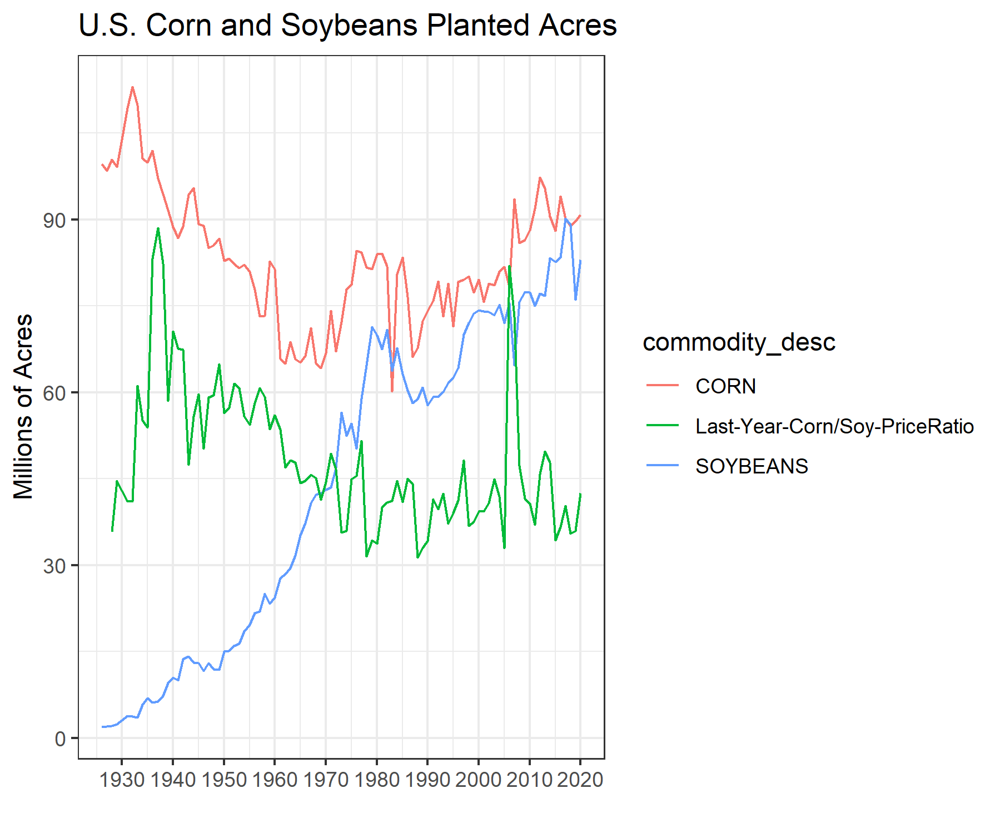

```{r setup, include=FALSE}
options(htmltools.dir.version = FALSE)
purduegold <- '#CEB888'
colorscheme <- purduegold
```

```{r xaringan-themer, include=FALSE, warning=FALSE}
library(xaringanthemer)
style_duo_accent(
  #base_color = purduegold,
  primary_color = colorscheme,
  secondary_color = "black",
  header_font_google = google_font("Josefin Sans"),
  text_font_google   = google_font("Montserrat", "300", "300i"),
  code_font_google   = google_font("Fira Mono")
)
```


---

#Highlights

  + Learn the timeline and tools to estimate acreage and yield. 
  
  + Learn the relative price of corn versus soybeans contributes to acreage decisions, and thus production.
  
  + Learn basic techniques for forecasting yield before and during the growing season.
  
---

#Check Your Understanding

  + Can you use NASS data for soybeans to forecast production in a similar manner shown for corn?

---

  + We will focus our energy on more data and technical questions of actually forecasting elements of the balance sheet. 
  + short term price changes using time-series econometric techniques.

---


  + Our first task in forecasting a balance sheet will be to get a good estimate of production for the marketing year. 
  
  + As we noted before, `Production = Acreage X Yield`. To begin, we will discuss the fundamentals of estimating acreage.
  
---

 

---

## Estimating Acreage

  + The forecasting depends on the time of year, we are making the forecast. 
  
  + Prior to planting season, we can rely on recent trends in acreage from previous years. 
  
  + And, relative profitability of planting competing crops as measured by relative futures prices. 
  
---

## Estimating Acreage (CONT...)

Historical acres planted and harvested can be found from USDA NASS. 

+ Steps to download historical acreage data: 

 1. Go to [https://www.nass.usda.gov/Quick_Stats/Lite/index.php]
   
 2. Click **Crops** in the menu 
 
 3. In the query, choose **Field Crops**
 
 4. Choose **Corn**
 
 5. Click **Acreage, Yield, Production, and Price**
 
 6. Select the years you want. Hold **Ctrl key** to select multiple.
 
 7. Click **Get Data**.
 
 
---


---

## Estimating Acreage (CONT...)

  + The graph of historical corn **Planted Acres** along with the ratio of **Average Prices Received by Farmers** for corn and soybeans.
  
  + The graph of historical corn **Planted Acres and Harvested Acres** generated from the data described above from 2000 to 2014. 
  
  + The left axis shows planted and harvested acres while the right axis shows the difference between the two. 
  
  + Since 2000, corn acreage has been increasing steadily from 80 million acres to just above 90 million acres. 
  
  + Given this, prior to planting season we might expect a simple trend-line to forecast corn acreage fairly well. 
  
  + In a couple of instances, there were fairly large deviations from the trend-line.
  
  
---




---

## Estimating Acreage (CONT...)

  + Aside from historical trends, the average corn farmer makes decisions based on relative profitability of planting corn versus planting soybeans. 
  
  + In years where profitability favors corn, more corn-on-corn acres will be planted, thus increasing the total number of acres planted to corn.
  
  + In years where profitability favors soybeans, less corn-on-corn acres will be planted, thus increasing soybean acres and reducing the total number of acres planted to soybeans. 
  
  + This pattern is demonstrated in 2008 and 2011 when an increase in the corn-to-soybean price ratio corresponded to an increase in planted acres. 
  
  
---

## Estimating Acreage (CONT...)

  + Figure 4 shows, December 2017 and November 2017 corn and soybean futures prices ratio from 10/1/2016 to 5/1/2017. 
  
  + This roughly corresponds to the time frame when a farmer must make acreage decisions for the next crop year. 
  
  + The acreage decision begins in the fall of the prior year because fertilizer on corn ground is often applied in the fall. 
  
  + Assuming inputs costs were constant, forecasts of corn and soybean acreage for Spring 2017 should take into account the changing profitability.
  
  + When corn/soy ratio is **high** and corn becomes more profitable relative to soybeans and vice versa. 

---

 

---

## Estimating Acreage (CONT...)

  + Figure 4 shows, during the fall of 2016, the corn/soy price ratio was falling. 
  
  + The acreage expectations should have been shifting slightly from corn toward soybeans. 
  
  + In late spring 2017, the corn price gained relative to the soybean price. 
  
  + Some corn acres may have been added back at the last minute that were originally planned for soybean acres. 
  
  + If we compare the 2017 prospective plantings report (released on 3/21/2017) with the 2017 acreage report (released on 6/30/2017). 
  
  + USDA estimated corn acres to be 90 million, but the acreage report showed plantings were nearly 1 million acres higher at 90.9 million

---

## Forecasting Harvested Acres

  + After forecasting **Planted Acres** one still needs to provide a forecast for **Harvested Acres**. 
  
  + Figure 5 shows historical trends in **Harvested Acres** relative to **Planted Acres**. 
  
  + The difference between these two variables is provided in gray with units along with the right axis for convenience. 

  + Harvested acres tends to be fairly stable number, averaging 7.6 million acres between 2000 and 2014. 

---

  


---

## Forecasting Harvested Acres (CONT...)
  
  + This variable deviates most from trend corresponds to years of exceptionally poor production. 
  
  + In figure 5, 2012 and 2002 as examples. These years marginal reductions in production are explained by reduced yield and abandoned acres.
  
  + Forecasting the harvested acres number accurately becomes very important to accurately forecasting production in shortfall years. 
  
---

## Forecasting Yield

  + In forecasting acreage, we have different procedures for forecasting yield prior to planting. 
  
  + Before summer, the growing season gets underway and trend yield is usually used. 
  
  + USDA has records on yield that go back to 1866. 
  
  + When forecasting, the old yield estimates are no longer useful for forecasting current yield. 
  
  + Technological progress caused yields to take of in the 1950's and they have been climbing ever since. 
  
---

## Forecasting Yield (CONT...)

  + In the forecasting world, this is called **Structural Change** or a **Structural Break**. 
  
  + If **Structural Change** has occurred, the world looks so different now than it did before. 
  
  + The **Structural Change** the data from before the break which is not useful for forecasting going forward. 

  + If a trend-line estimate beginning with 1952, 1980, or with pretty much any date in between, you will get an estimate that is roughly similar. 

---

## Forecasting Yield (CONT...)

+ **For Example:** 

  + Using the trend-line beginning with 1952 to forecast yield we come up with $Yield^{2015} = 1.9066*2015 - 3677.9 = 163.899$. 
  
  + While, using the trend-line beginning with 1980 to forecast yield we come up with $Yield^{2015} = 1.8619*2015 - 3588.9 = 162.8285$.
  
  + In other words, yields have been increasing by an average of just under 2 bushels per acre since the 1950's.
  
---

## Growing Season Yield Forecasts
 
  + The USDA undertakes an extensive effort to estimate yield during the growing season. 
  
  + Prior to August, they conduct the **Agricultural Yield Survey** (AYS) which surveys a large number of farmers and asks them to estimate yield.
  
  + Beginning in August, the USDA conducts the **Objective Yield Survey**. 
  
  + They take samples from a relatively large number of fields and estimates yield in those fields based on various factors such as:
  
   + Counts of plants 
   
   + Ears 
   
   + And, pods (for soybeans)
   
---

## Growing Season Yield Forecasts (CONT...)

  + The commodity futures markets respond to new information in the USDA reports. 
  
  + Analysts employed by private advisory firms or proprietary trading shops will try to anticipate the USDA's yield forecast. 
  
  + It can be capitalized on superior private information by making a well advised business decision or earning speculative profits.

  + This is difficult because an independent analyst will not have the same level of resources as the USDA does when it compiles its monthly yield estimates. 
  
  + They will have to rely on historical data and an understanding of weather is affecting crop yields across the geographically dispersed growing region.  
  
  + Figure 8 plots each year's deviation from trend yield since 1980. 
  
  + The first plot is in levels (i.e., $Yield_t - Trend Yield_t$); whereas the second plot is in percent terms (i.e., $\ln{Yield_t} - \ln{Trend Yield_t}$. 
  
---

## Growing Season Yield Forecasts (CONT...)

   + Notice that the shape looks roughly the same, but the 2012 drought looks worse.
   
   + Expressed in level deviations that the short crops of 1983, 1988, and 1993. 
   
   + The yield is trending higher. 
   
   + In percentage terms, the 2012 drought was equally as bad as 1983 and not quite as bad as 1988.  
   
---

## Growing Season Yield Forecasts (CONT...)

  + An advanced agronomic model that can take into account planting date, precipitation, or ability to estimate yield from remote sensing technology. 
  
  + We will have to resort to the **Similar Year Approach**.  

  + Analysts often estimate deviations from trend yield by finding year similar to the current one in terms of weather. 
  
  + The assumption is, if the weather patterns were similar then the percent deviation from trend yield should be similar as well. 
  
  + Percent deviation is preferable so you do not need to adjust for increasing trend in yield as you look backward to a similar year. 
  
---

## Growing Season Yield Forecasts (CONT...)

  + An alternative approach would be to use the **Crop Condition Report** and find a year in recent history. 
  
  + It had a similar percent of the crop rated **Good/Excellent**. 
  
  + Figure 9 shows how **Good** + **Excellent** crop condition ratings relating to the percent deviations in trend yield. 
  
  + They should be at least positively correlated, and in fact starting in the late 90's. 
  
  + This measure began to correlate strongly with the final yield. 

---

## Forecasting Production

  + Once you have an estimate for acreage and yield, you can multiply them to give you an estimate of production for your balance sheet forecast. 

## Conclusion

  + We reviewed the basics of forecasting production and forecasting acreage. 
  
  + Both Forecasting yields, before and during the growing season. 
  
  + We discovered that estimating yield percent deviations from trend better than the USDA is extremely difficult. 
  
  + Even anticipating whether the yield forecast will go up or down is not an easy task. 
  
  + The **Similar Year Method** has its limitations when used to find similar years in terms of weather or crop conditions ratings. 
  
---

## Exercises

  1. Use NASS data for soybeans for forecast production in a similar manner we we did in class for corn. 

  2. Read and Discuss: **Early Planting and 2015 Corn Yield Prospects: How Much of an Increase?**
  
  (http://farmdocdaily.illinois.edu/2015/05/early-planting-and-2015-corn-yield-prospects.html)

---

class: inverse, center, middle

##CHAPTER END

---