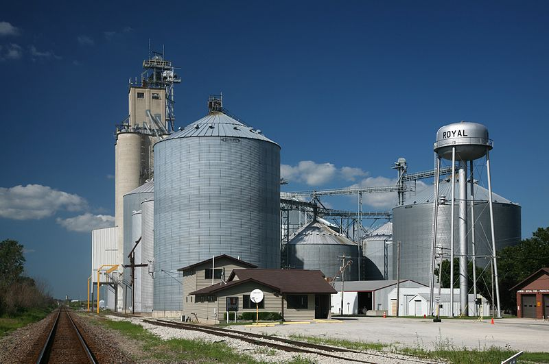

```{r setup, include=FALSE}
options(htmltools.dir.version = FALSE)
purduegold <- '#CEB888'
colorscheme <- purduegold
```

```{r xaringan-themer, include=FALSE, warning=FALSE}
library(xaringanthemer)
style_duo_accent(
  #base_color = purduegold,
  primary_color = colorscheme,
  secondary_color = "black",
  header_font_google = google_font("Josefin Sans"),
  text_font_google   = google_font("Montserrat", "300", "300i"),
  code_font_google   = google_font("Fira Mono")
)
```


---

# Futures and Hedging Review

**Highlights**

-   Review of futures contracts and how to calculate profit or loss on a trade. 

-   Hedging examples from the sell side (farmer's hedge) and from the buy side (flour mill's hedge). 

-   Learn how basis risk impacts a hedge.

**Check your Understanding**

-   Can you calculate the profit or loss from a trade? 

-   Can you fill out a hedging net revenue table given prices on key dates?

---

# Futures and Hedging Review

+ What is its purpose? 

+ Who does it? 

+ And how do futures contracts facilitate a 'hedge'?


---
class: inverse, center, middle

## Understanding who is hedging and why is very helpful to understanding price relationships and what drives them to move up or down


---

# Futures Contract Review

+ Contract to buy or sell 

  + at an agreed to price
  
  + a specific quantity 
  
  + a specific quality 
  
  + at a specific location 
  
---

# Example CBOT Corn Futures

+ 5,000 bushels 

+ U.S. number 2 yellow corn 

+ at specific elevators along the Illinois River, Lake Michigan, or associated canals. 

---
# Futures Contract Review

+ These contracts are traded on a centralized exchange, similar to the 'stock market' 

+ Two counter-parties do not know each other. 

---
class: center, middle

## The difference between a futures contract, and say buying a stock, is that when the trade takes place, no ownership transfer occurs. 

---
class: center, middle

## It is simply a promise to buy or sell at a specific date in the future. 

---
class: center, middle

## That is why there are many different futures contract 'months' like 'December 2022' corn futures, and 'March 2023' corn futures. 

---
# Futures Contract Review

+ Traders on futures exchanges need to post 'margin' 

  + money that acts as a performance bond so that everyone has confidence that both parties can make good on the contract 
  
  + As the price moves up, the seller's position is losing (because selling 'low' is 'bad' business) 
  
  + money is taken from short traders' margin accounts and put into the buyers' margin accounts (because buying 'low' is 'good' business). 
  
  + This daily transfer of money from the losers to the winners is called 'marking to market' 
  
    + makes sure everyone has the financial capital required to make good on the terms of the contract.

---
# Profit/Loss Calculation Review


Consider this example. 

+ At 10am the March corn futures contract is trading at **$4.50** per bushel 

+ Trader A decides to **buy** one contract and Trader B decides to **sell** one contract  

+ At 1pm both traders decide to close their position and the price has moved up to **$4.75** per bushel


## What is the gain or loss of both the long and short side? 

---
# Profit/Loss Calculation Review

Since the price went up the by $0.25 per bushel, the longs (buyers) gain 

+0.25\*5000 = $1250 and the shorts (sellers) lose -0.25\*5000 = $1250

| Time                | Trader A                  | Trader B                  |
|:--------------------|:--------------------------|:--------------------------|
| 10am                | buy $4.50                 | sell  $4.50               |
| 1pm                 | sell  $4.75               | buy  $4.75                |
| profit per bu       | $4.75 - $4.50 = +$0.25    |  $4.50 -  $4.75 = -$0.25  |
| profit one contract | +$1250                    | - $1250                   |

---
# Position Exit Review 

+ Very few contracts are held all the way to expiration when transfer of ownership would take place 

+ The traders who originally bought, sometime before expiration will sell 

  + eliminates their obligation in the market, or gets them to a 'flat' position 
  
+ The traders who originally sold, will buy, getting them to a 'flat' position as well 

---
# Delivery of Futures Contracts

+ The CME Group grain and oilseed future are deliverable contracts, ensuring a link between the spot market and the futures market  

+ Only a few of the futures contracts traded are actually delivered on, however 

+ The purpose of the futures market is not to provide a mechanism for physical exchange, but rather a means for streamlined risk management in a liquid market

---
class: center, middle

## Exchange designates a few large commercial grain handlers and warehouses as *regular for delivery*

---
# Location of 'Regular' Grain Warehouses

These grain handlers lie in one of the following territories specified in the [CME Group Rulebook](https://www.cmegroup.com/rulebook/CBOT/II/10/10.pdf)

> Corn shipping certificates shall specify shipment from one of the warehouses or shipping stations currently regular for delivery and located in one of the following territories:
>
> A. Chicago and Burns Harbor, Indiana Switching District - When used in these Rules, the Chicago Switching District will be that area geographically defined by Tariff ICC WTL 8020-Series and that portion of the Illinois Waterway at or above river mile 304 which includes the Calumet Sag Channel and the Chicago Sanitary & Ship Canal. When used in these Rules, Burns Harbor, Indiana Switching District will be that area geographically defined by the boundaries of Burns Waterway Harbor at Burns Harbor, Indiana which is owned and operated by the Indiana Port Commission.
>

---
# Location of 'Regular' Grain Warehouses

These grain handlers lie in one of the following territories specified in the [CME Group Rulebook](https://www.cmegroup.com/rulebook/CBOT/II/10/10.pdf)

> Corn shipping certificates shall specify shipment from one of the warehouses or shipping stations currently regular for delivery and located in one of the following territories:
>
> B. Lockport-Seneca Shipping District - When used in these Rules, the Lockport-Seneca Shipping District will be that portion of the Illinois Waterway below river mile 304 at the junction of the Calumet Sag Channel and the Chicago Sanitary & Ship Canal and above river mile 244.6 at the Marseilles Lock and Dam.
>

---
# Location of 'Regular' Grain Warehouses

These grain handlers lie in one of the following territories specified in the [CME Group Rulebook](https://www.cmegroup.com/rulebook/CBOT/II/10/10.pdf)

> Corn shipping certificates shall specify shipment from one of the warehouses or shipping stations currently regular for delivery and located in one of the following territories:
>
> C. Ottawa-Chillicothe Shipping District - When used in these Rules, the Ottawa-Chillicothe Shipping District will be that portion of the Illinois Waterway below river mile 244.6 at the Marseilles Lock and Dam and at or above river mile 170 between Chillicothe and Peoria, IL.
>

---
# Location of 'Regular' Grain Warehouses

These grain handlers lie in one of the following territories specified in the [CME Group Rulebook](https://www.cmegroup.com/rulebook/CBOT/II/10/10.pdf)

> Corn shipping certificates shall specify shipment from one of the warehouses or shipping stations currently regular for delivery and located in one of the following territories:
>
> D. Peoria -- Pekin Shipping District - When used in these Rules, the Peoria-Pekin Shipping District will be that portion of the Illinois Waterway below river mile 170 between Chillicothe and Peoria, IL and at or above river mile 151 at Pekin, IL.

---
# Delivery Process

+ Shorts cannot just show up at one of these locations with 5,000 bushels of grain in trucks. 

+ Deliverable instrument is a **shipping certificate** for 5,000 bushels of grain from a regular for delivery warehouse 

---
# Delivery Process

+ **Shipping certificate** gives the holder the right to demand load-out of grain that meets certain quality standards 

+ Holders of shipping certificates are required to pay what are called **premium charges** 

  + Fees collected by the warehouse for the space provided to store the grain. 
  
---
# Delivery Process 


Likewise, if the long party (the person who bought the futures contract) wants to take delivery, they must pay the full amount, $Futures Price X 5,000$ bushels, and must pay premium charges to the warehouse to hold the shipping certificate.

---
class: inverse, center, middle

## Hedging 


---
class: center, middle

## Examples: Who Hedges and How Does a Futures Contract Facilitate a Hedge?

---

### Farmer Hedge

+ Plants her crop in April waits for it to grow and then mature through the summer and fall
+ Harvests in November. 
+ Sell at harvest in the cash market -> take grain to a local grain elevator
+ elevator will purchase all she has at a publicly posted price

[](https://commons.wikimedia.org/wiki/File:Grain_elevators_in_Royal,_IL.)

Source: [Daniel Schwen, CC-License](https://commons.wikimedia.org/wiki/File%3AGrain_elevators_in_Royal%2C_IL.jpg)

---

### Farmer Hedge

Hedge -> Reduce Uncertainty

1.  Crop Insurance. They can purchase a crop insurance policy that will pay them an indemnity if either price goes down, yield is low, or both depending on the exact specification of the contract. This activity does not directly interact with the futures market, so it does not have a large effect on price.

2.  Forward Price Contract. 

---
## Farmer Hedge

3.  Futures Market. Alternatively, a farmer could go directly to the futures market themselves to sell futures contracts and reduce price uncertainty. 
  + Farmer still faces *basis risk* in this case. 


$$Basis = Cash Price - Futures Price$$

---
## Example Farmer Hedge With Futures

+ May 1st, local elevator is offering to buy corn for $3.50, and the December futures contract price is $3.75. 

**To Hedge - Take the same action in the futures market (buy or sell) that you will do in the cash market at a future date**

---
## Example Farmer Hedge With Futures

+ Should sell (the December) futures to hedge. 

+ Consider two cases, one where the Dec futures price in November turned out to be $4.00  

+ And one where the Dec futures price in November turned out to be $3.60.


---
## Example Farmer Hedge With Futures


|        Date         |              Action              | Cash Price in Royal, IL |  Dec Corn Futures Price   |     Basis     |
|:-------------------:|:--------------------------------:|:-----------------------:|:-------------------------:|:-------------:|
|       May 1st       |         Sell Dec Futures         |         $3.50           |          $3.75            | -$0.25        |
|       Nov 1st       | Buy Dec Futures & Sell Cash Corn |                         |                           | -$0.25        |
| Profit Calculation, |         Cash and Futures         |                         |                           |               |
|                     |      Net per bushel revenue      |                         |                           |               |

---
## Example Farmer Hedge With Futures

**Dec Futures Price went Up to $4.00, Basis Unchanged**


|        Date         |              Action              | Cash Price in Royal, IL |  Dec Corn Futures Price   |     Basis     |
|:-------------------:|:--------------------------------:|:-----------------------:|:-------------------------:|:-------------:|
|       May 1st       |         Sell Dec Futures         |         $3.50           |          $3.75            | -$0.25        |
|       Nov 1st       | Buy Dec Futures & Sell Cash Corn |         $3.75           |          $4.00            | -$0.25        |
| Profit Calculation, |         Cash and Futures         |         $3.75           | $3.75 - $4.00 = -$0.25    |               |
|                     |      Net per bushel revenue      |     $3.75 -  $0.25      |         = $3.50           |               |


---
## Example Farmer Hedge With Futures

**Dec Futures Price went Down to $3.60, Basis Unchanged**

|        Date         |              Action              | Cash Price in Royal, IL |  Dec Corn Futures Price   |     Basis     |
|:-------------------:|:--------------------------------:|:-----------------------:|:-------------------------:|:-------------:|
|       May 1st       |         Sell Dec Futures         |         $3.50           |          $3.75            | -$0.25        |
|       Nov 1st       | Buy Dec Futures & Sell Cash Corn |                         |                           | -$0.25        |
| Profit Calculation, |         Cash and Futures         |                         |                           |               |
|                     |      Net per bushel revenue      |                         |                           |               |

---
## Example Farmer Hedge With Futures

**Dec Futures Price went Down to $3.60, Basis Unchanged**

|        Date         |              Action              | Cash Price in Royal, IL |  Dec Corn Futures Price   |     Basis     |
|:-------------------:|:--------------------------------:|:-----------------------:|:-------------------------:|:-------------:|
|       May 1st       |         Sell Dec Futures         |         $3.50           |          $3.75            | -$0.25        |
|       Nov 1st       | Buy Dec Futures & Sell Cash Corn |         $3.35           |          $3.60            | -$0.25        |
| Profit Calculation, |         Cash and Futures         |         $3.35           | $3.75 - $3.60 = +$0.15    |               |
|                     |      Net per bushel revenue      |     $3.35 + $0.15       |         = $3.50           |               |

---
## Example Farmer Hedge With Futures


**Dec Futures Price Unchanged, Basis now -$0.50**

|        Date         |              Action              | Cash Price in Royal, IL |  Dec Corn Futures Price   |     Basis     |
|:-------------------:|:--------------------------------:|:-----------------------:|:-------------------------:|:-------------:|
|       May 1st       |         Sell Dec Futures         |         $3.50           |          $3.75            | -$0.25        |
|       Nov 1st       | Buy Dec Futures & Sell Cash Corn |                         |                           | -$0.50        |
| Profit Calculation, |         Cash and Futures         |                         |                           |               |
|                     |      Net per bushel revenue      |                         |                           |               |


---
## Example Farmer Hedge With Futures


**Dec Futures Price Unchanged, Basis now -$0.50**

|        Date         |              Action              | Cash Price in Royal, IL |  Dec Corn Futures Price   |     Basis     |
|:-------------------:|:--------------------------------:|:-----------------------:|:-------------------------:|:-------------:|
|       May 1st       |         Sell Dec Futures         |         $3.50           |          $3.75            | -$0.25        |
|       Nov 1st       | Buy Dec Futures & Sell Cash Corn |         $3.25           |          $3.75            | -$0.50        |
| Profit Calculation, |         Cash and Futures         |         $3.25           | $3.75 - $3.75 = +$0.00    |               |
|                     |      Net per bushel revenue      |     $3.25 + $0.00       |         = $3.25           |               |

This time, the basis widening from -$0.25 to -$0.50 was a loss to the farmer, even though general price levels were unchanged (Dec price unchanged). The next example shows the farmer's revenue if the basis strengthens, or narrows.

---
## Example Farmer Hedge With Futures


**Dec Futures Price Unchanged, Basis now $0.00**

|        Date         |              Action              | Cash Price in Royal, IL |  Dec Corn Futures Price   |     Basis     |
|:-------------------:|:--------------------------------:|:-----------------------:|:-------------------------:|:-------------:|
|       May 1st       |         Sell Dec Futures         |         $3.50           |          $3.75            | -$0.25        |
|       Nov 1st       | Buy Dec Futures & Sell Cash Corn |                         |                           | $0.00         |
| Profit Calculation, |         Cash and Futures         |                         |                           |               |
|                     |      Net per bushel revenue      |                         |                           |               |


---
## Example Farmer Hedge With Futures


**Dec Futures Price Unchanged, Basis now $0.00**

|        Date         |              Action              | Cash Price in Royal, IL |  Dec Corn Futures Price   |     Basis     |
|:-------------------:|:--------------------------------:|:-----------------------:|:-------------------------:|:-------------:|
|       May 1st       |         Sell Dec Futures         |         $3.50           |          $3.75            | -$0.25        |
|       Nov 1st       | Buy Dec Futures & Sell Cash Corn |         $3.75           |          $3.75            | $0.00         |
| Profit Calculation, |         Cash and Futures         |         $3.75           | $3.75 - $3.75 = +$0.00    |               |
|                     |      Net per bushel revenue      |     $3.75 + $0.00      |         = $3.75            |               |

The narrowing of the basis was an increase in profit to the farmer.


---
## Example Farmer Hedge With Futures

+ Farmer hedges with futures -> they are 'long in the basis'
  + Futures hedge eliminates price uncertainty that comes from general price levels
  + But not uncertainty due to spatial variations


---
## Farmer Hedge With Put Options

Covered in the next 4 chapters

---

## Flour Mill

+ A flour mill buys large quantities of grain for making into flour. 

+ They can use futures to hedge price risk by 'buying ahead' futures contracts. 

---

## Flour Mill

+ Flour mill processes grain year round 

+ Need to hedge price risk at multiple points in time for when they routinely purchase grain 
 
+ Commercial wheat flour mills -> 50,000 bushels of wheat per month 

+ Wheat futures contracts -> 5,000 bushels N
  + Need 10 contracts to hedge one month

---

## Flour Mill

There are five wheat futures contracts per year, March, May, July, September, and December

| Wheat Futures Contracts |       |     |      |           |          |
|:------------------------|:-----:|:---:|:----:|:---------:|:--------:|
| Expiration              | March | May | July | September | December |

---

## Flour Mill

+ Suppose on December 1st 2020 the mill wants to lock in its wheat purchase price (aside from basis risk) for the first six months of 2021 

+ Needs to hedge January, February, and March wheat purchases with the March futures contract 

+ April and May purchases with May contract 

+ June purchases with July contract 

+ Need to buy 60 contracts of wheat on Dec 1, 2020 to hedge January through July purchases. 

---

## Flour Mill

Example below takes real data from 2016, and assumes that the basis is fixed at -0.25 cents under the nearby futures contract, meaning the spot price column is always 0.25 cents less than the next to expire futures contract.


---

## Flour Mill


| Dates     | Action                     | Long                   | Net Price Paid                  | Spot   | Mar Fut | May Fut | Jul Futs |
|:---------:|:--------------------------:|:-----------------------|:-------------------------------:|:------:|:-------:|:-------:|:--------:|
| Dec 1, 15 | Buy 30 Mar, 20 May, 10 Jul |                        |                                 | 469.75 | 470     | 476.5   | 483.25   |
| Jan 1, 16 | Buy 50k spot, Sell 10 Mar  | 20 Mar, 20 May, 10 Jul | -479 + (479.25-470) = - 469.75  | 479.00 | 479.25  | 485     | 490.5    |
| Feb 1     | Buy 50k spot, Sell 10 Mar  | 10 Mar, 20 May, 10 Jul | -444.75 + (445-470) = -469.75   | 444.75 | 445     | 453.25  | 460.25   |
| Mar 1     | Buy 50k spot, Sell 10 Mar  | 20 May, 10 Jul         | -471.25 + (471.5-470) = -469.75 | 471.25 | 471.5   | 473.5   | 480.75   |
| Apr 1     | Buy 50k spot, Sell 10 May  | 10 May, 10 Jul         | -477.75 + (478- 476.5) = -476.25| 477.75 | NA      | 478     | 488.5    |
| May 1     | Buy 50k spot, Sell 10 May  | 10 Jul                 | -464.75 + (465 -476.5) = 476.25 | 464.75 | NA      | 465     | 464.5    |
| Jun 1     | Buy 50k spot, Sell 10 Jul  | 0                      | -431 + (431.25- 483.25) = -483  | 431    | NA      | NA      | 431.25   |


---

## Hedging Crush Business

The 'crush' hedges are a little more complicated because they involve buying a certain kind of commodity, transforming it, and selling another commodity. Some are lucky in that they can hedge both the buy and sell side of the crushing business.

--- 

### Soybean Crusher

The soybean crusher buys soybeans and sells soybean meal and oil. Their futures hedge would involve buying soybean futures and selling meal and oil futures.

---

### Importance of Having a Line of Credit in Futures Hedging

+ As the hedge is losing money, margin needs to be maintained in their hedging account 

+ If prices move against the hedge a lot, additional money will need to be deposited to keep sufficient margin in the account 

+ Usually, this will need to come from a lender. 

+ Without the ability to access a line of credit and maintain margin, the short hedge position will be forced to liquidate, and then the farmer will no longer be hedged.

---

### Discuss How Crop Revanue Insurance Has Changed Commodity Marketing and Hedging Needs


