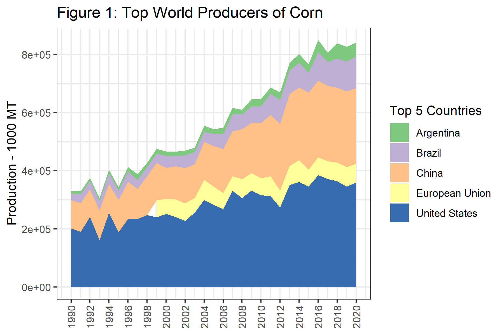
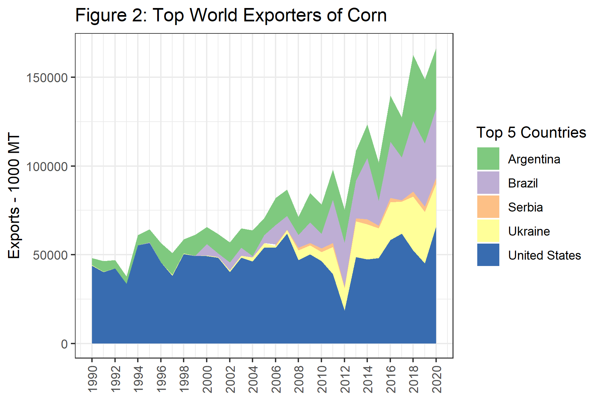
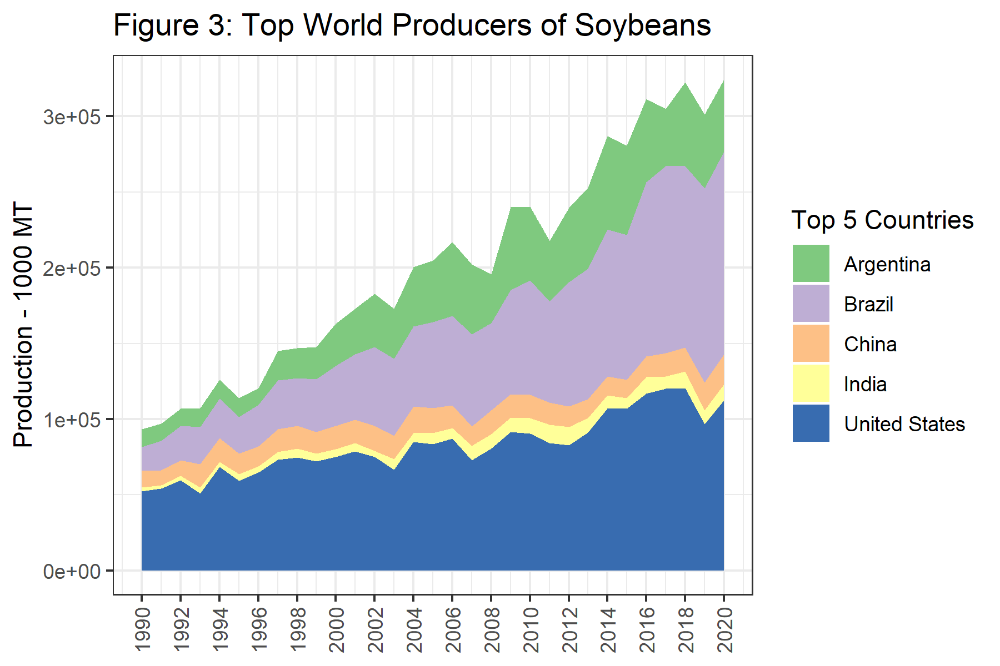
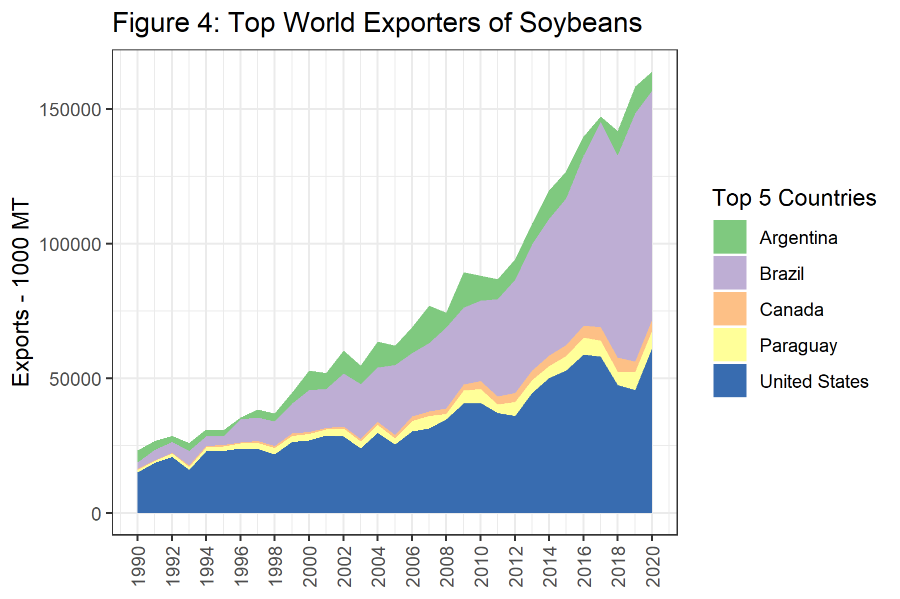

```{r setup, include=FALSE}
options(htmltools.dir.version = FALSE)
purduegold <- '#CEB888'
colorscheme <- purduegold
```

```{r xaringan-themer, include=FALSE, warning=FALSE}
library(xaringanthemer)
style_duo_accent(
  #base_color = purduegold,
  primary_color = colorscheme,
  secondary_color = "black",
  header_font_google = google_font("Josefin Sans"),
  text_font_google   = google_font("Montserrat", "300", "300i"),
  code_font_google   = google_font("Fira Mono")
)
```


---

# South American Production


  + Over the last twenty years Brazil and Argentina have grown in prominence on the world stage. 
  
  + They are currently among the most important growers of soybeans and corn, particularly so for soybeans. 
  
---

# South American Production


  + Many thanks to Felipe Grimaldi Avileis, my teaching assistant for ACE 427 in 2017. 
  
---

  + Figure 1, world's top five producers of corn
  
  + Data for Figures 1-4 come from the [USDA FAS World Production Supply and Demand](https://apps.fas.usda.gov/) historical data-sets for grains and oilseeds.
  
---



---

  
  + Argentina, Brazil, China, the European Union, and the United States round out this group. 
  
  + A clear pattern of increases over time is notable particularly for the U.S., China, and Brazil, generating an upward trend in the production from this group. 

---

## Production of Corn


  + Figure 2 plots the top five countries by exports. 
  
---



---
  
   + While U.S. exports have been mostly flat over this time period, exports from Brazil have been expanding rapidly since about 2004. 
   
---
  
  + Next, in table 1, we present the top producers of corn in 2017.
  
  
---

```{r}
read.csv(file = "assets/corn_exporters.csv") 

```
  
  + Table 1: Top 10 World Producers of Corn, 2017
  
---

## Production of Soybeans

  + Now, we turn our attention to the soybean market. 
  
  + In Figure 3, we present production since 1990 from the top five countries. 
  
---



---
  
  + The importance of Brazil and Argentina is much more obvious. 
  
  + While production in the U.S. has a visible upward trend, Brazil and Argentina are really increasing at a rapid rate.
  
---

## Production of Soybeans (CONT...)
  
  + In Figure 4, we plot the exports from the top five countries. 
  
  
---



---
  
  + The growth in soybean exports from Brazil is quite remarkable in this chart. 
  
---

```{r}
read.csv(file = "assets/corn_exporters.csv") 

```
  
  + Table 2 shows the top ten producers of soybeans in the World. Here we see that Paraguay and Bolivia are present in the top ten as well. 
  
---

## South American Production Seasons and Trade Flows

  + South America experiences summer when we in the North America experience winter and vice versa. 
  
  + North American and South American production is nicely complementary in providing corn and soybeans for the export market. 
  
---
  
  + U.S. corn and soybean exports are at their highest levels during the 2nd quarter of the marketing year - right after harvest. 
  
  + The planting and growing seasons are underway in South America. 
  
  + The heavy export season from harvesting the previous crop is winding down. 
  
---

## South American Production Seasons and Trade Flows (CONT...)

  + South American farmers are harvesting during our planting and growing seasons (March through June). 

  + The seasonality is a boon for importers because they have the opportunity to buy for seasonally low harvest-time prices.
  
  + The price would increase twice per year rather than just once per year. 

---

### Brazil

  + Brazil, being quite close to the equator, enjoys the ability to double crop most every year. 
  
  + The farmers plant soybeans as the first crop because if they plant soybeans first they get a second crop of corn. 
  
  + If they plant corn first, there is not enough time to get a second crop of soybeans. 
  
---
  
  + Yields of first crop corn are higher then yields of second crop corn due to when the rainy season comes. 
  
  + In some places, farmers choose to plant one crop of corn and forego double cropping.  
  
---

Figure 6 show production intensity of soybeans by state, and also provides a calendar of when planting and harvest activity of first crop soybeans are taking place. 


---


---

### Brazil (CONT...)

  + Figure 7 shows the same for second crop corn. 
  
  
---


---
  
  + While Figure 8 shows the regional production intensity of first crop corn. 
  
---


---
  
  + The highest production of first crop corn is located in regions that have no second crop in Figure 7. 
  
  + In the east, where managing a second crop is more difficult, farmers are more apt to plant a single crop of corn.

---

### Where to find information on Brazilian Crops 

  + Information about Brazillian production the [National Supply Company (Conab)](https://www.conab.gov.br/) is the main resource. 
  
  + They publish crop reports monthly, just like the USDA's WASDE report. 
  
  + Typically, the Brazillian report is released a couple of days before the WASDE report. 
  
  + If there is information from Brazil that will affect world stocks or production, these reports will move prices in the U.S. 
  
---

### Argentina

  + Argentina is more similar to the U.S. in latitude, so they are only able to plant a single crop. 
  
  + Planting of corn begins in September and harvest runs from March until May.
  
  + Planting of soybeans begins in November and harvest runs from April to May. 
  
---
  

### Where to find information on Argentinian Crops


  + The [Bolsa de Cereales](https://www.bolsadecereales.com/) is the grain exchange in Argentina. 
  
  + They undertake the responsibility of producing crop reports. 
  
---


  + The reports most closely followed are the Weekly Agricultural Report, which tells the planting or harvest progress, and gives a general update about market conditions. 
  
  + The other report is the Esdtado Y Condition de Cultivos (ECC), which is released once per month. 
  
  + This has more detailed estimates about planting and growing conditions. 
  
---

THE END
  
